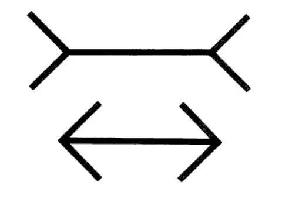
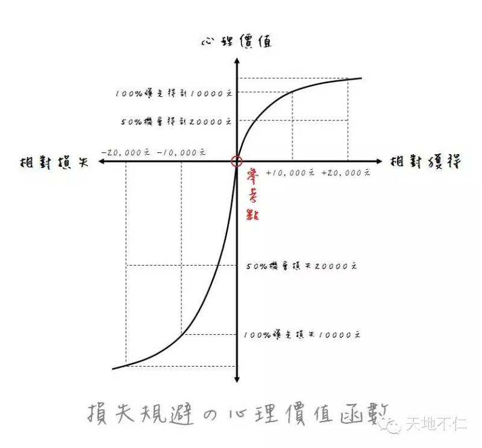

&emsp;&emsp;22.《快思慢想》-- 4.14

# 序
因为《万万没想到》以及《新卖桔者言》 多次提到Daniel Kahneman，再加上广告上说是继弗洛伊德之后最伟大的心理学家，且是诺贝尔经济学奖获得者，我买下了这本书。

本来想买简体版的，简体版的标题是《思考，快与慢》，不得不的说对于原书名《thinking，fast and slow》，简体版更贴切，但是繁体版更传神。比起繁体版来说，简体版便宜很多，差不多前者是后者的2倍价钱，但因评论说简体版翻译得很糟糕，而且有不少人都有这样的感受，于是买了一个翻译不错，但是翻译风格有争议的台湾版（因为译者是个心理学家，所以有些东西有点偏向他自己的观点）。我已经极其害怕再读到翻译很糟糕的简体书了，行文之晦涩，翻译之朦胧，简直会毁了一本好书。最好的办法是看原版，事实是我的英文阅读能力还是差啊，看起来太是费劲了。

一位心理学家获得了诺贝尔经济学奖，这个怕是很多“火箭科学家”难以接受的吧，因为我们总以为我们自己很理性，我们通过学习和认知，避免了很多误区，实际上，遇到了坑我们还是一直往下跳。

譬如大家炒股，明明说好了跌倒阈值一定割肉，但是大部分人做不到；明明说好了，盈利超过一定数量就要卖出，但是到了那个点心理又继续把哪个数量变大。面对损失，我们选择风险规避，面对盈利，我们选择追求风险，最好大部分的结果是损失会比预计严重，而受益比预计要小得多。这只是我们思维误区的其中一小部分。

# 眼见不为实

作者提出了我们思维模型是由两个系统组成：
- 一个是称为感性的系统一，反应非常快，直觉嘛，几乎瞬间就有结果的；
- 另一个称为理性的系统二，就是要通过思考计算，调出知识储备，相当费力之后才有结果的。

其实这个模型，还真有点像冯诺伊曼提到到，人脑分成**不可量化的模拟系统**与**高度数字化的数字系统**的假说一样。

作者设计并完成了大量的实验，（有说服力的实验，而不是那种为了结果而去故意设计的实验）。因为作者本身就在探索思考模型，通过理论来解释这些试验结果与我们的日常行为，这个过程和五常先生坚持的经济学要解释现实时间一样。

我们的心智会对**显而易见的东西看不见**，而且我们**看不见自己的看不见**，我们在数学测验时，交卷子的时候都是信心满满地，既是检查，也会遵循着自己想的那个方式去检查，直到发下卷子来，看到了红叉，然后万分懊悔的说我怎么能犯如此低级的错误。

看看这两个系统，明显就是系统一做预处理，然后系统二做校验，但是系统一提交了结果，不存在太大的疑问的时候，系统二会照单全收，相当于跳过了做校验的过程，只有系统一觉得不对路的时候，才会调动起系统二的校验功能。

思考是耗费精力的，当前最热门的AlphaGo如果只给它一块牛扒一大碗米饭来提供能量的话，它连开机都困难啊。实际上，我们遇到一些很简单的问题的时候，毫不思索的就会涌现答案，但是遇到一些棘手的问题的时候，你涌现出来的答案一定是个**在类似情景下你容易回答的答案**，所以问非所答是人类一项天生具备的技能。

那天和朋友聊中医谈佛学，朋友提到，不要相信你眼睛看到的。对于经典的Muller-Lyer错觉，你第一反应或许每一次都会觉得下面的线段比较长，其实你的系统二会说去量一下的，但是总会被忽略过去的，然后下一次看到这样的情况的时候，主动的告诉自己，不要信任自己的印象，他们是一样长的。

书上继续谈到，当你对一项工作变得熟练的时候，对能源的需求会越来越少，如果有好几个方式能达到同样的目标的时候，我们的大脑会选择能量最小的一条路径。比如打羽毛球，专业选手大量时间练习挥拍，跑动与跳跃，面对同一个来球，专业选手的反应和非专业选手的反应是不一样的，专业选手的练习几乎都是最优化的路径，而且这反应是相当熟练的，能量也耗费最少，非专业选手，就得重新思考调整去找到一条相对优化的路径，由于没有大量的练习，同一时刻能找到相对最优化的路径的机会是很小的。

系统二的调用需要注意力和努力，大量的使用系统二导致自我损耗增加，系统二的调用会变得更加困难，因为体内可以供系统二消耗的葡萄糖越来越少了。在面试过程中，疲倦和饥饿的面试官会容易倾向预设立场，就是系统一的直觉，这个时候，补充甜食会改善系统二的能量。中医说的“思则伤脾”，或许表达的也是系统二的长时间运作，会大量消耗能量，于是伤了脾。

同时，训练注意力和控制力也会降低系统二的消耗，正如专业运动员的专业训练，另外，打游戏机也会有相同的效果，我更加肯定了我的笨是来源于小的时候家里不让打游戏机！

# 假亦真时真亦假

**系统一有个癖好，会主动发散思维，接着创造一个因果关系，然后从内心接受它。**

所以其实每个人天生就是个有赌徒心理的人，天生就有追逐宗教的本性，通过视觉听觉会强化某些观点，企业文化也是因为同样的原理起作用的。

作为一个认知系统，对于某种不断重复的理论，即使是谬论也会接受的，时间久了，系统就无法区分出真假了，因此自我暗示的假话说久了，就会变得笃信了。

人会在不自觉的时候产生偏见，预置立场，所以通常说集思广益会出真知灼见，是必须有前提条件的，就是**这个群体是不具备偏见的，或者是没有共同的偏见的，一旦这个群体出现了共同的偏见，那讨论的结果害真不如个人决定的**。

在《哈佛商业评论》曾经有一篇文章，讲的就是所谓的有光环的高管，到底在企业决策中起到了什么作用，因为很多奇葩的商业决定，甚至公司破产，都是这帮有光环的高管做的决定。

所以做一个有前瞻性，相对思维上独立，能规避认知缺陷的老总，会比一帮智囊更强。好吧，回到我以前的观点，世界只有一个乔布斯，也只有一个杰克韦尔奇，好的公司和制度是因为有好的boss，不是有好的制度造就了好的boss。

统计学是一把双刃剑，尽管很多人会说，但是不见得大家都能认识到。因为认知模式的运作，对没有经过训练的眼睛来说，随机看起来是有规律可循的，很多时候，我们会说拿数据说话，但是那个数据究竟能不能说明问题呢？作者举例：
> 一项对美国3141个郡县做的肾脏癌的研究表明， 发病率最低的多半是乡下，人口稀少的州。

咋一看，我们的认识就会解释，乡下，污染少，压力小，添加剂少。

同一个调查还发现，

> 发病率最高的多半也是乡下，人口稀少的州。

我们还会辩解，贫穷，医疗条件不好，高脂肪的食物和过量的酒精。

比起人口稠密的州，只是因为人口稀少的州的样本比较小，某年可能出现了极端事件。如果多取几年的数据对比一下，再结合其它大样本数据，发现其实发病率是稳定的，并没有因为人口分布而产生变化。

正如某日，我在朋友圈看到一消息，说中国的公务员数量太多，机构设置太繁杂，我饶有兴趣的打卡，发现只是罗列了机构设置和人群总数，那如何说明是多而且是太多，如何说明机构设置繁杂，没有对比，没有更多的统计样本，如何能说明问题？但是却激发了不少人的情绪，对！这就是我们认知系统的缺陷，凭直觉，用了系统一，系统二也没把好关。

# 专家耍权术

人类发明了风险的概念，本意是为了帮助他们了解和应付生活中的不确定性，然后各种专家就应运而生。实际上，**当人们喜欢某件事物，便会把风险评估得很低，厌恶某些事，便会把风险评估得很高**。

评估的前提，就是要假设出现了什么情况，假设民众怎么选择，假设选择的结果，然后通过统计学出来评估意见。又是统计学，这些评估的事件，本身出现的可能的事件就很多。专家用他的喜好，筛选了事件，建立了自己的样本，从而支撑自己的意见。

专家也是有偏见的，甚至偏见不见的比大众小，书中写道“大众与专家，应该尊重对方的洞见和智慧”，所以界定风险是**权力的角力**，也是公共政策优先度不对不稳定的重要原因。

新闻媒体的报道，加上带有偏见的专家情绪，以及受影响的群众的情绪，再添加权力的角逐，一个有关公共安全（健康，饮食，恐怖事件）新闻是很容易酝酿出不合理的公共政策。因为认知系统的这样的工作方式，导致恐怖袭击对民众的影响会远大于袭击造成的伤害，恐怖分子知道，政府专家也知道。

作者曾在以色列建国期间，参与了军人能力测试的设计和评估工作。有飞行专家对他说，表扬一个飞行员，下一次他很有可能飞的没这么好，但是批评一个飞行员，下一次很有可能飞的更好。同样的理论，我们在生活中无数次的出现，但是只是因为每次飞行都是关于飞行员能力的一次随机事件，意味着**从统计学来说是关于他能力的一个回归，就是有时好一点有时差一点，基本都在回归线上**。

统计学的回归，大部分人都学过，但是能把现实出现的情况归结为事件的回归，而不是自己想象的伪因果关系。 即便是学过统计，关于**回归**和**相关**，或许自己也是不清楚的，我也是直到这一刻才明白，
- 回归是表征一种稳定的情况；
- 相关只是表征两个变量之间的线性关系；

虽然大部分时候是两条直线，但是却有着本质的区别。从经济危机出发，大部分专家并未预测到经济危机的出现，直到出现之后，就有很多马后炮的理论专家跳出来。人类总觉得自己可以预测未来，建立在了解过去的基础上，但是我们了解的所谓的历史，比真实的需要了解的历史少得多。马后炮的专家会过度夸大自己的能力，同时会培养出不从过程来着眼，以结果来评判对错。

马后炮效应对做决策的人，相当不利！一件事情失败首当其从的责怪决策者，哪怕决策是好的，执行坏了。然而，这个决策对了，大家几乎不会太感谢决策者。决策者不傻，这种明显的后果偏见，造就了“标准操作流程”，只要流程对了，结果无所谓，医生就是最常见的决策者。

**这种认知偏见会对不负责任的追求风险者不应该有的报酬，有理智的有前瞻性的人反而会被认为是胆小，差劲和没有作为。**同时，这种心态造就了众多的成功学作品，因为我们的认知系统对一个简单的成功或者失败的故事，忽略了运气和回归效应。

专家在什么情况下会比较靠谱呢？每个人对专家的认可度和期望值是不同的，但是如果符合下面两个条件的时候，我们认为是比较靠谱的：
- 一是有一个很规则可以被预测的环境，
- 二是从长久的练习中有机会学会这些规律。

在这个背景下似乎只有棋牌一类的东西是符合的，在**一个不可预测的世界去责怪别人未能正确预测**，或者**对某些因为专业而作出的信誓旦旦的预测深信不疑**都是不对的。在一个无法被预测的社会，专家的专业直觉的可靠性重要取决于**回馈的品质和速度**，以及有没有足够的机会练习，互联网＋就是这么一个行业。过度自信是系统一的特质，可以被驯服，但是无法消失。

# 生生谓之易

又回到经济学的效用的理论了，百努利认为10元对一个手里有100元的人的效用等价于20元对于手里有200元的人的效用。

然而如果两个人每人手里都有1000元，那么他们的感觉是一样的么？如果一个人昨天只有500元，今天变成了1000元，另外一个人昨天有2000元，今天有1000元，他们的心里感觉一定是不一样的。

作者认为，人的认知模型是有参考点的，递减的敏感度适用于感官和评价财富的改变，最重要的是人要**规避损失**，因为**损失带来的痛楚远大于获得**，简单的说损失100元的心里需要获得200元才能平复。这个观点就是作者最出名的一个理论，论文在1974年发表在Science上，作者命名为**展望理论**，这个理论是描述普通人在受到获利和损失情绪的立即影响。

同样的认知模型会导致**禀赋理论**的产生，这个理论源于有一位R教授（芝加哥大学商学院的院长），喜欢红酒，但是他购入红酒的价格不会超过35美元，但是有人要买他的酒的话，不超过100美元他是不会卖的，这是一个违背经济学理论的。于是瑟勒把这种**没有规律性买卖的，因为拥有某个物品然后对该物品的价格评估要大于没有该物品时候的效应**称之为禀赋理论，尤其对那些不可量化的东西，比如休假时间，生活标准。

有没有没有禀赋效应的人？有，穷人！在展望理论下，穷人的的生活在参考点以下，**很多物品需要但是买不起**，所以他们一直在损失中，任何赚到的钱都会看成**减少损失**，而不是获得，导致穷人的认知状态一直在相对损失的陡坡，或许就是所谓的“穷人的思维模式”的根源。

商人和穷人不一样，商人对得到和放弃中间的差异没有感觉，穷人认为**一切都是损失**，花在这个东西上的钱是另外一个东西的损失。

上图就是展望理论在财产得失的时候出现的选择状态，右上角就是人类很多**不幸的来源**，
> 面对不好的状态是，愿意去赌一把，以至于出现比预期更糟糕的结果，而本来可以选择一个可以比较确定的损失。

所以大家**在赢的领域规避风险，其实可以赚更多，在输的领域寻求风险，其实可以输更少**。

我们总以为满意就是幸福，其实这根本是两个概念，只是我们的认知系统偷换了概念。从一些调查发现，人们**经验的幸福是过他们想过的生活**，评价幸福往往知识评估自己当下状态的感受。

高教育程度和生活的高满意度连接在一起，而不是高幸福感，换句话说，你书读得多了，会让你想要的东西多，而不是幸福多了。贫穷会放大生活中其他不幸的经验，尤其是疾病。

收入的增加会增加你的满意度和幸福感，然而如果年收入超过75000美元约合人民币48.65万，暂且说50万吧，过了这条线之后财富的增加对你的满意度和幸福感的增加作用是很微弱的。

# 结语

如果想让自己变得更好，那就得多看看自己的局限性。初生牛犊不怕虎，说是这么说，然而小牛犊遇到老虎，无知无畏的话，大部分都会成为老虎的食物。那句互联网流行的话“贫穷限制了我的想象力”，不只是一种自嘲，也是有科学依据的。

法政路2016.4.15