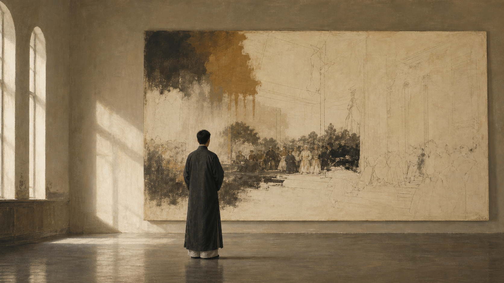
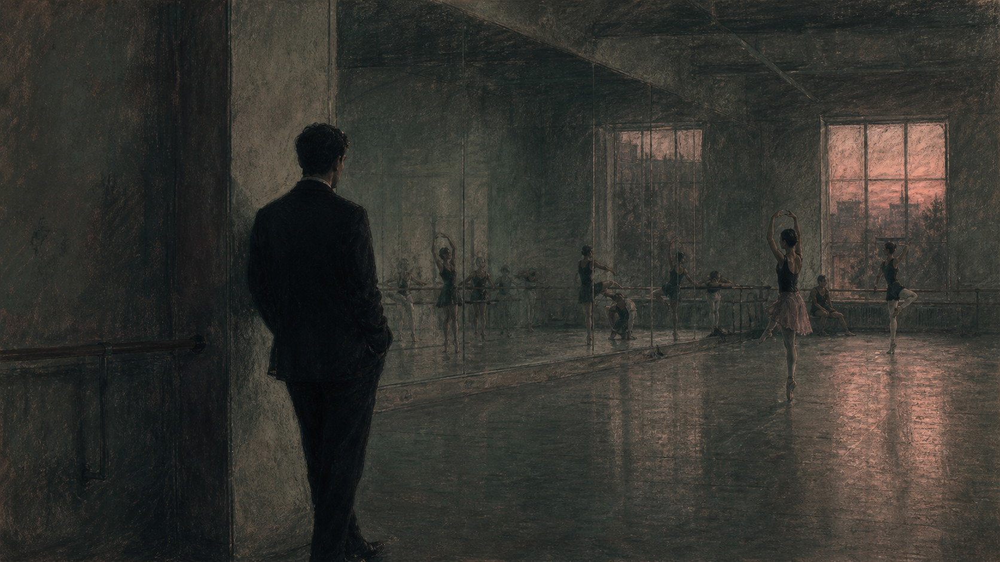
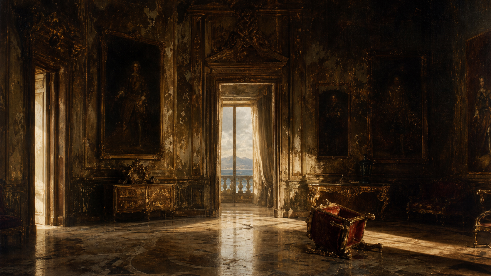
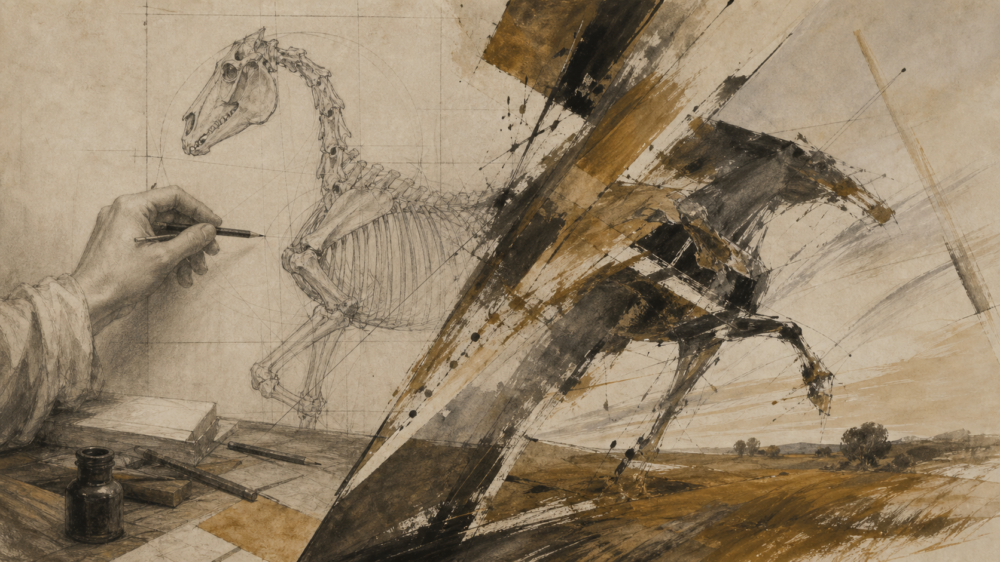
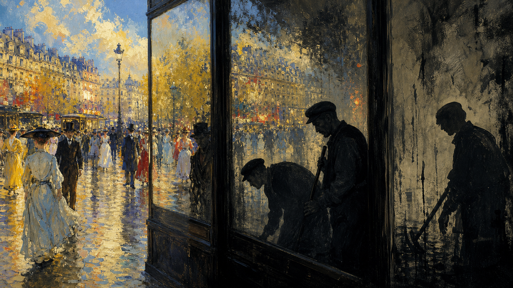
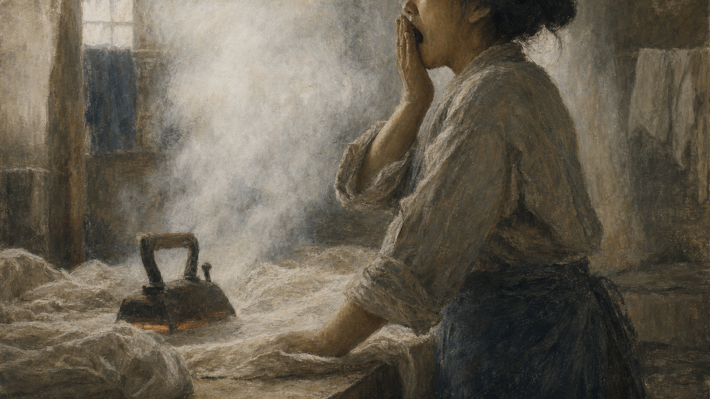
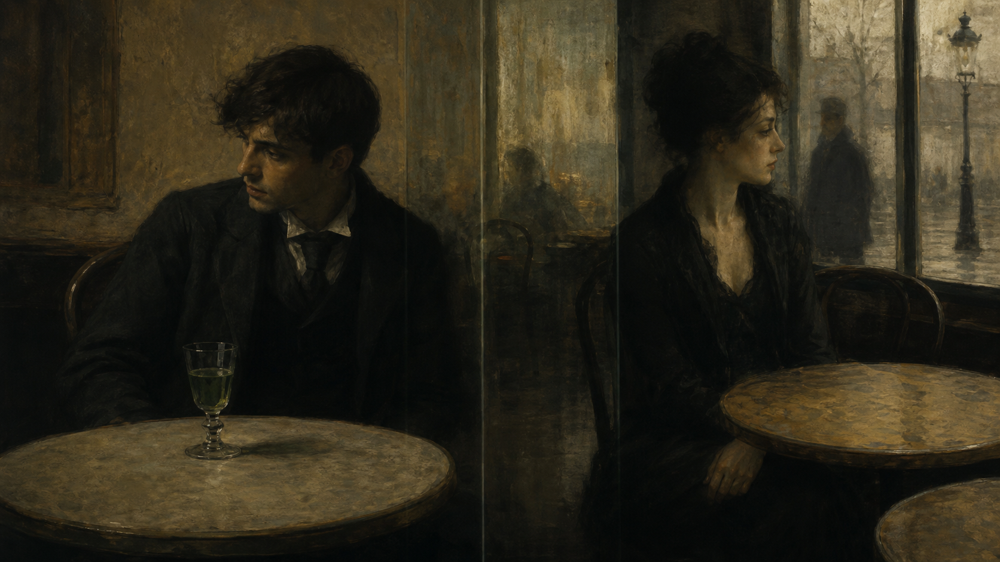
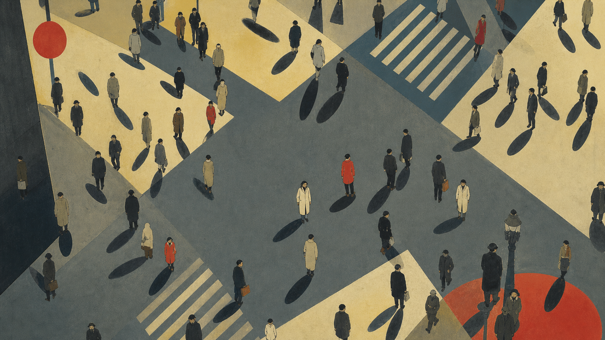
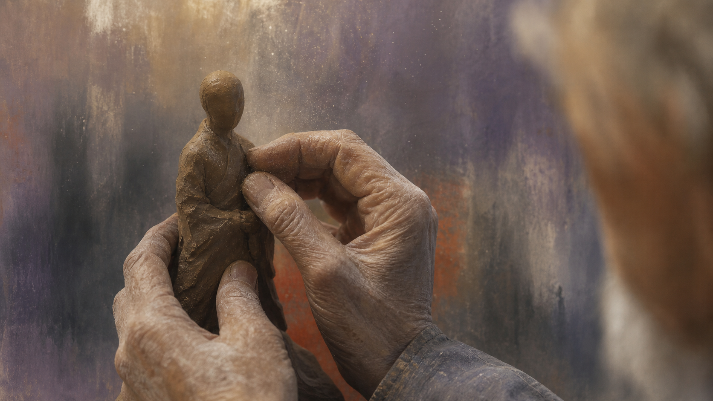
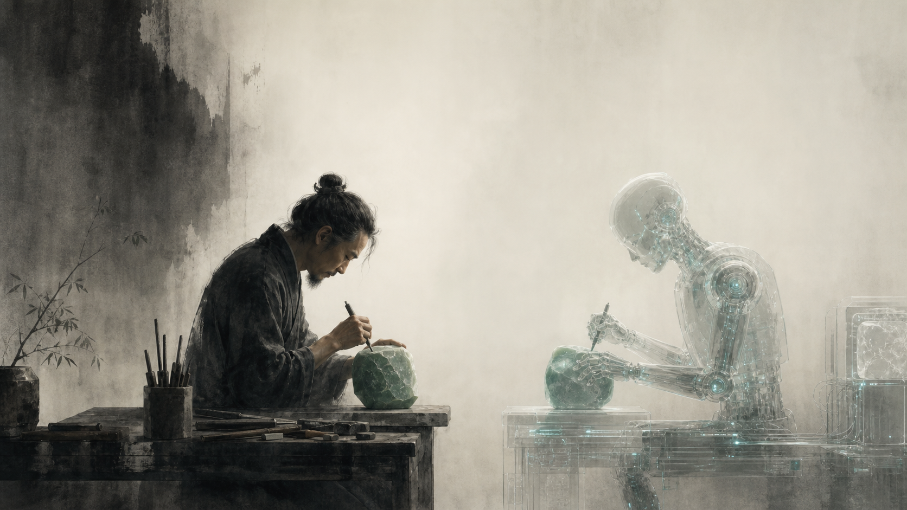

# 序

蒋勋是一位我非常喜欢的文化作家。在贵州工作的那几年，我看了好些蒋勋的书，无论是眼界上，还是对文化、对艺术的认识上，跟以前的自己相比都有了不少进步。

以前对美学和绘画都不太理解，后来通过蒋勋对整个绘画史的介绍，以及陈丹青的《局部》，慢慢地对艺术——尤其是西方艺术的萌芽、诞生和变化——有了粗略的认识。

有了这些认识，才能进一步去探讨：为什么以前看不懂德加之美？美学这种东西，似乎不仅仅是书上所写的作者想表达的内容，更重要的是要站在真迹面前。就像陈丹青说的，站在博物馆的真迹面前，用心去看、去感受，多看几遍，说不定那种感受就出来了。

<!-- more -->

# 疏离是繁华的另一面--《蒋勋破解德加之美》

蒋勋说，许多人把德加归类为印象派画家，但他坚决否认。虽然参加过印象派的活动，他却绝不承认自己是印象派，这让评论家们头痛不已。我觉得，这正是他的性格所在。

说来有趣，我感觉德加和加缪之间有一种跨越时代的精神相似。加缪写过《局外人》和《西西弗神话》——他成长于两次大战的阴影之下，而德加身处更早的工业革命时期，两人相隔近八十年，精神气质却有着奇妙的共鸣：

1. 加缪早期的作品文字细腻、传神、生动；德加早期的画作走古典主义路线，同样细腻传神。两人都从传统的基本功出发——加缪从写实文学起步，德加师从古典大师安格尔，从最基本的素描开始，一点点成长起来。
2. 更深层的相似在于，他们都是各自时代的"局外人"：置身潮流之中，却始终与潮流保持着审慎的距离。

德加在画布上捕捉到的那种都会疏离感，和加缪在文字中写出的"局外人"，其实指向同一种现代人的精神困境。

## 贵族血统与落寞底色

德加出身于富商家庭，他和印象派主要成员莫奈、雷诺阿的关系很奇妙——有时若即若离，有时又理念相同，好得不成样子。但蒋勋分析说，正因为出生于贵族世家，加上个性孤僻自负、难以与人相处，德加内心的落寞和复杂的绅士身世，或许没有多少人能理解。或许是他看尽了繁华，最终背叛了自己的贵族血统，审视繁华如过眼云烟，内心无比荒寂。

他拥有足够显赫的家世：逃亡意大利的贵族祖父，金融巨子的父亲，来自美国新奥尔良克里奥尔家族的母亲，嫁给拉布拉斯伯爵的姑姑，嫁给公爵的妹妹，经营棉花产业的混血舅舅。德加从小便在这样的贵族记忆里长大——家族一直在意大利南部那不勒斯拥有城堡和宫殿式的豪华庄园。在这种记忆里，荣耀辉煌与颓废败落交错，这或许造就了他的骄傲自负，也或许使他孤寂颓废。

然而，他当时说的是：他想做一名历史画家。他关心历史，关心家族血缘和文化传承，关心传统在个人身上积淀的力量。或许正是因为这种贵族身世带来的生活反差与阅历，在优渥的生活状态下，他内心的感受反而不易于直接传达出来。

## 不偏激的反叛者

莫奈、雷诺阿、西斯莱这些典型的印象派画家，大多诞生于 1840 年前后，年纪相仿。印象派运动发生时，他们刚过 30 岁。德加比他们年长些，在 1874 年第一次印象派大展时已经 40 岁了。相比于那几位几乎与巴黎的工业化、商业化一起成长、并全心拥抱城市文明的一代，德加显得格格不入。

他抨击当时国家美术、官方美术的保守，反对学院艺术僵化、不面对现实的态度，支持年轻一代，对抗主流美术霸道的垄断。但另一方面，德加在传统学院美术的优秀技法、人文涵养以及沉潜内敛的美术品质上，都下过极深的功夫。

由于他受到的训练都是古典传统的基本功，早期的画作能看出他在传统训练下的那种一丝不苟。即便在 40 岁时目睹了年轻一代的反学院运动，他也能保持不偏激的态度：给予鼓励，不失去自己的独创性，不盲目屈服于运动的宣言。

这大概是所有"反叛"中最难的一种——不是推翻一切另起炉灶，而是带着传统的根基，走进新的旷野。

## 色调与主题：繁华的反面

蒋勋一直在对比德加与印象派的画作，差异是鲜明的：

**色调差异**：印象派的画是绚烂的，写出了工业革命后那种繁华、美的光芒，所以几乎不用黑色调。而德加用了许多黑色调——从这种色调中能感受到，他并不那么受鼓舞，也不那么认同那种繁华。

**主题差异**：普通的印象派画家通常选择"美"的主题，无论写景还是描绘剧院等生活场景，至少是赞美的场景。但德加越往后越关注朴素的、甚至不起眼的场景——芭蕾舞演员的练习、风尘女子的生活细节、熨衣工的劳作，以及赛马的瞬间。

如果用现代的视角来看，德加可能是通过一种"定格"技术，瞬间记录下普通民众极具反差的生活画面。他运用了一些虚化、模糊的手段，画面不可能呈现古典主义那种极致的精美，但你能感觉到那是一个活生生的人。比如他与女画家玛丽·卡萨特交往甚欢时为人画的肖像，依然画得非常像，但他不再关注琐碎的细节。

虽然我并不是专业的艺术学习者，无法用专业的语言来表达感受，但我只想说：德加的画并不像照相机那样原原本本地描绘细腻精致的形象，而是通过一种既清楚又模糊的状态，展现人的关键特征。当他有具体指向时，你看得出是谁；但更多时候，他没有具体的指向，画的往往是人的背面或侧面，根本没有正面。即便有正面，你也只能看出性别和状态。

仅此而已。

于是，他通过画作这种特殊的形式不断地画。即便每一幅看起来似乎都是些不起眼的侧面或背面，主题也不那么明显，甚至有很多雷同的内容——选帽子的贵妇，熨衣服的熨衣工，野餐的妓女。这些作品记录的只是当时社会风俗中极不起眼、甚至"不入流"的小片段。但我相信，他的每一幅画作都倾注了极深的心思。

蒋勋在书的序里写道，德加是颠覆者、革命者，提出一连串对生命的询问。他不满足于历史总在原地踏步，难以归类——参加印象派，又说自己不是印象派。但仅仅从美术画派的角度看德加，或许不容易看清楚。他关心的是人——人才是他永恒的主题。是人、是人性，而不是人的身体。他画的不是身份，而是身份背后那个活生生的人：芭蕾舞者在练功房里疲惫的弯腰，熨衣工在蒸汽中打着哈欠，妓女在野餐时毫无防备的姿态——每一个不起眼的瞬间，都是一个人最真实的样子。

无论是贵族还是芸芸众生，回到人的原点，都是德加笔下关心的对象。在这样的情况下，或许时代成就了德加，德加也成就了这个时代。当然，这是从两百多年后的今天回望，相信德加当年是不在意别人对他的非议的，这是一种艺术家难能可贵的自信。

## 疏离是繁华的另一面

再往后，蒋勋在赏析《苦艾酒》（又名《咖啡馆的一角》）时这么写道：

> 工商业形成城市之后，大街小巷多了很多小咖啡厅，可以喝苦艾酒、喝咖啡，用一点简餐。可以约会朋友，也可以无所事事。农业时代的人们很难想象要花钱坐在咖啡馆，喝一杯不会饱足的、苦苦的黑色饮料。因为城市的形成，中产阶级需要娱乐、社交、休憩空间，咖啡馆才成为城市文明的新风景，成为生活时尚的新主题。

然而，在马奈、莫奈和雷诺阿的笔下，咖啡馆、小酒馆大多热闹非凡，拥挤着男女、侍生、淑女，灯光炫耀缤纷，每个人喜悦活泼，充满新的都会文明的蓬勃朝气。同一个时代的德加，表现方式截然不同。

画家更像是静静坐在咖啡馆的一个角落，静静看着午后的时光，看着眼前的陌生人。两名男女并排坐着——城市空间的形成使人和人很靠近，但不熟悉。陌生人并肩坐着，似乎各有心事，各在各的冥想，彼此无关，彼此疏离。

西方文明中现代人的疏离议题，第一次在绘画里被表现出来。农村文化不会有疏离，农村人口也不会有陌生人的靠近。疏离是都会繁华的标志：人群拥挤，热闹繁华，人却格外落寞。蒋勋进一步指出，画家德加捕捉城市风景的能力远远超过同代的印象派画家。

印象派捕捉的城市风景热闹繁华，多是表面视觉的繁华；德加却透视到了人内在的荒寂。蒋勋认为，德加把平凡的素材放进了哲学的思考：文明是什么？繁华是什么？为什么如此靠近又如此隔膜？为什么如此繁华又如此虚无？

这开启了现代美学和城市美学——去面对城市文明新的困惑和质问。文学里卡夫卡的《变形记》、加缪的《局外人》，戏剧里贝克特的《等待戈多》，都在触碰那种不能沟通的疏离感。许多关于城市文明的疏离主题，要到 20 世纪才会得到更精准的探讨，而德加却早在19世纪的绘画里就触碰到了——他是如此敏锐地感觉到了现代城市不可避免的心灵荒境。

加缪笔下的默尔索在母亲的葬礼上无动于衷，不是因为冷漠，而是因为他与周围所有人之间隔着一层无法穿透的东西。德加在《苦艾酒》里画出的，正是同一种处境——人与人靠得那么近，中间却什么也没有。只不过加缪用的是文字，德加用的是画笔，而他比加缪早了半个多世纪。

## 繁华过后的虚无

再谈后期。他画中那些戴帽子的女人，仿佛在时尚繁华的背后，看见了繁华过后的荒凉与空寂。

越到后期，女性时尚的主题越不明显。无论是戴帽的女性、女店员，还是一抹偶然涂在墙上的暗影，都没有实质存在的身体——那样虚幻，那样虚无。

晚年的德加视力严重衰退，几近失明。他不得不放下精细的油画笔，转向色粉画和蜡塑——那些触感比视觉更可靠的媒介。但即便在这样的困境下，他仍然没有停止创作。或许正是因为看不清了，画面反而愈发接近他心中真正想要抵达的东西：不是眼前的形象，而是形象背后那种说不出的况味。

这大概就是德加最终抵达的地方，真的做了一名历史画家，且有了自己独特的审美：画到极处，不是精美，而是空。

而这个"空"，恰恰是最值得今天的我们去想一想的——在一个技术能替代越来越多技艺的时代，什么才是技术替代不了的？

## 当技艺不再是门槛

其实每个时代真正搞艺术的人，都在思考人性的故事：是被解放了，还是被禁锢了？是被封闭了，还是自由的？这些思考会在作品中以不同的形式表现出来。

而更多的前卫艺术家，因为过于前卫，往往不能被当代理解。虽然作品留存了下来，但即便我们自己做不到那么前卫，多看看、多学学，去了解身处那个环境的大师们的想法和创作，也会让我们更好地思考当下。

如果工业文明到了现在这个阶段，随着 AI 的蓬勃出现，当许多技艺都不再成为门槛的时候——生而为人的观点在哪里？思想在哪里？人与文明之间的关系和传承又在哪里？当 AI 能够做题、讲历史、写文章的时候，人的能力又体现在哪里？

这些追问放在德加身上同样成立——只不过他那个时代的"门槛"，不是技艺被 AI 取代，而是艺术被市场裹挟。德加之所以能够那样淡定地去画画，让他的艺术不断向上走，至少在相当长一段时间里他是衣食无忧的。但更多的画家从事绘画是为了糊口。同样是绘画、同样是做艺术，有的是为了表达自我，有的是为了探索前卫，而有的真的只是为了养家糊口。

或许我们不能用同样的标准去要求每个艺术家。再者，艺术造诣终究是天赋，熏陶和训练只是让它浮现，而非凭空造出。

# 结语

这就好比一块玉石——如果不经过琢磨和雕琢，永远无法知道里面是否藏着玉器，也看不到玉的温润；但如果你本身就是块普通石头，再怎么雕琢，终究也只是一块普通的石头。

不过话说回来，谁又能在琢磨之前，就断定自己是玉还是石呢？
