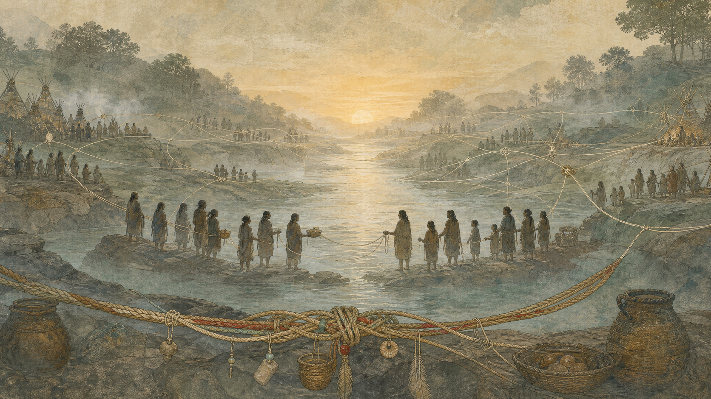
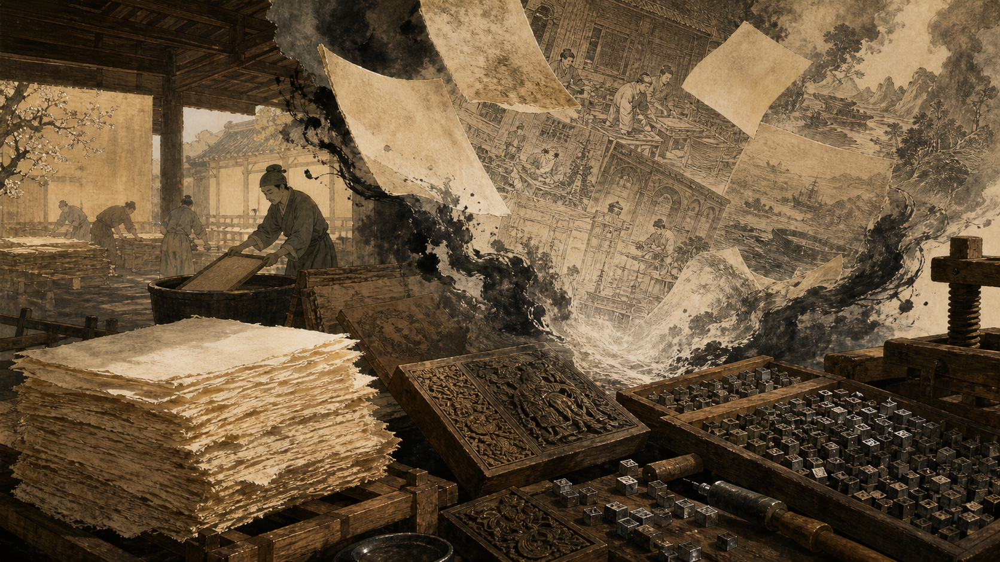

# 序

今天刚读完郑也夫教授的《文明是副产品》。合上书，脑子里反复回响的是两个字：意外。

外婚制、农业、文字、造纸术、雕版印刷、活字印刷——人类文明的六大里程碑，在郑教授的考证里，没有一个是人类为了"创造文明"而刻意做出来的。它们都是副产品。

<!-- more -->

# 计划之外——《文明是副产品》

上一次读郑也夫的作品，是《神似祖先》。那是一本写给普通读者的社会学通俗读物，看完之后，我对这位传统社会学教授的风格赞叹不已。

《文明是副产品》则显然是一部学术作品：措辞专业，引证严谨，对过往同一问题的各家研究，梳理得清清楚楚。按他自己在后记里的说法，早在 1993 年写作时，他就动过写"文明是个副产品"的念头；1995 年写《代价论》时，这个想法再次浮现。但这本书，一直到 2015 年才付梓印刷——一个念头，在心里养了二十多年。

他选了六个话题：外婚制、农业的起源、文字的起源、造纸术的起源、雕版印刷的起源和活字印刷的起源。这些看起来都是我们熟悉的话题，但郑也夫梳理了不同学者、不同流派的观点与研究，也给出了自己的判断。并不见得所有观点我都看得懂、都能同意，但至少在形成自己准确的想法之前，我暂且知道了：郑教授是这么认为的。

## 六大里程碑，皆是无心插柳

通过人类文明的这六大里程碑，郑也夫想说的是：它们都不是人类计划和目的的产物，它们是副产品。

当初的那些操作并没有这样的目的，其目的是制造另外一种器物，或者另外一种观念、另外一种状态。但正因为有了这些选择，它们在新的因子的推动下，生发出了远超预期的作用。

顺着书里的线索粗粗串一下：外婚制让族群之间得以联结，社会变得更庞大，人群变得更强壮，这为农业的起源打下了底子；有了农业，人们渐渐定居，游牧和野外采集变少了；定居与剩余产品又催生了交换和管理，商品生产和文字记录的需求越来越大，文字便应运而生……一环扣一环，而每一环结出的果，都不在上一环播种时的算计之内。

## 古腾堡时刻：印刷术是为了赚钱

书里关于"古腾堡时刻"的分析，特别有意思。

在中国这边，雕版印刷自唐代兴起，历经五代，到宋已相当成熟，工匠众多、成本低廉。相比之下，活字印刷在中国反而在经济上不划算——汉字单字太多，制备一整套活字的成本，远高于老老实实雕一块版。

而古腾堡那边虽然也有雕版的传统，但他们用的毕竟是拉丁文，需要制作的字母数量很少。更关键的是，印刷《圣经》及相关书籍是为了赚钱——在商业利益的驱动下，印刷术才蓬勃发展起来。他们并不是为了"发明印刷术"而做印刷术，纯粹就是因为赚钱。

这背后还有一层社会结构的差异。知识在从前是垄断在上层的：中国的官刻书籍，多为经史典籍和科举士子的学习材料，官家印书，通常也不怎么指望牟利。而古腾堡那边有自由民，有相对活跃的商业生活，在逐利动机的驱动下，反而把这项技术推向了更远大的发展。

倘若不为了挣钱，就不会有古腾堡印刷术的诞生。你看，连"知识的普及"这样的大事，也是逐利的副产品。

## AI：我们这个时代最大的意外

这本书成书不到十年，AI 的爆发，几乎给"副产品"理论添了一个最新的注脚。

当年谷歌团队提出 Transformer 架构，本是为了改进机器翻译，并不是为了训练出能够人机对话、能够"听懂人话"的大语言模型。谁也没有想过，Transformer 在一定的语料上训练之后，竟然可以获得有意义的输出；这套注意力机制加深度神经网络，能够真的帮人干活。这种状态是从来没有人预想过的，完全是工程技术上的一个意外。

虽然辛顿（Geoffrey Hinton）几十年来一直笃信神经网络这条路，但如果不是 OpenAI，如果不是 GPT-3 的训练展现出了这样的能力，大家可能都不会相信——尽管当时大家都在研究。从某种程度上说，这个例子未必十分准确，但当年研究 Transformer、研究人工智能的人，期待其实并没有那么大，完全没有预料到后来会有这么长足的发展。

昨天跟几个朋友聊起尤瓦尔·赫拉利的《智人之上》，重新看待文字的出现、信息的传递，以及后续这些里程碑式的文明成果，两本书恰好可以相互印证。也看得出，各家的文化与文明在不断交融，技术传播来、传播去，又结合不同的生活场景和文化土壤，共同推动着社会的进步。

## 先安身立命，再读"无用"之书

读完这本书，另一个对我触动很大的点，落在读书与谋生的先后上。

在 AI 蓬勃发展、书籍空前丰富的今天，我们或许首先得找到一份安身立命的工作。对普通家庭、普通学子来说，学理工科可能有更好的就业前景；在有了一份稳定或相对合适的工作之后，再不断提升自己各个方向的人文素养，或许是更务实的路径。毕竟，书是看不完的。

而像社会学、历史、人类学这些领域，需要不断地学习和研究，做这方面的学者确实辛苦。最近耿同学揭露了一些科研上不好的做法和风气，换个角度看，那也是人家的谋生之路——只不过这种价值观和方法不可取。本质上，普通人还是要先掌握一门过硬的谋生技能（无论挣多挣少），然后在不必为生计奔波的闲暇里，去读点别的书。这可能是更好的选择。

当然，很多人未必会选择阅读，而是看视频、打牌，或者做别的很多事。并不是说这些爱好不好。只是如果从目的论出发，把阅读当作一种技能来看：读某些人文书籍、读工作以外的书，未必直接对工作产生促进；但间接来看，它的"副作用"恰恰是提升了你的工作能力和综合能力——副产品的逻辑，在一个人身上同样成立。

话说回来，有个前提：本职的技能得先立得住，在工作和工艺上精益求精。在此之上，用额外的时间多读些书，作为副产品，它或许反过来会成全你的工作。至少对我来说，确有这样的感受。

## 宏大叙事：点不着火，却能救人

这是这本书给我的又一重感受，也是对我自己非常重要的一个。

在很长一段时间里（包括最近），我都更关注小人物角度的叙事，更关注自己身上发生的事，忙于应对那些日常琐碎、耗尽精力、让人焦虑的遭遇。

但最近的一些经历让我感到：在经历过纷纷扰扰、纷杂繁琐的工作和小事之后，宏大叙事依然需要我们去关注。琐事会让你焦虑，让你手足无措，让你难以承受心情的低落和情绪的低谷；而或许只有回到宏大的叙事里，人才会为之一振，愿意跳出当下的困境，去看一看更多的事物，换一种思路去思考问题。宏大叙事给你一种寄托，让你有机会跳出原来那个狭隘的小叙事。

很多人遭遇打击之后走不出来，就一直消沉，停在那儿了。有人过几个月、几年才走出来，有人一辈子都走不出来，也就那么回事了。宏大叙事的作用，恰恰就在这个地方。

它跟哲学一样——你说它有没有用？大部分时候，它既点不着火，又办不成事。但在这个 AI 年代，你在构建很多东西的时候，恰恰需要一些哲学来温暖人心，需要哲学来对齐人的需求。所以，这也是个副产品啊。

## 向源头去：与《圆桌派》不谋而合

还有一个让我感同身受的地方。最近把《圆桌派》最新几集看完，在后半部分，窦文涛讲出了我近来的感受：为什么先秦、汉代、魏晋时期的那些花纹和器具，看起来就"孔武有力"，能给人一种美的冲击？为什么越往后，这种冲击力反倒没那么大了？

不断往中华文明的源头上去挖掘，确实是一件很有趣的事情。文涛是这么想的，其实我也是这么想的，还真是无独有偶。

所以，搞理工的、搞工科的，真的需要有一些人文的关怀。看看历史，感悟一下过去的故事和文明的流变，能不能给当下的自己——无论是做人做事，还是思考事业、思考孩子——一些启发和启示？多一些人文的视角，比如社会学，也能让我们更好地处理人与社群之间、人与人之间的关系。

# 结语

立足于工作之外，书还是需要读的。不管有什么别的爱好都好，都不应该挤占阅读的时间和机会。

只是无论怎么说，能静下心来阅读的人确实越来越少了。AI 的能力越来越大，不得不说，人的危机感也就越来越重。当你什么都不想，突然受到冲击的那一刻，就像雪崩来临时——没有一片雪花是无辜的。到那时，就不要抱怨太多了。

文明是副产品，一个人的成长又何尝不是。那些看似无用的阅读、绕了远路的思考，未必能直接兑换成什么，却会在某个意想不到的时刻，成为托住你的那块雕版、那枚活字。愿我们都能在"无用之用"里，攒下属于自己的副产品。
