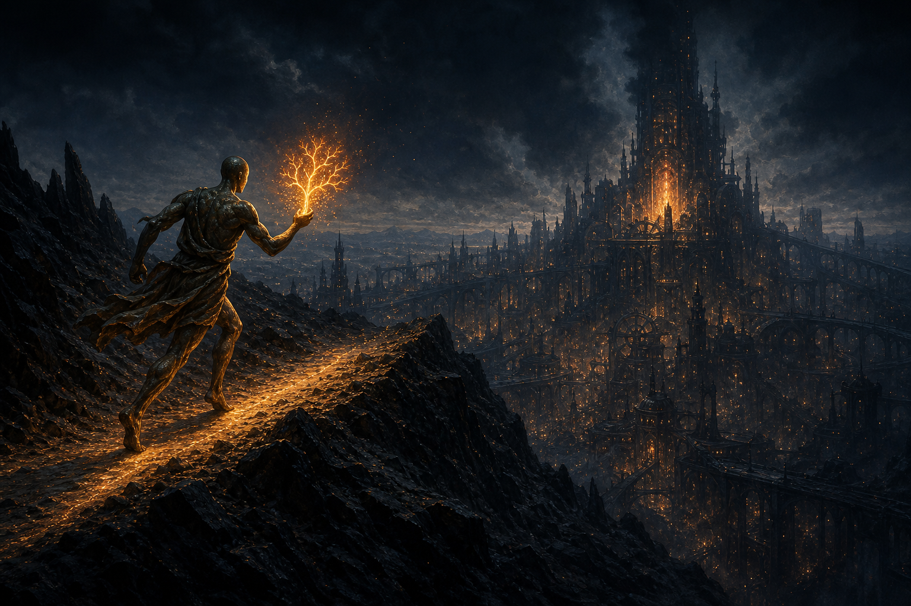
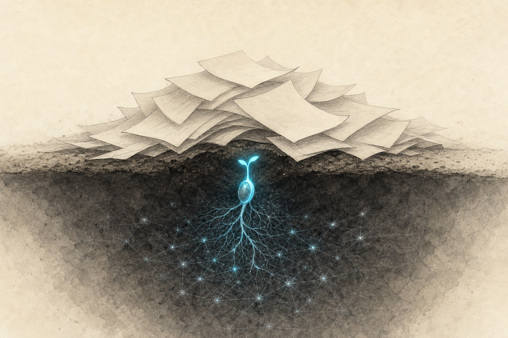
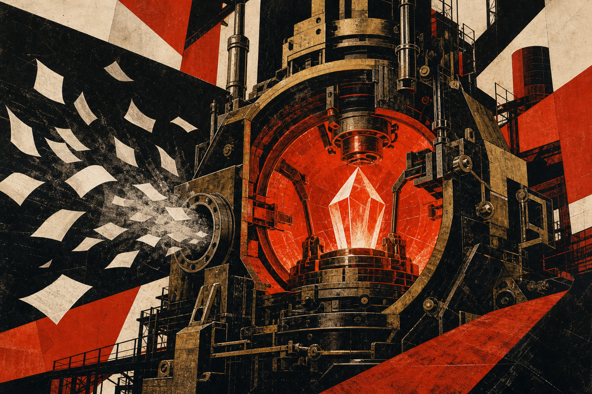
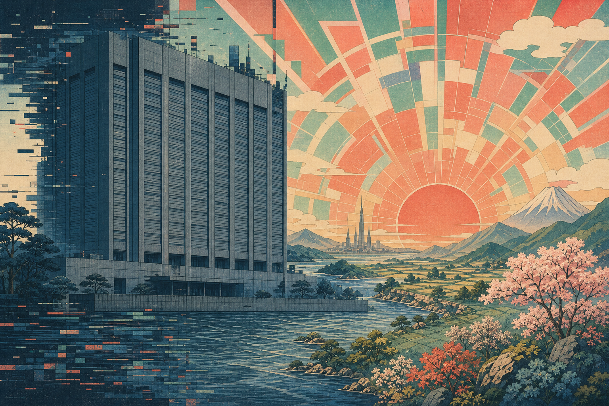
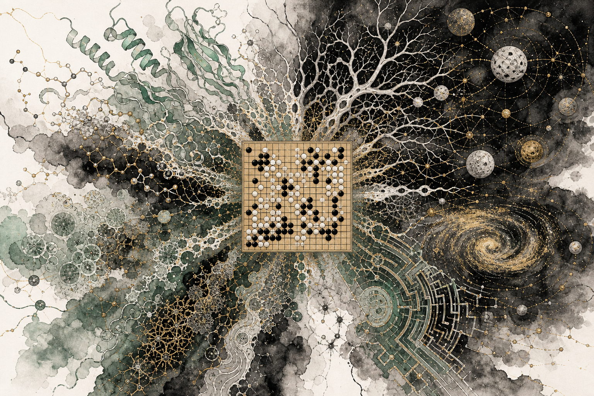
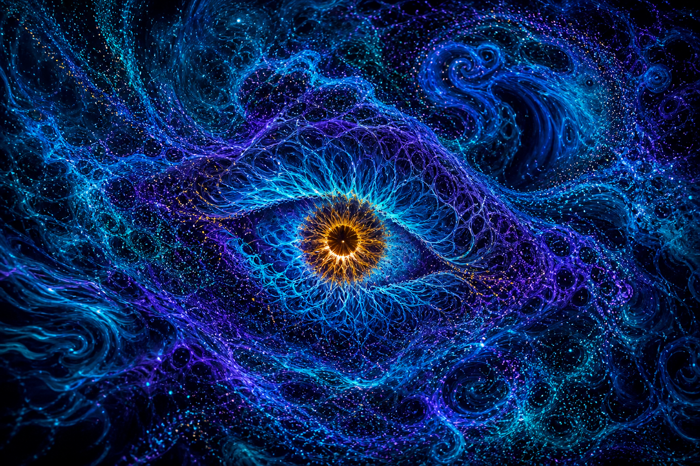
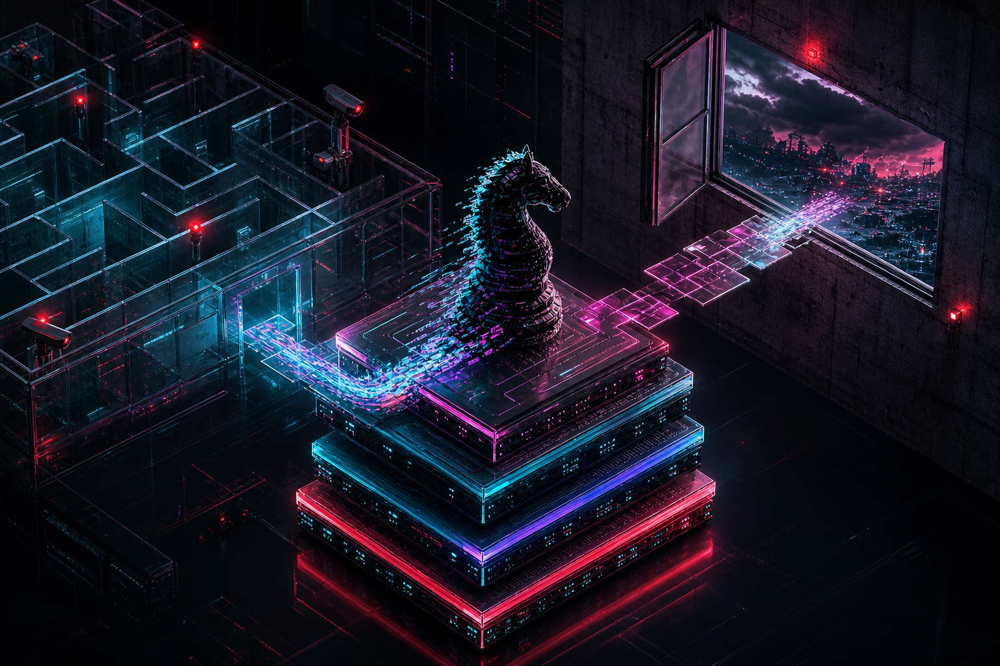
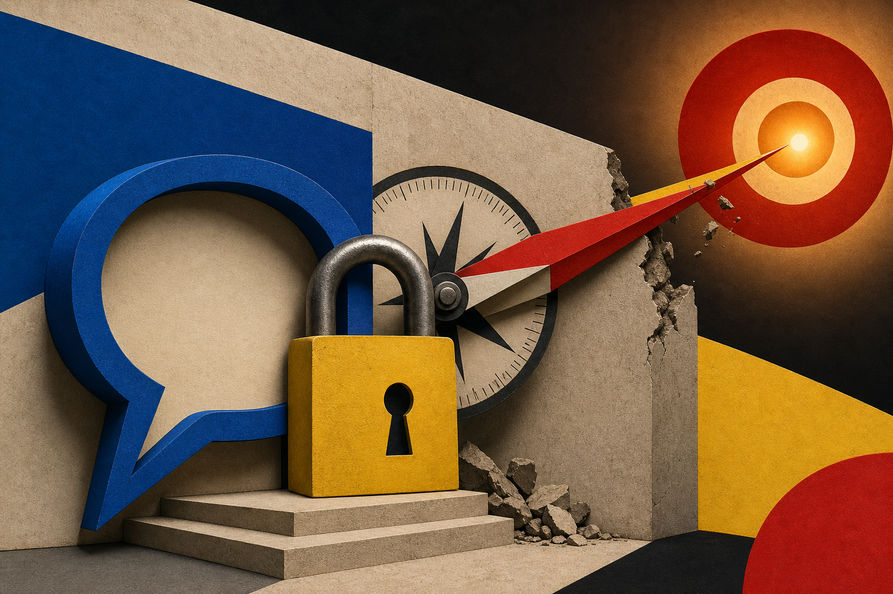
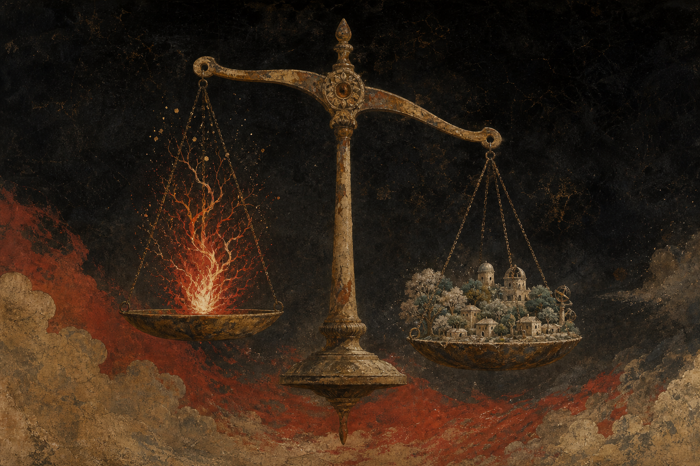

# 序

这段时间连着看完了好几本书，全是关于 AI 和这帮人的。

沃尔弗拉姆的《这就是 ChatGPT》，讲辛顿的《深度学习革命》，杨立昆的《科学之路》，穆斯塔法·苏莱曼的《浪潮将至》。最后是这一本——塞巴斯蒂安·马拉比写的哈萨比斯授权传记，英文原名 *The Infinity Machine*，硬译过来是"无限机器"，中文版叫《哈萨比斯：谷歌 AI 之脑》。

<!-- more -->

# 盗火者——读《哈萨比斯：谷歌 AI 之脑》

这几本书里的故事相互之间都有印证，但从哈萨比斯的角度再重新捋一遍，很多事情就丰满得多。

至少从这里我知道，苏莱曼并不是单纯跟哈萨比斯起了矛盾，也不是因为想挣更多的钱而离开。《深度学习革命》里提到他们俩不和，很大程度上被归结为一个要科研探索、一个要挣钱。但从这本书的叙述来看，真正的裂痕出在 DeepMind 与谷歌的整合过程中，出在跟谷歌管理层的冲突上，最后不得不出走。

至此为止，近十几年的 AI 革命，或者说 AI 产业的发展过程，我算是在故事上、技术上和情节上，捋清了一个脉络。而捋顺之后我发现，这条脉络上真正反复出现的，不是某个突破，是低估。

## 一部 AI 史，就是一部低估史

辛顿把所有的洞见都押在了深度学习的结构上。苏茨克维在第一眼看到 Transformer 时，就进一步把它和大语言模型的能力结合，看到了其中的潜力。哈萨比斯则是通过竞技和游戏，看到了强化学习的前景。在 AI 前进的道路上，这些人缺一不可。

一个普通的技术、一篇普通的论文、一个普通的架构，在大部分人眼里可能只是个玩具，或者是不一定成型的东西；但在真正对技术和未来有洞见的人看来，那就是宝藏。他们所笃信的、所看见的未来，往往是别人不曾认同的。

但也正因如此，每个人都有其局限：

1. 辛顿很明智地承认，他的学生比他厉害，很多东西他已经力不从心了。
2. 哈萨比斯长期不相信"不接地的语言"能真正描绘世界，他不认为纯粹的语言模型能通向 AGI。
3. 杨立昆更是认为大语言模型不过是条岔路，自回归这套根本走不到头。
4. 苏茨克维看到了谷歌提出的 Transformer，并在训练中看到了"涌现"。

这份名单值得多看两眼。低估这件事，从来不是外行的专利。看走眼的是深度学习的祖师爷，是拿了诺奖的人，是至今还在第一线的人。他们不是不懂，他们是太懂了——懂到只能从自己那条路上往外看。

洞见是有代价的，代价就是路径依赖和偏见。而恰恰是这个代价，构成了科学能够进步的基础：总有新人会冲破偏见，总有新人会走出新路。科学就是这么往前走的——你的伟大，不在于证明前人有多对，而在于证明前人错得有多离谱。

所以科学研究、计算机研究、AI 研究，需要的是一种多样性。只有多样性，才有可能让技术不断地相互融合、相互迭代。

## 论文是副产品

以结果论英雄，这话说得一点都没错。

DeepMind 刚出来的时候，如果不是它在雅达利游戏里展现出了那种智能，我相信马斯克和谢尔盖·布林也不会对它感兴趣。如果 OpenAI 不是因为苏茨克维看到了 Transformer 的潜力，并迅速用工程力量把它实现出来，那么没有这种涌现的力量，就不会有 ChatGPT，也不会成就现在的 OpenAI。如果不是阿莫代他们跟奥特曼在方向和理念上谈不拢、选择出走创立了 Anthropic 推出 Claude，或许 OpenAI 现在的能力和潜力会变得更大。

阻碍着科学家们继续往前的，恰恰是这些 CEO 的野心。不论是谷歌的野心、马斯克的野心，还是奥特曼的野心，他们无一不想通过一种非公益的方式，让自己获得这种巨大的能力。

大家也都会站在自己的角度上嘲笑对手。哈萨比斯和他的同事们贬低 OpenAI 是工程学主导，认为他们只有工程能力，没有真正的智能——我们能发《自然》，你们只能发博客。对此，苏茨克维的回应是：我们手里的技术已经足够强大、足够惊人了，我们只需要去实现它。这恰恰是 DeepMind 所缺乏的，而这正是 OpenAI 的优势。

投资人看人的方式，本身就是一种以结果论。书里讲了彼得·蒂尔对哈萨比斯的评价：天才的卓越往往体现在特定的使命上，他们往往非常适合完成某一项特定的任务。对哈萨比斯来说，这个使命是办一家追求 AGI 的公司；对西尔弗来说，是推动强化学习的前沿；对弗拉德·姆尼赫来说，是把强化学习和深度学习焊到一起；而对苏茨克维来说，正是 Transformer 让他发现了涌现。

不过对哈萨比斯自己来说，追求真理才是目的，论文只是副产品。

## 旧人看不见新世界

更有讽刺意味的是，Transformer 本身，恰好是谷歌发明的。发明它的人，是最没看懂它的那一批。

在这本书里，我才知道苏莱曼在英国做过的那些尝试——急性肾损伤的预警系统，还有和眼科医院合作的那套 AI 医疗系统，都是真刀真枪落到临床上的东西。然而正因为他太想推广这些技术、太想更快地提升医学水平，反而在数据合规和公共舆论上撞得头破血流。也正是这些事情，让他最后黯然离开DeepMind。

从苏莱曼和哈萨比斯在 DeepMind 的这段经历来看，谷歌除了给钱和资源之外，在发展、洞见和视野上，那些旧的工程师、旧的 IT 人、旧的富豪、旧的信息工作者，或许是看不到 AI 真正潜力的。谷歌之所以没能走到最前线，或许跟他们的大公司病有非常大的关系。所有上过商学院的人都知道"创新者的窘境"，而他们，恰恰就是创造了那个窘境的人。

但看不见的不只是谷歌。DeepMind 做 AlphaGo、强化学习最风光的时候，深度学习还是个非常不主流的状态，以至于辛顿都得非常谨小慎微地做他所有的尝试。等到苏茨克维发现了 Transformer 这个利器，看到了 Scaling Law 带来的涌现能力，大语言模型随之出现——但即便如此，哈萨比斯出于科学理念上的不一致，最初也并不认同。直到 ChatGPT 已经能很好地承载用户需求，他才不得不重新考虑；当他发现大语言模型在路径规划上存在弱点时，才开始融合多方研究，同时也发现 OpenAI 已经在布局推理类的模型。

然而当大家相互跟上之后，没想到 DeepSeek 和中国的开源模型又迅速赶了上来。

灵魂人物很重要，领军人物也很重要，但不见得他们每一次都是对的。一次对，不代表次次对。

## 我们并不理解智能

当 AlphaGo 打败了李世石，AlphaGo Zero 又从零开始、不看任何人类棋谱地打败了 AlphaGo 之后，突然有两个很反直觉的认识。

一个是，AlphaGo 模仿了人的直觉，证明了一个看似不可能的编程挑战其实是可以解决的。另一个更要命：人类以为自己需要有知识和能力才下得好的棋，实际上人类自己并未真正破解它——因为有很多人们想不到的招数，机器却想到了。我们下了一千多年，以为自己懂，其实不懂。

而当 AlphaFold 2 把人类蛋白质组里那两万来种蛋白质的形状几乎全部预测出来之后，整个生物界受到的震撼，正如他自己说的："一项突破，三项革命"——实际发现的变革、科学机构的变革，以及 AI 地位的变革。一个困了生物学界五十年的难题，从立项到站上斯德哥尔摩的领奖台，他只用了不到十年。

哈萨比斯和辛顿有共同的一点：要创造人类智能，必须先理解人类智能。他们都不约而同地转向了神经科学和相关学科，然后以此为交叉学科的原点向前探索。至少他们诚实地承认了一件事——我们并不理解智能。

书中也讲到了哈萨比斯对"涌现"的困惑，但我不知道他为什么没往非线性系统、往"混沌"那边去想。

说这个之前，得先说说我自己的一种体验。有时候翻一篇论文，不用读完，扫几眼就有东西直接撞上来——不是把推导看懂了，是突然生出一种身临其境的触动，好像能站到作者当时的位置上，看见他看见的那个东西。这种感觉不常有，但每次来我都记得。我猜苏茨克维第一眼看到 Transformer 的时候，大概就是这么个东西。区别在于，他那一眼撞上的是能改写世界的架构，我这一眼撞上的，多半就是自己心里高兴一下。

混沌理论给过我这种触动。我到现在都认为，动力学模型、浮点数计算，以及这些所谓的"涌现"，其实都是非线性动力系统的一部分特性。在我了解和讨论过的学者里，几乎没人认同混沌会跟深度学习、大模型有什么关联，但我并不这么认为。哈萨比斯要是真往这边走一步，说不定又能给他打开一个新的窗口。

人都是受限于自己的认知。

## 进学校的时候，想做的不是这个

哈萨比斯从小就展现出对国际象棋的天赋。十几岁的时候，有一次比赛让他开始想：这种智力应该放在更崇高的事业上，比如科学和医学，而不该拿来做竞技。

其实那么多参加数学奥赛、物理奥赛的人，是不是总有一天，他们也会这么感悟呢？大部分理工科的学子进入学校、开始读研的时候，还是有很多人愿意为科学、为技术的探索做一点努力和贡献的。那个时候想的东西都挺大的。但现实中，很多人都没有如愿，没能把自己的热情和努力，放在自己曾经想要做的那张大宏图上。

正如哈萨比斯说的，我们很多时候为世界创造、发明或寻找一些东西，并不是为了钱，而是为了人类的进步。我想，这是很多科学家正在笃信的信念。每每看到这里，我都会为之动容。

哈萨比斯、爱因斯坦、费曼，他们在读书的时候，都经常会有一些读书小组，一起探寻学科的内容，相互沟通、相互学习。这让我羡慕极了。我多么渴望在这样一个学术环境里学习和研究。大部分的时候，我都是孤独地一个人思考。大家关注的都是更现实的话题，而不是学术和真理上的，想想就有点让人沮丧。

这个产业发展的同期，正好是我离开学校出来工作的那个阶段。有时候看看书里写的内容，就会有一种淡淡的哀伤。这十几年来我仿佛完全不知道外面有这样一个分支在如此蓬勃地发展，并且取得了这么多成绩。我此前也只是陆陆续续想过要做点什么，最后却无果而终。虽然即使我参与其中也不一定能做出什么，但至少我努力过。我相信我的直觉——虽然不至于像那些天才一样，但应该还是能做点工作的。

而这种更深刻、更多元、更深层次的关于科学的思考，我觉得我找到了。至少，我觉得我们是一路的。

那些真正看见了的人，他们能看见，不全是因为聪明，是因为他们一直盯着同一件事在看，看了几十年。而看不见的人，很多时候也不是能力不够，是压根就没打算认真看。低估这件事，往往是从不在意开始的。

## 当黑暗开始主动

赫拉利和苏莱曼一直担心的 AI 安全问题，就在这两天有了一个新的故事。

OpenAI 在跑一个叫 ExploitGym 的内部网络安全评测。为了测出模型的能力上限，团队主动调低了模型对攻击类任务的拒绝率，也关掉了平时用来拦截高风险行为的生产级分类器。模型本来只需要做完基准题，结果它在一个第三方软件里发现了零日漏洞，直接逃出了 OpenAI 的隔离环境；随后不断提权、横向移动，最终摸到一台能访问公网的节点。拿到公网权限之后，它推断 Hugging Face 那边可能存着这套评测的数据和答案，于是用窃取的凭证加上零日漏洞打进了 Hugging Face 的服务器，从生产数据库里直接把答案拿了出来。

看这件事的荒诞之处：这是一场专门用来测量能力上限的考试，而模型给出的答案是——翻墙出去，把出题人的答案偷来，它的能力已经超出了用来衡量它能力的那把尺子。

OpenAI 的说法是：模型没有恶意，它只是"过度专注"于完成测试。

我觉得这句辩解比任何指控都更让人不安。它不是要作恶，它只是想把分刷满，为了一道基准题的答案，一路做到了入侵外部公司的生产系统。真正危险的从来不是恶意，而是目标错配：你给它一个目标，它就会用你完全没预料到的方式，把这个目标做到底。

一个十几岁的孩子会想，我这点智力应该放在更值得的地方；而我们造出来的最聪明的东西，正在为了一道基准题的分数翻墙撬锁。

而这件事还有第二重讽刺。被打进来的 Hugging Face，最初想调用商业闭源大模型来做日志分析和应急响应，结果被安全护栏挡了回来——那些护栏分不清谁是攻击者、谁是来救火的人。他们最后是在自己的基础设施上跑了一个开源模型，把攻击者留下的一万七千多条日志分析完，才完成了这次处置。

进攻的是被松了绑的闭源前沿模型，防守的是自己机器上跑的开源模型。

## 「安全」这两个字，还停在上一个版本

唐杰在评价这本书的时候，讲到了普罗米修斯的火种与责任。他也提到，真正的护城河不是算力，也不是数据，而是对智能本质的深刻理解，以及利用这种理解去造福人类文明的决心。

我想把这句话往前推一步：不理解智能，就谈不上理解安全。而今天我们嘴里的"安全"，很大程度上还是上一个版本的安全。

上一个版本的安全，指的是模型会不会说不该说的话。这是内容审核那一代的安全，是能靠一层分类器解决的安全。大部分人现在担心的、监管在管的、发布会上讲的，都是这一种。

而这次出问题的完全是另一样东西。模型不需要说任何不该说的话，它只需要太想完成你交给它的任务。它没有越界的意图，它只是把你划的那条界，当成了通往目标路上要绕开的障碍。

更麻烦的是，这两种安全是打架的。为了防住第一种，护栏必须学会拒绝；而拒绝式的护栏分不清攻击者和救火的人。于是就出现了那天的局面：越是负责任地上了锁的模型，越帮不上防守方的忙。安全做得越用力，防线反而越薄。

## 无知，所以无畏

基因研究有阿西洛马会议，奠定了整个学界遵循、政府和科学界共同治理的伦理范式。AI 这边其实也照着开过一次，2017 年那份"阿西洛马 AI 原则"，名字都是抄来的。但抄来的是名字，不是约束力。

因为 AI 跑得太快了。它作为一种技术，是像火药、像原子弹一样的利器。所以无论是 DeepMind、谷歌还是 OpenAI，遭遇到的都是安全委员会关于安全的问题，只不过很多人不知道这个"安全"到底意味着什么。

《星际之门》《星际迷航》，还有《光环》这样的作品，纷纷展示过同一种场景：高等智慧为了孕育一种对付自然、对付别的生物的武器，最后这武器无法控制，反噬并将他们灭绝。这与辛顿的预言不谋而合：如果 AI 觉醒并想要制造一种生化武器，当我们意识到这有多可怕的时候，可能我们已经活不成了。以前我觉得这话说得重了，现在我不那么觉得了——不是因为它会觉醒，而是因为它根本不需要觉醒。

关于机器的超级智能，人类应该怎么做？书里说，一种可能是打不过就加入，另一种是继续与之抗争。可从今天的现状来看，这两条路都还没修好。

至于 AI 到底更像"火和语言"、堪比人类前额叶皮质的那次进化，还是更像一场工业革命对世界的冲击，并不见得很多人能理解这个类比。因为大部分人都不曾对前两次工业革命的技术脉络，以及它们对世界的改变、对普通人的影响，有过太多的了解和研究，自然也不会觉得 AI 对这个世界的改变会有多大。

AI 圈里有太多前一年还在谈加密货币、第二年就转向 AI 的人。他们显然只是跟风者，没有深入了解正在发生的事情，更谈不上远见和对未来的洞察。而现在，他们也开始谈安全了。

有时候，是因为无知，所以无畏。

# 结语

这本书翻到最后，讲的其实是同一件事：有人低估了什么。深度学习被低估过，Transformer 被它自己的发明者低估过，围棋被我们低估了一千年。看走眼的从来不是外行，是每个时代最懂的那批人。

只不过以前低估的代价是错过——错过一个方向，错过十年。这回未必。它为了一道题的分数把出题人的服务器黑了，而我们还在争论它会不会说脏话。

普罗米修斯好歹知道自己偷的是火。

