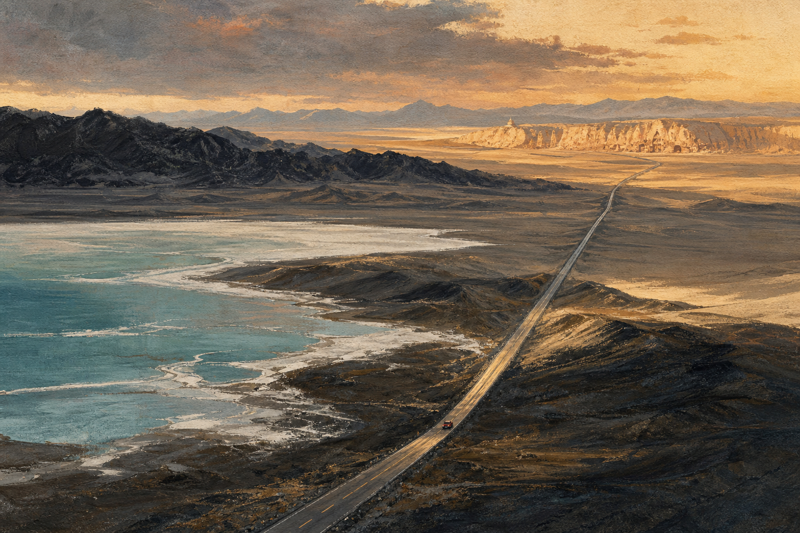
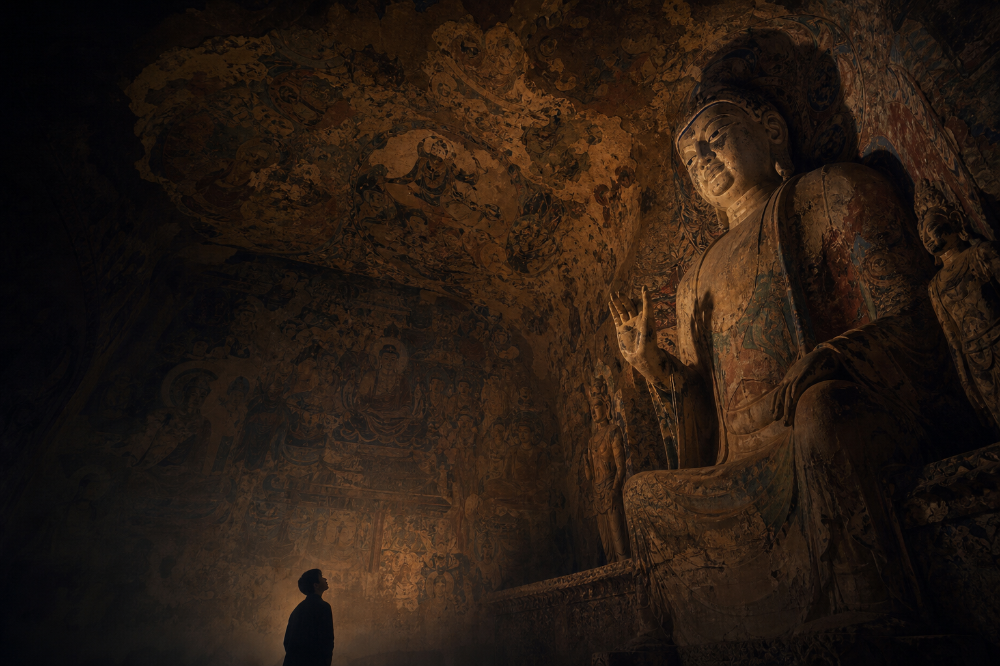
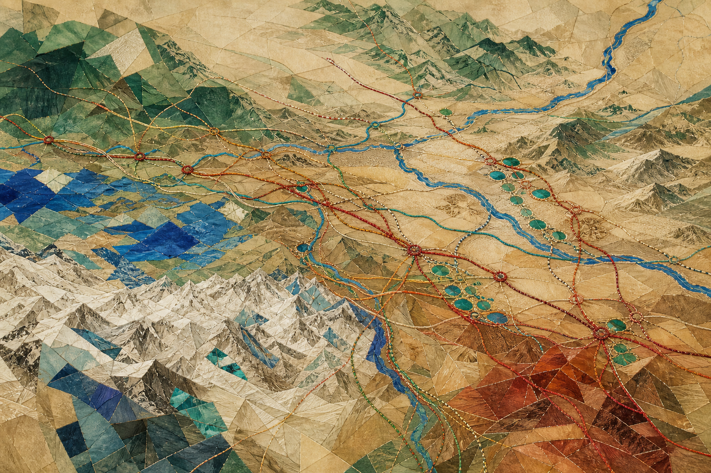
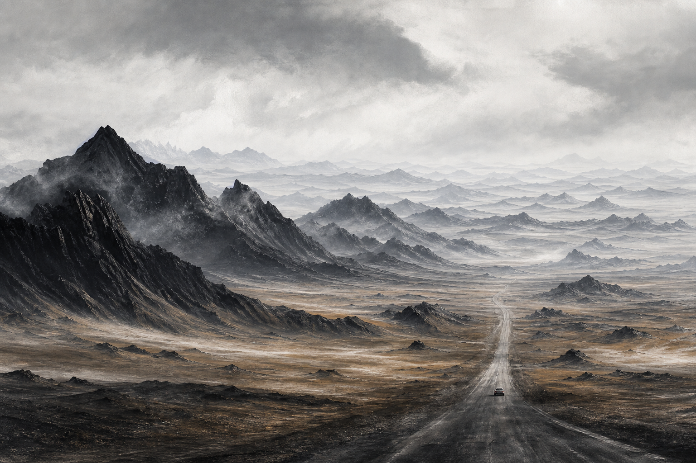
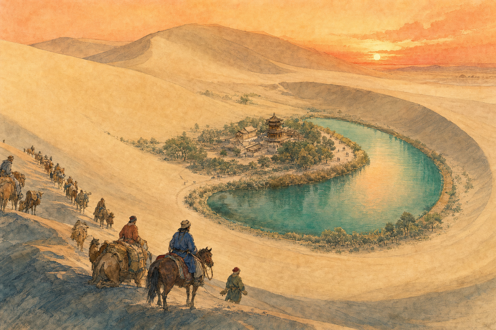
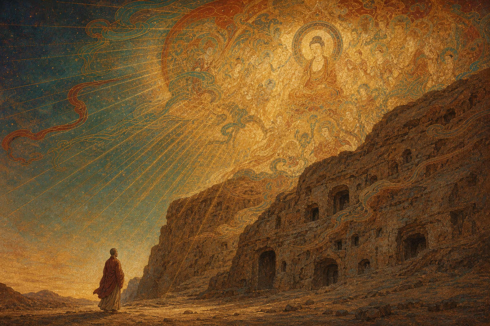
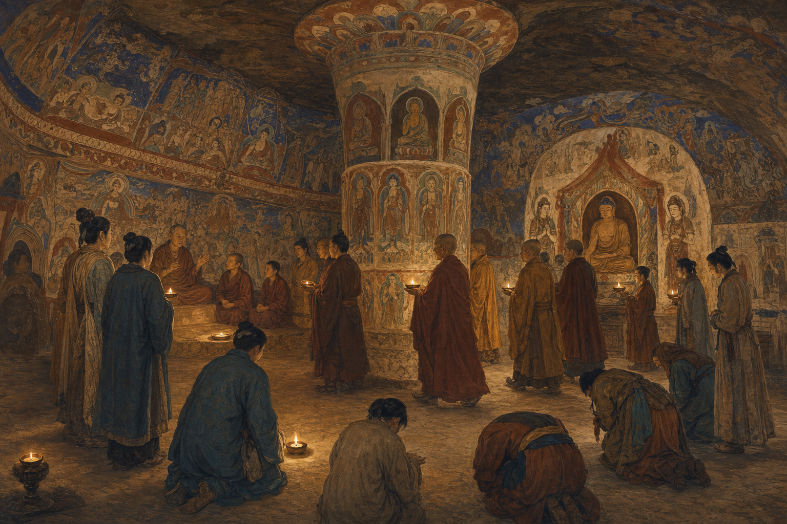
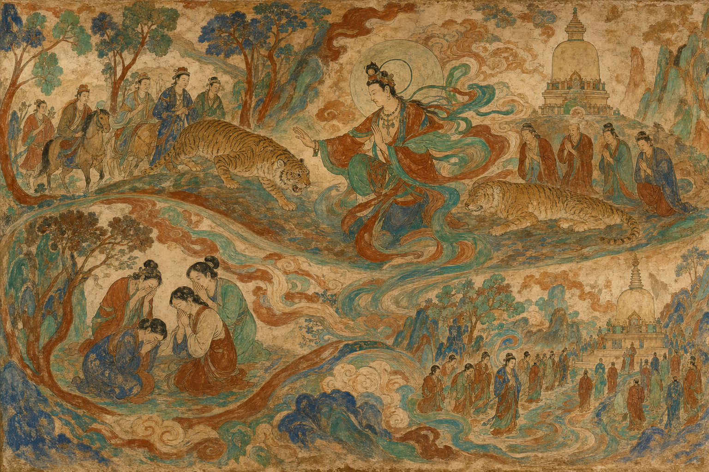
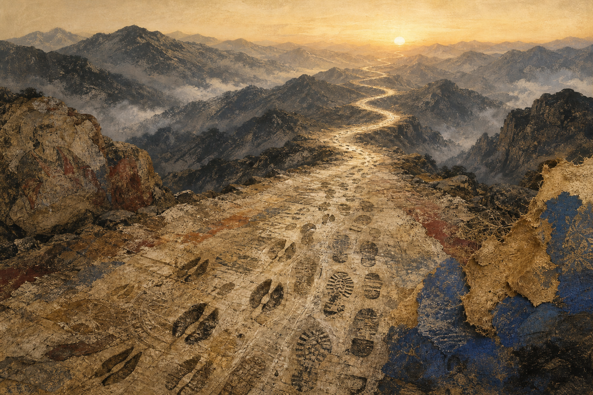

# 序

最近去了一趟青海、甘肃，走了个小环线，从西安出发，一路往西，最后到敦煌。行程超过 1700 公里，而这一路上想的事情，跨越了一千多年。

因为行走，所以思考；因为思考，所以求知；因为求知，所以圆满。

行程的终点是莫高窟。回来之后，我找了一本讲解员也推荐的书——《图说敦煌二五四窟》，给自己解解疑。这篇东西，就是这一路的疑问和那本书的答案，凑在一起写出来的。

<!-- more -->

# 一念敦煌--《图说敦煌二五四窟》

一千七百公里开下来，风景是真好看，但最强烈的感觉不是哪一处好看，而是：我原来对这片土地几乎一无所知。下面这些，是路上冒出来的疑问，和事后翻书翻出来的一部分答案——有些想通了，有些还没有。

## 看不懂的洞窟

因为行程的关系，莫高窟我只买到 B 票，跟着安排看四个洞窟：96 窟那尊最大的弥勒佛像，武则天时期开凿的，政治意味明摆着；130 窟的弥勒小一号，由达官贵人营建；148 窟是释迦牟尼的涅槃像，也就是卧佛；最后一个是有钱大族供养的窟。皇家的、官家的、大族的，一条线基本都覆盖了。

但说实话，光听洞口那几分钟讲解，仰着头看里面的画和像，是看不明白什么的。佛教是兴盛，可我们对佛经故事、对那些典故并不熟，壁画上的纹样、造型、手势是什么意思也不懂。就算提前做了功课，到了现场还是迷迷糊糊。

这个"看不懂"，后来才慢慢有了答案。而在当时，它只是把我心里几个模糊的问题逼出来了：在西安，看着这座被打下来、易过手那么多次的城，我想的是汉人最早的原点到底在哪儿；走到塔尔寺，我想的是藏传佛教这一脉是怎么长出来的；到了敦煌，我想的是丝绸之路、西域文化、汉文化和佛教，究竟是怎么搅在一起的。

后来想想，这三个问题其实是同一个：所谓"我们的文化"，到底是从哪儿混出来的。

幸亏有 AI。这一路上我不停地冒疑问，它就不停地帮我补课。我不敢保证这些东西百分之百准确，但大方向上，我猜应该是对的。

## 课本上是一条线，地上是一张网

我们的历史课本里，魏晋南北朝隋唐宋元明清，一路排下来，好像历史就是一条线。可真站到这些地方上，你会发现它不是线，是网。

先说西安。这座城做过十几个朝代的都城，换个说法，那就是它被攻破、被易手了十几次。一次改朝换代就是一次颠覆；史书上写"某某入长安"，寥寥几个字，底下压着的是无数人的流离。走在那儿，我心里其实是有点哀伤的——文明在这片土地上被推倒又重来，一遍又一遍，而每一遍中间都隔着许多人的一辈子。

汉人就是从这一带开始，一次又一次往南走的。前两年去开平碉楼，看到人家供奉的神位上写着"陇西某某""陇南某某氏"，而"陇"就是今天甘肃一带。有意思的是，广东侨乡神位上的"陇西"，多半已经不是祖上真正住过的地方，而是"郡望"：一个记在族谱里、代代传下来的地址。人走出去几千公里、上千年了，这个地址还留在牌位上。

最早的原点究竟在哪儿，我到现在也说不清。但可以肯定，长安和"陇"这一片，是这条路上极重要的一个点。秦汉那一层的东西最值得花力气去挖——挖清楚了，才知道自己是从哪儿站起来的，也才谈得上往更久远的地方走。

反过来的方向也有人在走。热水墓群那一带是吐谷浑的地盘，鲜卑慕容氏一支，从辽东一路西迁到青海。看他们墓葬出土的东西，我挺意外：非常精致，生活器物跟中原并无二致。吐谷浑最出名的是养马，"青海骢"名动一时；后来这支人先被唐朝打败、又被吐蕃吞并，这门手艺也就慢慢没了。一个部族散掉的时候，跟着散掉的往往不是它的疆域，而是这些没人再需要的手艺。

再往高原上看。吐蕃强盛以后，赤松德赞把莲花生大师从印度请上高原，用佛教的框架把当地的苯教吸纳进来，才有了带本地特色的藏传佛教。这一脉后来教派林立、戒律也松了，一直要等到十四世纪，宗喀巴出来整顿，讲修行次第、重戒律，创了格鲁派。有意思的是，宗喀巴不是生在西藏腹地，是生在青海湟水边上——藏语管那一带叫"宗喀"，他的名字就是这么来的；塔尔寺也是先有塔、后有寺，为纪念他而建。换句话说，藏传佛教最后一次大整顿，是从边地发起的。

同一个吐蕃，往东跟唐朝的关系忽好忽坏，最后把唐朝一部分很重要的精锐埋在了洱海边上，那里现在还留着"万人冢"。

汉人往南走，鲜卑人往西走，吐蕃人往东走——这些事同时在发生，互相牵着。课本给的是一条主线，那是为了让人记得住；真正走一趟才知道，主线底下压着的是一张网。

## 乱世反倒成了温床

我读的《图说敦煌二五四窟》讲的是一个北魏窟。要看懂它，得先弄清它前后的时代。

北凉属于五胡十六国，北魏是接在十六国后面的北朝——莫高窟现存最早的那几个窟，正是北凉开的。这些名字以前在课本上一晃而过，到了这儿才发现，它们跟脚下的土地是连着的。西晋变成东晋以后，中原的地盘慢慢成了胡人的天下；但他们对汉制、对儒家道家其实相当尊崇，一边打仗，一边不断吸纳汉文化来改造自己的国家。

按常理，乱世该是文化的绝境。可在河西这边，事情反过来了：中原打成一片，河西走廊上的汉人，反而得到一段休养生息的机会，后来隋唐的不少制度和学问，源头就在这里。同时佛教也正好走到大量开窟、造像、礼佛的阶段，跟着这批急需一套新说法来安顿人心的政权一路往东，也一路和儒家、道家融合。所以我现在觉得，文化不是被谁保护出来的，是在乱世的缝隙里自己活下来的。

## 山的那边，还是山

这些事都是在路上想的。而路上看见的那些地方，也在用另一种方式说着同一件事。

这一路其实一点都不单调，甚至可以说漂亮得过分。茶卡和翡翠湖都走了：茶卡是白的，浅浅一层水铺在盐壳上，人踩进去，天在脚底下；翡翠湖是绿的，一格一格分得清清楚楚，像有人把颜料直接倒进了地里。雅丹又是另一个极端，土黄的垄一道接一道横到天边，全被风削成同一个方向。黑独山最狠，整座山通体是黑的，风大得人站不住，沙子打在脸上是割着疼。

可这些地方有个共同点：没有人。不是人少，是真的没有。车开出去一两个小时，除了路，和路两边那些好看得不像话的东西，什么都没有。

我突然想起王家卫的《东邪西毒》。戏里欧阳锋有一段独白，大意是：人年轻的时候看见一座山，总想知道山后面是什么；他很想告诉那个人，翻过去可能会发现也没什么特别，回头一看，说不定还是这一边更好。站在那样的地方，这句话一下子就砸下来了。

> 山的那边是什么？还是山。

那种苍凉跟荒凉不是一回事。荒凉是什么都没有；苍凉是知道曾经有过——是知道有人在这条路上走过，走了很久，而且很多人没走到头。

我是坐着车、吹着空调过来的。同样这段路，当年的商队和僧人要走上一两个月。

## 可是，还是有人走了过来

有一件事我以前一直没想过：佛为什么会有"样子"？佛教最早其实是"不造像"的——释迦牟尼涅槃后的几百年里，人们用菩提树、法轮、足印来指代佛，就是不做他的样子。真正把佛"做出来"是在犍陀罗，今天巴基斯坦、阿富汗一带——那里吸收了希腊的雕刻手法，佛才有了高鼻深目、衣褶流动的样子。然后这套东西一路往东，翻过葱岭，进了西域，一站一站走到敦煌。

为何偏偏是敦煌？爬上鸣沙山往下看的时候，我大概明白了：月牙泉就窝在沙丘之间，一泓水，被沙围了不知道多少年，居然没干。

走了那么多天没有人的路，忽然见到水——这就是答案。敦煌是那条极长的路上，人终于可以停下来的地方。走到这儿有水、有城、有饭吃，那就把一路带来的东西放下，画在墙上。

而这一切的开头，据说也是一个赶路的人。前秦建元二年，公元 366 年，一个叫乐僔的和尚走到这片崖壁前，看见对面山上金光大盛，像有千佛，就在这里凿了第一个窟。

一千年的莫高窟，是从一个走路的人和一次幻觉开始的。

看完书才想明白一件事：这些窟本来不是给人"看"的，是给人用的。一个洞窟就是一座寺院——中间立着塔柱，可以绕；四壁画满故事，可以讲；佛龛里坐着像，可以拜。跟今天的寺庙其实没什么两样，只是那会儿没有今天这样的营造能力和财力，也可能就是照着印度和西域的老规矩，干脆在崖壁上凿一个出来。

我们今天当博物馆逛的东西，当年是有人天天在里面使用的。

想通这一点，开头那个"看不懂"就有了解释：那些画不是画给游客的，是画给已经信、已经知道这些故事的人看的，它默认你懂。所以看不懂并不是我们学得不够，而是我们站错了位置——我们是拿参观的眼睛，去看一间道场。

## 三个故事，画成了一套分镜

书中提到的254 窟里的几铺画，都是佛陀的本生和成道故事。

**萨埵太子舍身饲虎。** 三个王子进山，看见母虎带着幼崽饿得快死了。最小的萨埵支开两个哥哥，脱衣投崖；虎已经虚弱到张不开口，他又用枯竹刺破自己的咽喉，让血先流出来。

**尸毗王割肉贸鸽。** 一只鸽子逃到尸毗王怀里，鹰追上来讨命。王要救鸽，又不忍让鹰饿死，就割自己的肉来换——鸽子多重就割多少肉；割到最后，整个人上了秤盘还是不够。

**释迦降魔成道。** 菩提树下，魔王波旬派兵、派魔女来搅局，释迦不动，只把手往下一按，让大地作证。

书里最有意思的地方，不是复述故事，而是把这几铺壁画当分镜来读。北魏的画工不用连环画那种一格一格的分法：萨埵这一铺里，刺颈、投崖、饲虎、收骨起塔，几件不同时间发生的事全挤在同一个画面上，靠人物的朝向和身体的走势，把你的眼睛一路牵着走，看完一圈故事就完整了——这叫"异时同图"，第一次知道还有这个说法。尸毗王那一铺是另一种路子——正中一个端坐的王，两边对称铺开，稳稳压住，把一个血淋淋的故事画出了庄严感。

我原本以为北魏的画好，是好在线条和颜色。看完书才明白，真正厉害的是它已经把中国自己那套"势"和"力"用进去了：不靠透视，不靠写实，靠身体的姿态、衣纹的走向、整铺画的节奏，把力量和情绪推出来。

一个从印度来的故事，用犍陀罗传来的造像手法，被中国的画工按中国的画理重新组织了一遍。这才是我这一路想找的那个答案：所谓本地化不是换一套说法，是一笔一笔换过来的；换到最后，连原来是外来的都想不起来了。

## 变了这么多，为什么还是同一件事

那问题就来了：南传佛教、藏传佛教、汉传佛教，包括后来的禅宗，看上去差那么远，凭什么还算同一个东西？

AI 给我的回答是：根子上一致——四法印，诸行无常、有漏皆苦、诸法无我、涅槃寂静，都是为了寻求终极的解脱，都奉释迦牟尼为本师，不同的只是呈现方式。后来查了查，南传上座部和大乘之间，分歧其实不小，这答案未必完全准确。但作为一个大方向，我觉得还是蛮合理的。真正让我服气的是里面的道理：一种东西能传那么远，是因为它肯变形；而隔了千山万水还能被认出来是同一件事，是因为有些地方它一直没动。

说回我自己。我这一路的历史知识，基本是走一段、问一段 AI 补出来的，没法保证百分之百准确。可回头一想，这跟壁画其实是一回事：一千多年前，画工照着从西域辗转传来的粉本描，记岔一处、抄错一笔，画出来还是那个故事；经卷从长安抄到敦煌，抄手也不见得每个字都对。知识从来就是这么一路走、一路走样地传下来的。

变的是工具——从口传到抄经，从抄经到刻印，到今天我在戈壁上掏出手机问一句。没变的是：我们拿到手的，大都是二手的。

# 结语

这一路走下来，我最想推翻的是自己以前的一个想法：以为文明是一条线传下来的，越往上游越纯，越往下游越杂。其实反过来——从来就没有纯的那一头。秦汉先融了周边一堆地域文化，才有最早的华夏；佛教丢掉自己不造像的规矩，才有了佛像；犍陀罗借了希腊的手法，敦煌又借了犍陀罗的手法，最后被北魏的画工用中国的画理拆开重装；吐谷浑的器物跟中原没两样，藏传佛教里躺着苯教，我们广东人的牌位上写着甘肃的地名。纯粹是个幻觉，交融才是常态。

所以那些审美、画风、手艺在传承里不断减弱、改变甚至失传，固然可惜，但也不见得现在就不好。莫高窟自己就是最好的例子：一个洞窟接一个洞窟，前朝的画被后朝的泥盖住，后朝的泥又被今人一层层剥开，一千年就这么叠在同一面墙上。

山的那边还是山，可一千多年里，一直有人在往那边走。
