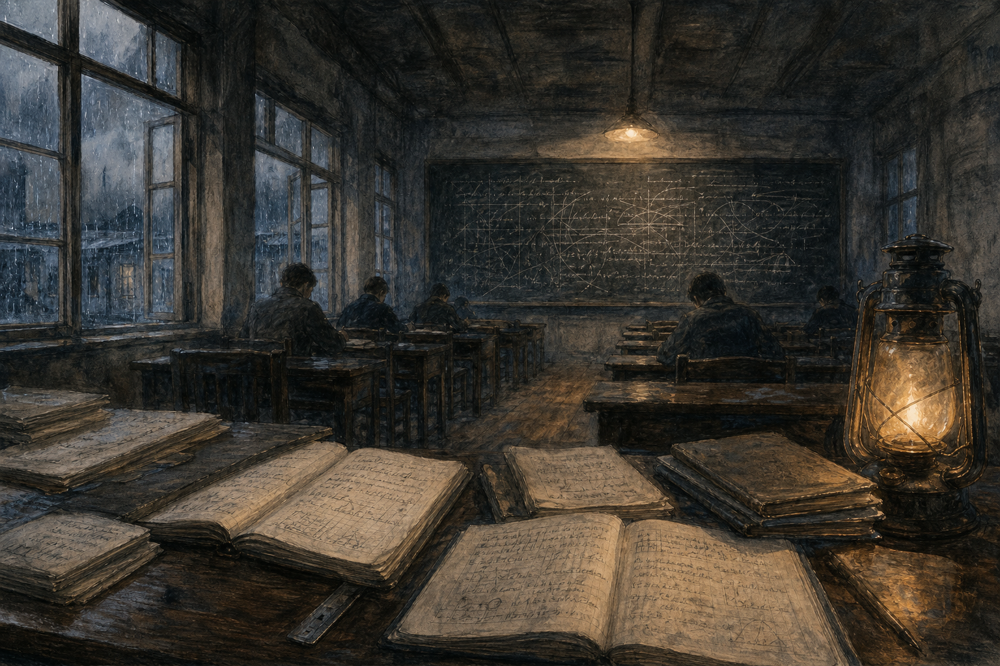

# 序

在一位历史专业的朋友推荐下，我读了历史学家何炳棣的自传《读史阅世六十年》。字里行间，我对民国年间清华那批考取庚款、公费留美的大师的风骨，又添了几分敬意。

<!-- more -->

# 一代风骨——从《读史阅世六十年》说起

读这本书，最先打动我的，是一些特别具体的细节。

## 一个专业，就取一个人

何先生是和杨振宁大致同期的庚款公费留学生。

读了才知道，每一批留学生其实并不多，也就二十来人，分二十几个专业，一个专业往往只取一个人。何先生说，他们考试要考二十多门，第一次没考上，考了第二次才中。每一门都是当时著名学者出的题，难度可想而知。二十多门课，能考取的，个个是出类拔萃的人——何先生那一届（第六届），他还是第一名。

所以不难理解，这批拿庚款公费出去的人，后来大都成了各自领域的大家，不是没有原因的。他们底子扎实，成绩又好，肯读书，又进了美国顶尖的院所深造，最终成就了一代人物。

只可惜后来能称得上"大家"的，好像就……反正我也说不清是不是越来越少，还是怎么的。至少能让普通人叫得出名字的大家，确实不多了。

## 历史学到底是做什么的

说来惭愧，读这本书之前，我对历史学并没有太清楚的认识，总以为不过是对过去的事件做考证、考据，得背一大堆东西。

后来特意去求证了一下，才发现根本不是这么回事。历史学真正要回答的，是这么几个问题：

- 人类社会过去发生了什么？
- 为什么会发生？
- 如何证明它发生过？
- 以及，这对今天意味着什么？

它的核心不是记忆历史，而是解释历史。

何先生在清华读的就是历史，师从蒋廷黻、陈寅恪、冯友兰、雷海宗这些名家。历史系主任蒋廷黻认为，治史必须兼重社会科学，主张先读西洋史，学西方史学在观点、方法上的长处，再回过头来分析、综合中国历史上有意义的课题。

蒋先生这番话，何炳棣记了一辈子。后来他考取留学，在哥伦比亚大学做研究时格外用心，专去揣摩西方史学的方法，弄清他们到底强在哪里。他在哥大读的是英国史，拿了博士之后，才逐渐转入中国史的研究——这一"转"，恰恰是把西方那套方法，用回到中国自己的问题上。

有意思的是，他后来和胡适谈话，好多次都提到西方史学在观点、选题、综合方法和社会科学工具上的重要。可每次何先生一说到这儿，胡适总是把他打断、搪塞过去，只说一句"这不容易"。直到后来，胡适才为这事向他道了歉，坦白说：其实是自己不懂、做不到，所以也没法要求史语所去做。

## 数理一途，也是学与练缺一不可

再看西南联大。李政道当年求学，认真到什么程度？他的老师吴大猷不管给他多难的书、多难的题，他都能很快做完，回头再要更多。

三十年代的清华物理系，最难得的地方在于：它已经摸清了当时世界上最前沿的物理主流和取向，系里像吴有训（正之）、赵忠尧做出的成绩，和当时拿诺贝尔奖的研究已经非常接近了。

杨振宁在联大本科和清华研究院所受的训练，有极高的史料价值。那时候大一物理、大二电磁学、大二力学，分别由赵忠尧、吴有训、周培源讲授——这种教学水平，除了美国少数一流大学，别处真不多见。联大数理教学的风气极其认真，学生做题也极其勤奋。

所以你看，哪怕是数理这一路，学和练也是缺一不可。顶级的大师尚且这么熬出来，何况我们普通人。

## 名校的分量：从菲尔兹奖说起

正好前几天，今年的菲尔兹奖公布了。四位得主里有两位中国数学家：邓煜和王虹——这也是中国籍数学家第一次拿到菲尔兹奖，而且一次就拿了两个。

两人都是北京大学数学系的校友（同是 2007 级本科），后来都出国进了顶尖学府深造。邓煜从北大转去 MIT，又在普林斯顿拿了博士，如今在芝加哥大学；王虹则辗转法国，最后在 MIT 拿到博士，现在是法国高等研究所和纽约大学的教授。王虹这次拿奖最主要的工作，是证明了困扰数学界一百多年的三维挂谷猜想——那是她博士毕业之后，在海外做研究时完成的。

从做学问、做研究的角度看，国外这些名校确实可圈可点。无论是民国年间那些著名高校，还是放到今天，我从何先生书里记得最深的一句话就是：学西方那套主流史学的方法，弄清他们的长处，再拿来研究中国自己的问题。一套科学的、主流的研究方法，它的观点、选题和工具，都是研究里缺一不可的部分。

## 我这个没读博士的人

虽然我学的是计算机，不像历史这样的传统人文学科，但何先生这些话，我依然非常认同。

我只是一个硕士，没读过博士，出国留学的机会也几次和我擦肩而过——这里头有客观原因，可说到底，更多还是我个人的原因吧。虽然没读博士，但近十年来，从踏进这个学科起，我就没停下过对它的了解和专注。自己做的工作也许算不上出色，够不上博士研究生的水准，但在了解技术走向、理论进展，以及对一些技术、课题和方向的判断上，我几乎都是跟着主流走的。

或许因为我没有学术上的硬要求，所以不必像高校教职那样，非得找到一个自己的 position（定位）、一个方向，然后死磕到底。但从实用的角度说，也不见得象牙塔里的东西就一定跑在工程界前头。

我所在的这门学科，既重理论研究，也重工程实践。有时理论先于实践，有时工程又先于理论，不像别的学科那样非得理论在前、实践在后。

尤其在近十年 AI 的崛起里，像辛顿、哈萨比斯、伊利亚·苏茨克维尔这些厉害的人物，除了极强的理论功底，实践能力也非常强。他们还特别擅长发掘某些论文里的深度和潜力，把它漂亮地用到自己的实践里去。但专注还是最要紧的——能专注，才有机会做出点东西来。这一点，不管在哪个学科都一样。

和人文学科不同，数理类的学科（比如数学）一旦被证明是对的，往后很长一段时间基本都对，因为它是靠数理推理推出来的。而在计算机这行，只要你做出来了、它有用了，立马就会被世界重视，得到它该有的地位。以结果反推工作的价值——这种反馈，时时刻刻都在发生。

扎实的功底，有洞见力的选题，坚持不懈的努力，在我这个学科仍然是最重要的。没有这些底子和好的方向，努力再多也茫然。

## 轮到教孩子，我却使不上劲

换个角度想，无论从前还是现在，只有攒够了足够的阅读和自我练习，才有机会在某个领域里成为还不错的学者——先是学生，再是学者。

可回到教自己孩子这件事上，我好像有点使不上劲。手机、iPad、视频、游戏，对他们注意力的吞噬实在太厉害，以至于我满满几柜子的书，愣是吸引不了他们几分注意。也许正因为专注力不够，他们没能好好完成自己该完成的学习——这是让我挺头疼、也挺难过的事。

学习总是辛苦的，看书总是要专注的。没有一定的阅读量和沉淀，所谓的思考，以及分析问题、看待问题的方法论，都无从谈起。连背景和积累都没有，哪来的思考？就算有，那点思考大概也谈不上什么深度和更深的意义。没有大量的数理学习和训练，理科又怎么学得好？

其实想想，这里头还有点别扭。把孩子注意力一点点夺走的那些东西——手机、短视频、游戏——追根到底，不也正是我所在的这个行业、这个讲究"快"和"有用"的世界做出来的吗？只要做出来、有用了，就立马被重视。一边是我推崇的那种慢慢读书、慢慢沉淀，一边是我每天在里头讨生活的这个快世界；说到底，好像正是后者，把前面那条路一点点挤没了。这么一想，我倒有点说不清自己到底算哪一边的人了。

到了现在这个阶段，小升初也好，各类考试培训堆上来也好，孩子真的还有那么多时间，去读更多通识类的书、更多不同领域的书吗？

我是困惑的。我自己读再多的书，也没法替孩子学习、替孩子思考、替孩子读书。只是从我自己的经历里我知道：只有读了更多的书、见了更多的东西，人才能慢慢找到自己的方向。至少能养出一点阅读的审美，学到一点科学的方法，知道什么是主流的、什么是大众相对认同的，然后在纷纷扰扰的学术、资讯和声音里，找到自己要走的路。

这，全得靠自己。

# 结语

从庚款那一代人的风骨，到今天两位北大出身的菲尔兹奖得主，中间隔了快一百年。然而你会发现，底下的东西其实是一样的：肯读书，够专注，讲方法，最后还得自己去找方向。

时代变了太多，能替我们代劳的工具也越来越多——只是这些工具里，好些恰恰就是让人静不下来的那一类，而我自己，偏偏就靠着这一行吃饭。读书、专注这些事，说到底还是谁也替不了谁。

我是靠着这条笨路，才一点点摸到自己的方向的；我也盼着孩子能摸到他们自己的。只是有时我也会犯嘀咕：这条路终究得他们自己走，可等他们哪天愿意走了，它还在不在，我心里也没底。
