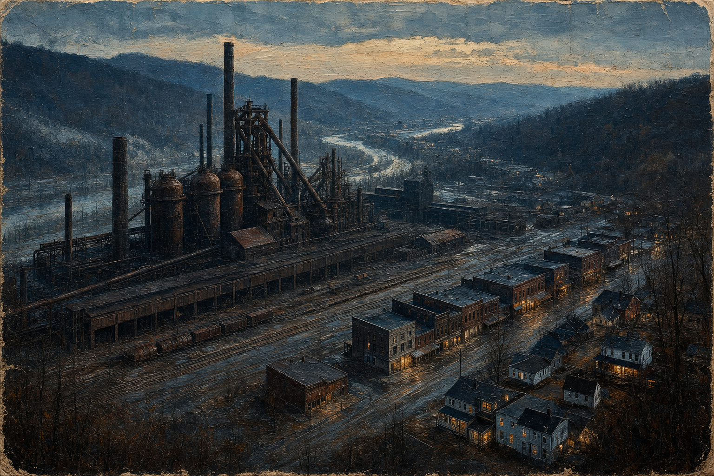
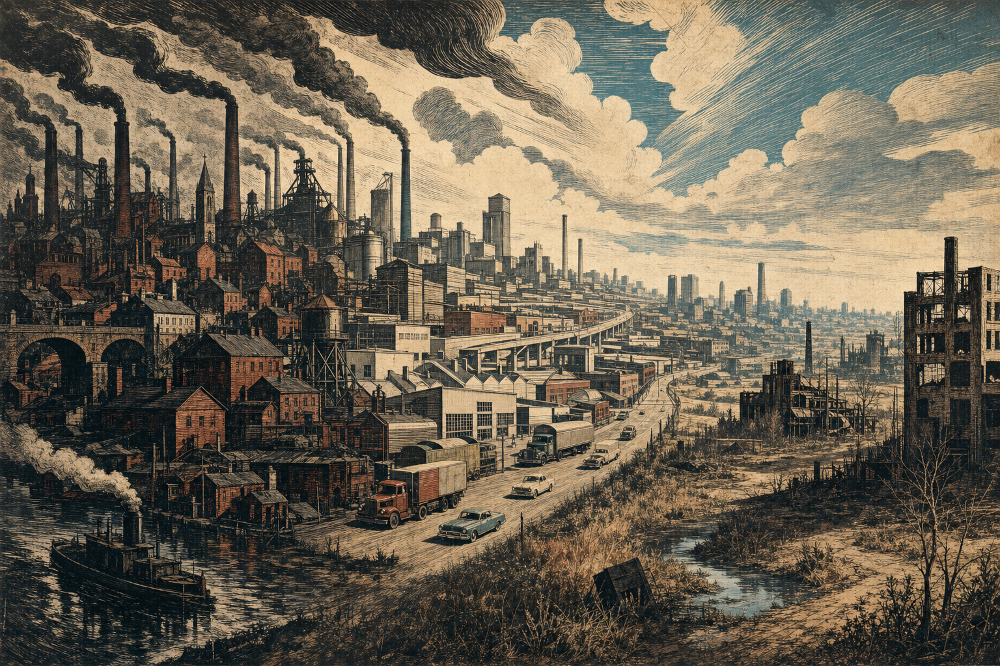
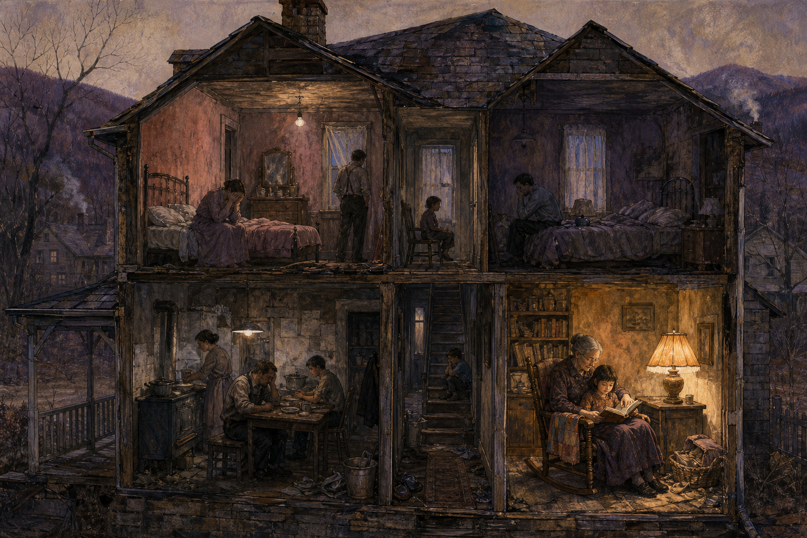

# 序

这是美国副总统万斯的一本回忆录。我查了查，书的口碑两极分化严重——批评的和认同的，态度都很鲜明，几乎没什么和稀泥的中间地带。

书本身没拿过普利策之类的文学奖，但读完之后，还是给了我不少可以琢磨的东西。

<!-- more -->

# 悲歌--《乡下人的悲歌》

从常见的批评说起。

第一种批评的声音是：万斯写的其实只是他自己的家庭，代表不了整个阿巴拉契亚。第二种更常见——美国“铁锈带”的问题是工厂外迁、全球化、自动化、工会衰落，再加上医疗和教育资源不足，这些远不是万斯强调的“家庭责任、个人奋斗、自律、教育”能概括的；书里过分强调个人责任、弱化了经济和政治因素，这是批评的重点。第三种则是立场之争：支持者觉得他揭示了普通美国人的困境，反对者却认为，他给某些保守派递上了现成的叙事框架。

这几条批评都有道理。但我读的时候，感受反而落在另一层面。

我们平时看到的美国作品，无论是写美国梦的，还是好莱坞电影和文学，主角大多住在大城市，或者离大城市不远；就算在别的州，也多半过着相对体面的日子。而万斯，按他自己的说法，是实打实从最底层爬出来的乡下人。他当然有他自己的挣扎——原生家庭的问题、自律的问题——但这不只是他一个人的问题，很可能是一整个群体共同的困境。这个群体平时是沉默的、是被别人"代表"的、忍受着社会偏见的，以至于很多人就像万斯说的那样，压根没意识到自己还能挣脱那层束缚，去更主动地工作、学习、生活。

所以在我看来，这本书的分量，恰恰不在于它说得对不对、全不全，而在于它把这么一个平时没人正眼看的世界，硬是摆到了台面上。

## 那他自己是怎么爬出来的

书里提到几次对他影响很大的改变，我把它看成三个转折点。

一是参加海军陆战队。军营那套纪律，加上一次真实的海外派驻，给他最大的东西不仅是爱国热情，还有一种"效能感"——原来很多事只要肯下手，自己是做得成的。他后来专门提过"习得性无助"——穷孩子从小被反复暗示"你不行、改变不了什么"，而部队的意义，恰恰是把这套暗示一点点拆掉，让他头一回觉得自己"能行"。也是从这时候起，他才回头看清，自己过去那些饮食和生活习惯，是怎么一步步把身体和成长往下拖的。

二是退伍后回到州立大学。他一边看清了自己的短板，一边也撞上了别人的偏见，于是发愤图强，成绩很好，最后以优秀毕业生毕业并考进了耶鲁法学院。

三是在耶鲁法学院深造。他继续认真读书，不光遇到了此生挚爱，也把自己重新审视了一遍——从改变自己、老实工作开始，把整个人生翻修了一回。

把这三件事摆在一起，我留意到一个共同点。万斯自己也说，“铁锈带”那些问题，在他成长的过程中，政府并不是没管，政策一直在调、一直在关注；可这些政策都太泛了，很难具体落到他一个人头上，也很难真的改变他的处境。真正把他拽出来的，反倒是些特别具体的东西——看起来很野蛮的外祖母、服役时军队那套规矩、耶鲁那几个肯带他的教授。说白了，宏观的力量够不着他，是几个近在眼前的人和环境，把他一把拉了上来。

这一点，我特别认同。

## “铁锈带”，得放进更长的脉络里看

万斯一家的遭遇，其实不是什么孤例。所谓"铁锈带"，往根上讲，是产业变迁甩下来的人和问题——这种事，无论是第一次工业革命的欧洲，还是第二次工业革命的美洲，都不同程度地上演过。

当年英国的日子也不好过，只是那会儿人口没这么多、疆域没这么大、产业规模也没膨胀到今天这个体量，所以看上去还算相对轻松地熬了过去。但也恰恰因为它在第一次工业革命里太成功，产业尾大不掉，等到第二次工业革命反而转不动身，没捞着太多好处，被其他欧洲国家迎头赶上——当然，这只是一种解释，历史学家怎么算这笔账，至今也没个定论。真正让美国和欧洲各国吃到大红利的，是二战之后：电力、机械制造这些第二次工业革命的成果被大规模铺开、彻底兑现，才迎来那段黄金时代。

到了今天，产业还在变，代际还在更替，欧洲和美国面对的是同一类困境。要说差别，不在"欧洲国家小"——更多是欧洲那套福利国家、社会民主的传统，让产业调整之后的善后（再就业、社会保障、教育和医疗的兜底）相对更容易被接住一些。但也就是"相对"而已：欧洲自己的“铁锈带”一个不少——英格兰北部那些没落的老工业市镇（英媒口中的"红墙"）、比利时的瓦隆、原东德、法国北部的煤钢区——处境跟美国铁锈带几乎一比一对照，攒下的怨气也如出一辙。制度能缓冲，但挡不住产业迁走之后那种整片社区被连根抽空的感觉。

只不过美国这边遍地超大城市和核心经济区，被甩在后头的地方，"乡下人的悲歌"式的故事就显得格外多，也格外容易被彻底淹没。

这么一绕回来，前面说的那些两极分化的评价，其实一点不矛盾——争得越凶，越说明这本书戳到了一个真实存在、又长期没人替它说话的社会切口。它作为一部社会学作品的分量，正在这儿。

## 一个家庭里的两代人

他的外祖父母当年不甘心浑浑噩噩、穷困潦倒过一辈子，为了逃离那个混乱、看不到头的老家，才跑到工业新城去讨生活。单是这一步，就已经让他们和留在老家的人不一样了——他们真心相信努力和克制能把日子过好，也确实为此拼过。可受教育和环境所限，光靠这两样，他们还是很难甩掉原生环境的老毛病：家里没完没了的争吵、对孩子管教的缺位、对读书的不当回事，都在往下拽。

到了他父母那一辈，情况又变了。同样在这种环境里长大，他们却更多地松开了对自己的约束，习惯把问题一股脑推给社会，而不是回头看看自己——不好好上班、动不动旷工、能偷懒就偷懒。说一句公道话：这里头不全是性格的原因。他父母成年、进厂的那几年，正赶上工厂一批批外迁、稳定的活计一茬茬消失，整个社区的经济底座都在塌——嘴上说"努力就有回报"，可回报正从他们眼皮底下被抽走。那份"放弃"，有一部分是人松了劲，但也有一部分，是时代先把底气给抽掉了。

话说回来，同样的处境，有人塌了，也有人咬牙扛住了——这中间的分野，最后还是落回到人自己头上。所以这种"松劲"，我相信谈不上普遍，但绝对有代表性。

他外祖母，就是那个"扛住了"的人。她到最后还是认定，这孩子得去读书、得养出点好品性，也一直撑着他，离开那些带坏他的瘾君子和逃学的伙伴。而万斯自己，也确实露出了愿意读书、也读得进去的那点苗头——回头看，就是这点苗头，最要紧。

## 照进现实：躺平和"薅羊毛"

写到他父母那辈的心态，我总有点坐不住——因为这种苗头，在我们眼下的社会里，多多少少也照得见。

倒不是说现在的年轻人都不努力。而是当他们看不到明确的回报时，有些人就干脆躺平，甚至反过来薅体制和制度的羊毛。心态是相通的：出了问题不怪自己，只怪体制不完善、制度没覆盖到位；不再相信踏踏实实把手上的活干好，能换来什么改变。这当然代表不了所有人，但就我接触和观察到的，确实有相当一部分人是这样，这不得不让我有一丝担忧。

我知道这么说，跟前面替万斯抱不平的调子，听着像是矛盾的——这一代年轻人面对的房价、岗位、上升通道，确实比父辈难得多，躺平里有一部分是算过账之后的清醒。但我还是觉得，同样一副牌，有人认了，也有人还在想办法；承认外部的挤压是真的，不等于人自己这头的责任就全免了。

放到眼下这个 AI 和经济转型的当口，我才更替这种心态捏把汗。你只有肯干活、去接社会真正的需求、去创造点实打实的价值，日子才有可能变好；只有肯读书、肯受教育，去找到自己能发光发热的那个位置，路才走得下去。

这话我知道，听着是有点说教。可要是心里没这根弦，人就容易滑向另一头：找个舒服的地方，找个能偷懒的地方，找个不必那么拼的地方待着。待久了，那点竞争力和斗志，也就一点点被磨平了。

## 延迟满足，才是最难的那一关

顺着这个往下想，我又想起那本《贫穷的本质》，和万斯这本自传摆在一块儿读，会互相印证得特别好。

毕竟那种长期吃不饱的绝对贫困，如今世界上越来越少见了。可为什么贫困还是难根除？他们和万斯，其实指向了同样几件事：教育、勤奋，和延迟满足。

教育，不是有了老师、有了学校就万事大吉。关键是那些该受教育的大人和孩子，心里得先有一股愿意学、也愿意为它搭上时间精力的劲儿。勤奋也一样，是打心底愿意去创造价值，而不是坑蒙拐骗、能混就混、成天想着投机取巧。

但这两样背后，其实都压着最难的一关：延迟满足。消费主义的毛病就在这儿——花钱、借钱，图的是立刻到手的那点爽感，爽完了却什么也没剩下。吸毒和各种坏嗜好，本质上是一码事：身体的奖励系统被太快地透支掉了。可读书也好、认真做事也好，偏偏都是要先吃苦、后见效的事。一个人要是熬不住这段"先付出、不见回报"的空窗，他的注意力和精力，就太容易被即时奖励——甚至那种直达神经元的加速奖励——给一口口吞掉。到那一步，消除贫困、改善生活，也就无从谈起了。

## 光努力还不够，得知道往哪儿使劲

不过，光有这几样也还不够。你还得对这个社会多一点认识，对自己的活儿和往后的路多一点打算。要是压根不了解这个社会，就像万斯说的，你的人生就只能简单地模仿身边的人——而不是靠自己去琢磨：该找什么样的工作，怎么调整自己去适应它，怎么一点一点把自己从泥潭里捞出来。

而这些——改变想法、改变饮食、改变情绪，改变自己一点一滴的状态——桩桩件件都不是容易的事。

所以我常觉得，万斯的运气，一半在于有军队那套规矩逼着他，一半在于耶鲁那几个肯带他的教授，在他求学时帮他看清自己到底要什么，让他朝着对的方向去使劲。这一点，比单纯的"努力"要紧得多。因为努力要是方向错了，照样让人一头撞南墙，越使劲越沮丧。

到头来，只有当你想清楚了自己为什么工作、这工作凭什么挣钱、你到底创造了什么、又怎样能创造更多——大概到这时候，一个年轻人才算真的对自己负了责。

## 轮到下一代，我就有点犯难

道理讲到大人身上，还算清楚。可一落到孩子身上，我就有点犯难了。

先是个老问题：下一代到底该快乐教育，还是高压地把学科要求压上去？眼下这教育已经卷成这样，站在家长的立场，说实话有点无所适从。可换个角度，跳出家长的视野、站到孩子那边看——如果一个小孩没有自主的创造力，不肯主动去学、去探究、去做事，而是刷视频、打游戏、把时间白白耗掉，那才是真正让人后背发凉的事。更麻烦的是，一个孩子的性格和观念怎么长成，压根不像捏泥巴，想捏成什么样就是什么样。想管，得先看管不管得住；管完了，又是不是你想象的那个样子？谁也说不准。

方向倒不是没有。卡帕西（Karpathy）就说过，小孩该把大量时间花在数学、物理和计算机上——不是为了将来一定去干这行，而是这三门最能"在大脑里刻出沟槽"，逼你从第一性原理出发、一层层去拆开复杂的系统。而这种从根上拆问题的思维，放到 AI 时代只会更值钱。我觉得这话一点没错。可问题也就卡在这儿——我们自己想明白了，不等于就能把孩子领进去、让他自己愿意这么走。这才是真正让我头疼的地方。

## 还得给自己织一张网

就算方向、方法都齐了，好像还差着一样东西。

韦伯讲过一个"工具理性"的概念——大意是，人为了达成目的，会把一切手段都算得清清楚楚。可这套逻辑有个天然的缺陷：它只管"怎么做"，不管"为什么做"。算盘打得再精，要是算着算着不知道自己为什么算了，人就空了。

格尔茨后来替韦伯补上的那张"意义之网"，说的正是这回事——人不是一台纯粹的计算机器，光靠效率和理性撑不到终点。我们终究得替自己找到"存在的意义"——读书的意义、努力的意义、把日子认真过下去的意义。人要是没能亲手织出这么一张网兜着自己，就很容易慢慢往下坠。

# 结语

《乡下人的悲歌》最打动我的，其实不是万斯一路考进耶鲁的励志戏码，而是它把一个特别朴素的问题，摆到了台面上：当外部的政策、经济、时代都靠不住的时候，一个人到底还能靠什么？

万斯给的答案，说穿了没什么新鲜——努力工作、延迟满足、认真读书，再加上一点运气，和几个肯拉你一把的人。

这些道理谁都懂，可真做起来，每一样都不容易。

