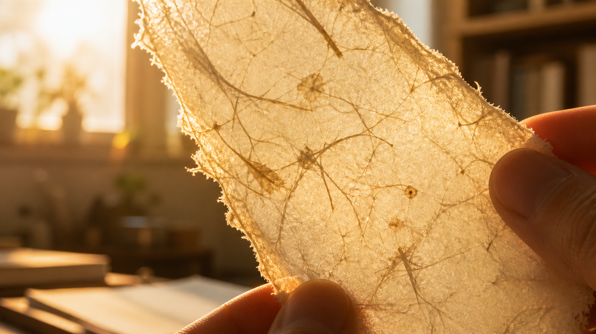
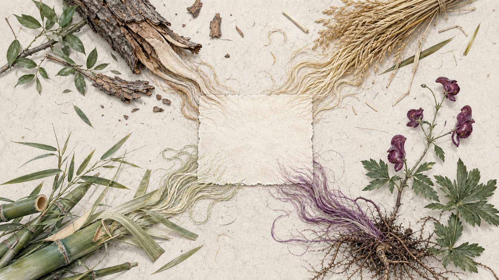
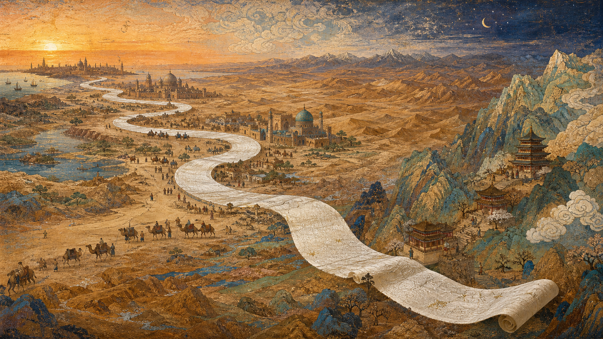
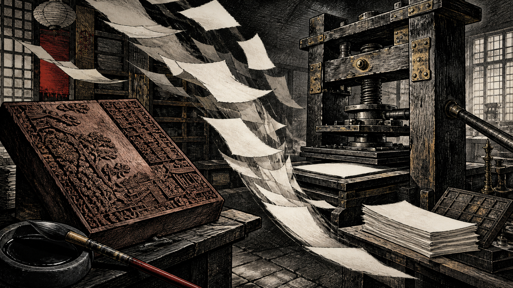
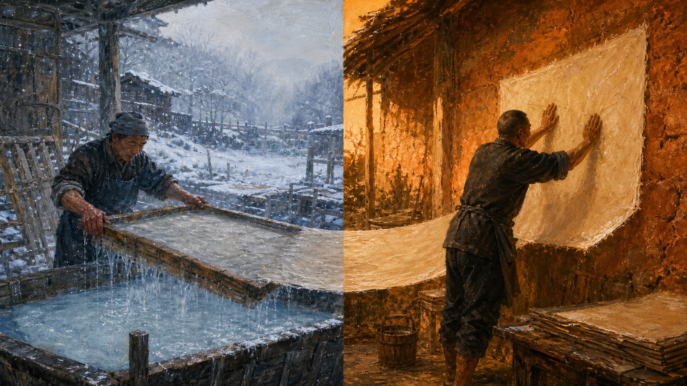
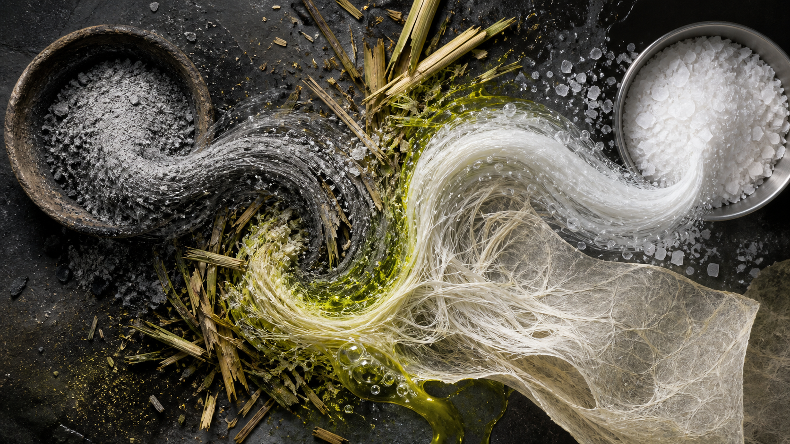
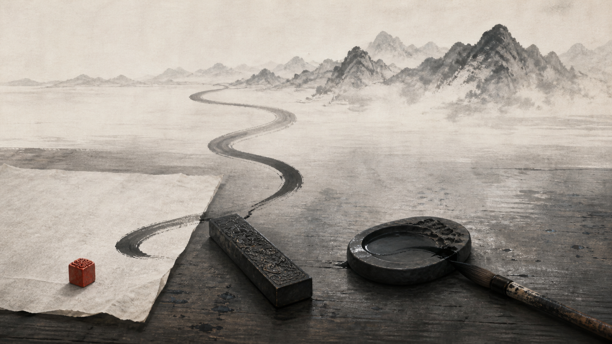

# 序

这本书我本来是不会买的。

定价实在太贵。真正让我掏钱的，是《锵锵行天下》里窦文涛跟着汪帆去造纸现场的那几集，跟着看竹子怎么一步一步变成纸。看完就觉得，还是得买一本。

贵也有贵的道理。书的最后附了二十五种可以用于古籍修复的手工纸样，是真纸，能上手摸。我拿到书先翻的就是那几页：厚的薄的都有，有的糙得像粗布，有的滑得像一层壳；对着光看过去，纤维横七竖八地卧在里面，一眼就知道不是机器出来的。汪帆自己也说，了解得再多、看得再多，都不如上手摸一摸、亲自感受一下来得真切。摸完再回头读正文，好像才算真的读进去。

<!-- more -->

# 一条文脉，一张纸--《寻纸》

这本书教我最多的，是重新认识一张纸。我原来以为纸就是纸，白的、薄的、能写字的，看完才知道里头分那么多路数。

也是在节目里我才知道，好纸不能用木材，只能用树皮、麻类纤维和一些草本的原料去做。木质素这个东西留在纸里，时间一长就要泛黄、发脆。除此之外还得做脱酸、防虫的处理，纸才存得住，才不容易被虫蛀，也不容易絮化、酥碎。

以前我只知道宣纸是一种特别的纸，别的没概念。看完才发现，宣纸用的是青檀树皮加沙田稻草；南方竹子多的地方，是把竹子沤烂了提纤维来造纸；而藏区居然拿狼毒草这种有毒的植物来做纸——正因为有毒，虫子和老鼠不碰，经书反倒存得住。各地民间散落着大大小小的匠人，各做各的纸，各传各的手艺。

所以说，别小看书，也别小看纸。我们天天没事就打印一张 A4，那种纸是木浆做的，放上几年就发黄发脆，谁也不会心疼。可就是这么稀松平常的东西，后面还藏着这么多不为人知的门道。

## 蔡伦之前，其实已经有纸

倒是有一点是一样的：这些散落各地的匠人，都奉蔡伦为祖师爷。

这倒也没错。郑也夫先生在《文明是个副产品》里也讲过造纸术。在蔡伦之前，应该已经有更原始的纸——考古上确实挖出过西汉的麻纸——但蔡伦把这件事往前推了一大步，做了改良和推广，人又在官家，史书上白纸黑字有记载。所以说到底，他是我们能找到的、明明确确的那个祖师爷。

有意思的是，纸这个东西发明出来以后，是一路往西走的：从中原到西域，再到撒马尔罕、巴格达，最后才进的欧洲。西方原本用的莎草纸、羊皮纸，严格说都不算纸。不同的地方用不同的取材，成就了不同的品质，然后又有了不同的用途。

## 古腾堡那台机器

再多说一句题外话。像古腾堡时刻这种在人类传播史上算是里程碑的事，没有发生在中国，而是发生在西方。原因大概不在纸，也不在有没有活字——毕昇比古腾堡早了四百年——更要紧的还是路径依赖：字母文字总共几十个字符，一副活字够用一辈子；汉字动辄几千上万，刻一副活字的成本，还不如老老实实雕版。前面说的狼毒纸也是一样，它和德格印经院那一套雕版体系，是配着长起来的。什么样的纸配什么样的印法，背后是一整条链子，一环扣着一环，谁也拽不动谁。

可这条链子走到最后，还是有点可惜。雕版我们走得最早，也走得最精，但它有个躲不掉的天花板：一块板对一页书，刻完才能印，梨木枣木的板子印上万次也就磨损了，还得重刻；而且我们始终是靠人拿刷子一张一张刷印的，快不起来。古腾堡那套东西真正厉害的地方其实不只是活字，还有那台螺旋压印机——排字、上墨、压印，"出一本新书"这件事第一次变得又快又便宜。于是同样是印书，我们印得最多的多半是那些早就被认定值得印的经典，而欧洲很快就开始印各种还在吵、还没定论的东西。

而且话说回来，只盯着书谈印刷，本身就是把印刷看小了。真正让这件事改变世界的，恐怕不是那些装帧讲究的大部头，而是报纸，是传单，是一张纸印完看完就扔的东西。古腾堡的机器印量最大的多半也不是《圣经》，是赎罪券这类零碎印件；后来路德那些小册子，几个星期就传遍了德意志；再往后才是报纸。便宜、快、走量、印完就撒出去——这才叫印刷。

我们这边也不是没有单张的东西，年画、纸马、门神、官府的告示，连宋朝的交子都是印出来的。可那种靠一张纸把消息和意见推到所有人面前的生意，始终没有长起来。书还是那些书，读书人还是那些读书人。想想是真的有点可惜。

## 冷水和焙墙，一年轮着来

不过这本书里让我记得最久的，其实不是上面这些知识，是人。汪帆七年跑了十几个省，写下来的与其说是纸，不如说是还在做纸的那些人。

书里写捞纸的和烤纸的，一年总有一半时间是难熬的。天冷的时候，烤纸的人守着焙墙，是舒服的，可捞纸的那双手要一直泡在冷水里；天一热又反过来，捞纸的还好，烤纸的贴着滚烫的墙面，就该遭罪了。一年到头，总有一半时间在受苦，而且是轮着来，谁也躲不掉。

还有那位做狼毒纸的藏区老人，是直接用手去扒开、清理狼毒草的根茎。汪帆自己试着弄了一会儿，没多久手上就被扎得火辣辣地疼。我实在很难想象，这门手艺，这些人是怎么一年一年、一点一点传下来的。

## 一百块钱一张纸，我下不去手

古籍修复本来就是个极其小众、极其细分的行当。这里头有个挺拧巴的地方：对纸的要求高得离谱，可需求量偏偏又极小——全国也就那么些图书馆、那么些修复师在用。要求最高的东西，量反而最少，成本自然摊不薄。而我们日常用的普通纸，消耗量大得惊人，价格却低到没人会多看一眼。

看这本书之前，我从来没想过手工纸会这么贵、做起来会这么难，更没想过还在做这件事的人，日子过得那么苦。

一百块钱一张纸，成本和手工的分量确实都在里面了。可是作为一个普通人，我实在下不去手。或许这就是为什么，手艺的坚持和它的销路、收益，始终对不上。

## 草木灰换成了工业碱

所以问题就绕回来了：这门手艺到底还有没有往下走的路。

我们很多工艺的讲究，说到底是在"守"。大家遵循古法，用竹帘捞纸，用石槽、石板这些相对原始的工具。为了保持原始，成本非常高。可一旦跟现代技术结合，又发现纤维不均匀、容易断裂，纸的质量达不到纯手工的水平。

就说碱吧。原来是用草木灰的碱来蒸煮原料，现在大家都不太用了——一是没有那么多的灰，二是也撑不起那么大的产量，只好退而求其次，改用工业碱。这固然也无可厚非。所谓古法，很多时候就是能守多少守多少，守不住的地方，只好悄悄换掉。

## "机器做的手工纸"

不过书里还提到另一种做法，我印象很深：日本那边有一种纸，叫"机器做的手工纸"。听着像个自相矛盾的词，意思其实是把机器放进一部分工序里去——打浆、烘干这些力气活交给机器，但抄纸这一关还是靠人手，原料也照旧用树皮，一点不含糊。机器进来了，纸的品质却没丢。

汪帆写到的那家小作坊，就在琢磨着学日本人的这套办法，想把自己宣纸的制作能力提上去。我觉得这事很值得肯定，也确实是条路——总比一边守着成本硬扛、一边在看不见的地方偷偷妥协要好。

说到底，任何技术都得有新鲜元素进来，才能变得更好、更标准化。哪怕是手工，也只有融进一些新东西，才可能有更大的产量，找到更多的使用场景。古籍修复用的手工纸也一样：它守着的除了纸本身，更是一门技艺；可这门技艺如果始终进不了主流，不跟主流的造纸技术互相提升、互相融合，终究很难走出更好的生命力。

## 纸有蔡伦，墨有韦诞

其实何止是纸。文房四宝，笔墨纸砚，都是同一个处境。更巧的是，它们还挤在同一片地方：宣纸出泾县，徽墨出歙县、绩溪一带，歙砚也是徽州的东西。

我们去黄山旅游的时候，在西递看到卖徽墨的，说是贡墨。这话不算吹——徽墨历代都是贡品，连墨锭上刻的"贡烟""顶烟"，本来就是等级的名字。一块好墨要杵上万次，工序十几道，历经千年而享誉中华。而且造墨这行也有自己的祖师爷，是三国时的韦诞。你看，纸有蔡伦，墨有韦诞，每一样东西背后都站着一个被人记了一千多年的名字。

可是现在大家都不用软笔了，也不用墨锭了，它该怎么传承呢？这确实是个很难回答的题目。

# 结语

看完这本书，我最大的一点感触是：我们一直在拼命保存书，却差一点忘了保存"造纸"这件事本身。一个古籍修复师，为了修好几百年前的纸，只好自己走十几个省，跑到山里去找还在做纸的人。她要修的其实不只是书页，还有那门手艺。

文脉这个东西，大概不是供起来才算传下去的。一张纸真正活着，是因为还有人在做，还有人在用，还有人肯往里头添一点新的东西。

