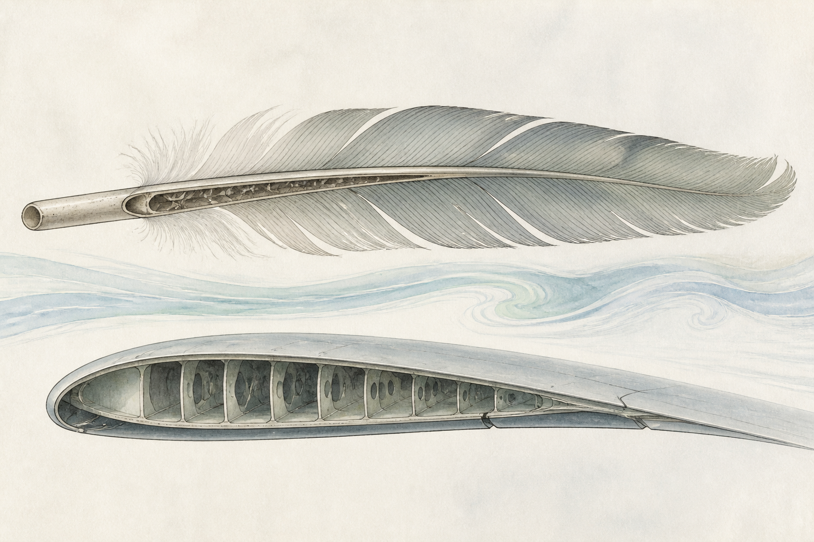
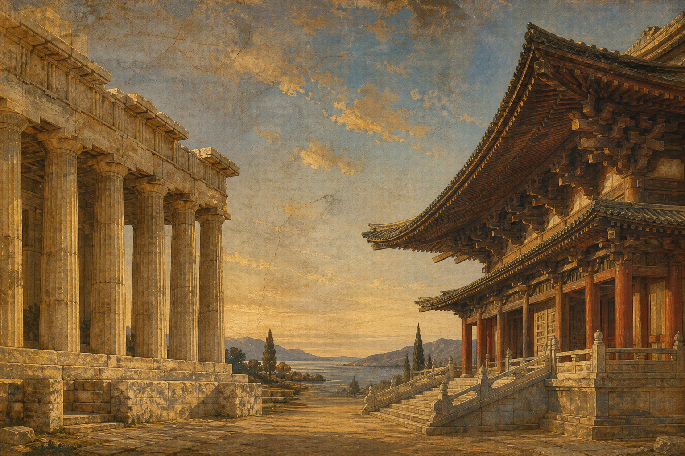
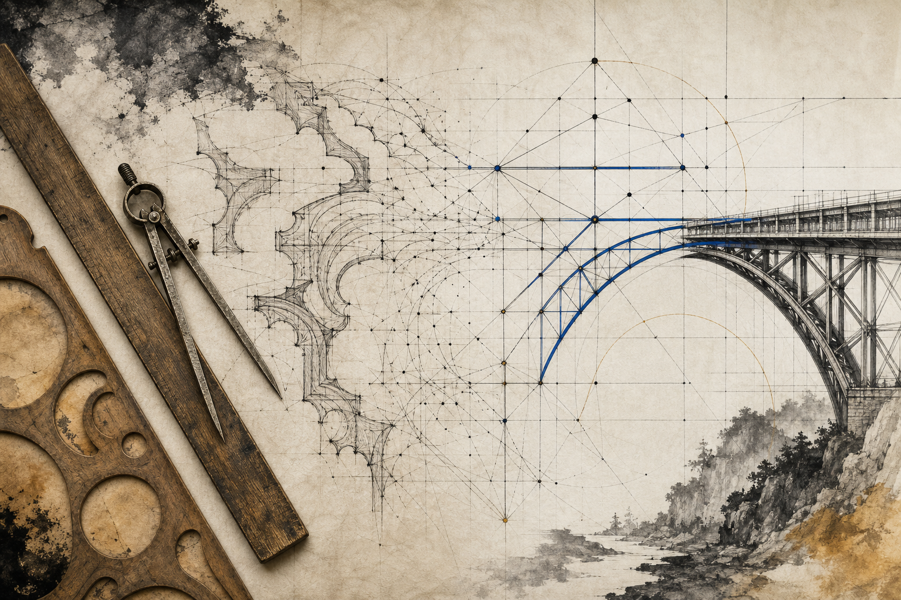
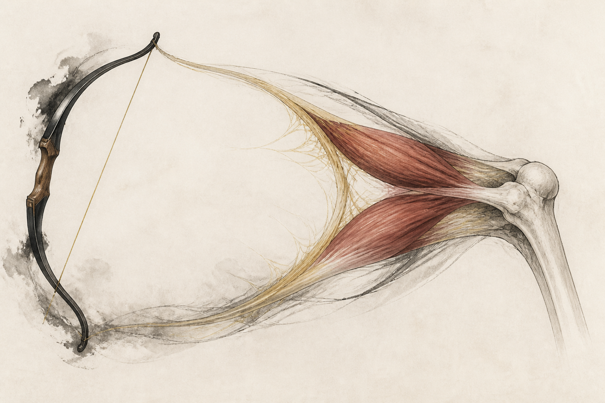
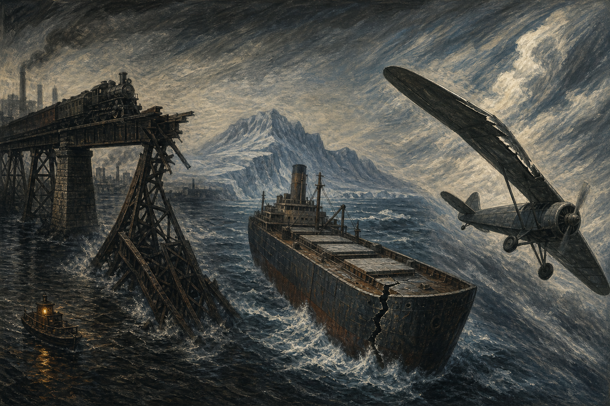
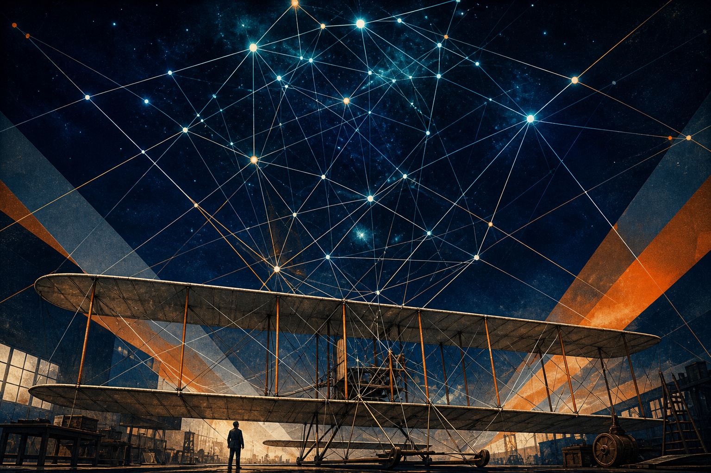

# 序

因为马斯克极力推荐，我买了这本《结构是什么》（*Structures: Or Why Things Don't Fall Down*）。他说这是一本很好的结构设计入门书，更重要的是，它解释了万事万物为什么不会倒塌。

书写于七十年代末，到今天已经快五十年了。看到中信把它重新推到市场上，我就把它买了回来。马斯克身上的光环太多，创造的奇迹也太多，我只是想知道，他这么推崇的一本书到底长什么样，又能给一个后来去造火箭发动机的人什么启发。

读完之后我发现，一根香肠为什么总是纵向裂开，和 Transformer 为什么能跑通，背后居然是同一种结构直觉。

<!-- more -->

# 从香肠到 Transformer--《结构是什么》

作者 J.E. 戈登不是个书斋里的人。二战时他在英国给飞机做结构，还设计过轰炸机上的救生艇；战后一路研究玻璃钢、碳纤维这些新材料，拿过格里菲斯奖章。所以这本书里的例子全是船、飞机、弓和骨头——都是他真正上过手的东西。

我虽然有理工科背景，读起来还是吃力。因为传统的理工科和新派的理工科不太一样。传统理工科是机械、建筑、力学；新派理工科大概就是计算机、电子这些新行业。这本书已经用了相当文学化的科普口吻，可很多关键概念我依然看得不太明白，只好在 AI 里问了一堆问题，来回想了很久，才勉强搞懂几个专业词汇。

不过，搞懂的过程本身，蛮有意思的。

## 自然是个很老练的工程师

这是一本讲结构和材料的书。但如果把它的观点搬到生物体和自然界里去重新看一遍，你会发现大自然对结构和材料的营造，精妙得让人服气。

比如机翼。机翼的气动中心大致落在弦长四分之一的位置，而鸟类羽毛的羽轴，受力的位置也差不多在同样的比例上。

这不是巧合！我们绕了很大一圈，用工程和计算，把自然早就给出的答案又验证了一遍。

## 从希腊神庙到大教堂

希腊和地中海一带因为森林砍伐得早、优质木材有限，很早就转向了石材；而中国的营造一直以木构为主。两种材料的脾气不同，结构和力学的思路自然也就长成了两副样子。

有意思的是，作者提到希腊神庙那些石头构件的样式，其实是在模仿更早的木结构——梁柱这套做法照搬了过来，只是材料换成了石头。可石头几乎不能受拉，石过梁跨不了多远，柱子就只好排得密密麻麻。你走进希腊神庙看到的那片柱林，其实是材料的脾气逼出来的。

拉力这道坎，后来的人是绕过去的。他们摸到了一条关键规律——只要让合力落在截面中间三分之一以内，石头就不必承受它最怕的拉力；实在撑不住就加大上部的重量把力往下压——靠着这些办法，终究将大教堂给建了出来。

榫卯、应县木塔、《营造法式》里那套“材分制”，都精妙得让人服气。真正的差别在别处：那是一套靠经验层层堆起来的规矩——师傅这么做，塔立了千年，所以就该这么做。它能告诉你梁该多粗，却回答不了“为什么是这个粗细”，更没办法推导出“换一种荷载、换一种跨度，该多粗”。

## 经验与演绎

在西方同样的问题，找寻答案走的是另一条路。从欧几里得那种公理化的演绎开始，一路到伽利略追问梁为什么会断、胡克写下“力与伸长成正比”、再到纳维叶把梁的受力真正算成公式——数学和工程被组织成了一个可以往前推的体系。经验只管得了你见过的，演绎能管到你还没见过的。差距大概就是从这里拉开的。

得益于这套体系，西方后来能建更大、更高、更宏伟的东西；而我们用木材能造的，尺度终归有限。我们曾经是能够傲视人类文明的，但那也确实只是过去了。当西方的科学和工程实践不断迭代上升，尤其是经历工业革命以及此后一百多年的发展，我们原来那点优势就不明显了，差距还在日益扩大。

为什么会这样？我想，从科学精神的萌芽到它真正发挥力量，中间隔了一千多年缓慢的酝酿，很多东西都可以一直追溯到很远的地方。土壤完全不同，我们这一边就很难在科技上跟人家匹敌。

## 分水岭其实是力学

我们的侧重点在道德。我们把千年的智慧几乎都用在了人和人的关系上，从道德、规范、伦理里提炼出营造和谐社会、或者说更好的乌托邦社会的那套意义；对技术则更多是“能用就行”的积累，不太追究背后的逻辑。所以我们弱的不是手艺，是那套不够体系、也不够深入的数学与工程框架。人家的弱项在道德，但他们用科技和法治做了弥补，甚至反过来超出了我们曾经的认知。

不过这条分界线其实不完全是东西之分，更像是“有没有力学”之分。中世纪盖大教堂的西方工匠，同样是靠师徒相传的比例和手感在干活，也同样出过事——博韦大教堂的唱诗席就塌过一次。真正的分水岭是十七世纪之后力学被算清楚了，在那之前大家都是凭经验。只是这一步我们没走出去。

## 材料是有脾气的

刚开始接触应力、应变、热胀、弹性模量，还有结构强度和材料强度、抗拉和抗压这些概念的时候，我是一头雾水。把关键词丢进 AI 里反复追问，画了几张受力示意图，才慢慢摸到一点门道。

裂缝的本质，是原子键的断裂。但真正让我意外的是后面那一层：真实材料的强度，远远达不到原子键理论上应该给出的数字。差了一两个数量级。

原因是材料里本来就藏着无数细小的裂纹和缺陷，应力在裂纹尖端会被急剧放大。所以断裂与其说是“被拉断的”，不如说是一场能量的赛跑——只要裂纹往前走一步所释放的能量，超过了它撕开新表面所需要的能量，它就会自己一路跑下去，停不住。

这就解释了一个反直觉的现象：很多人以为把材料做得更硬、更强就更安全，结果反而更容易出事。因为一味追求强度往往牺牲了韧性，材料变脆，裂纹一旦起头就直接跑到底。西方社会在这上面栽过很多跟头，付出过很惨重的代价。但也正是把失败的原因拆开来分析、把理论重新修一遍，才找到了更好的路。

所以我觉得，工业文明其实不是简简单单一套理论的文明，而是不断试错、直到理论能够预测现实的过程——留下来的都是对的。过程里那些试错的成本、那些牺牲掉的代价，恰恰是最不该被忽略的东西。

## 一张材料的性格清单

把“抗拉强度”和“断裂功”这两个指标放在一起看，材料的性格一下就清楚了：

1. **蜘蛛丝**：抗拉高、断裂功也高。又强又韧，是仿生学最爱举的例子——它真正的本事藏在内部纳米级的原纤排布里，而不是这根丝本身有多细。
2. **玻璃**：抗拉不低，断裂功极低。所以它很硬，但一碎就碎得干干净净。有意思的是玻璃的理论强度其实相当高，是表面那些看不见的细小划痕拖了后腿。
3. **豆腐**：抗拉差，断裂功也小。但恰恰因为这样，它有非常好的口感。
4. **橡胶**：抗拉不算高，抗裂性却极强。你很难把一块橡皮“撕裂”到底。

原来豆腐和玻璃是能放在同一张表里比的。

## 弓、肌腱和骨头

因为搞懂了拉力和拉伸距离的关系，才明白什么叫储能，也才明白反曲弓为什么能有更好的射程和杀伤力——它把更多的功，塞进了同样的一次拉开里。

那我们身体上的角质和肌腱，为什么会是现在这个设计？肌肉为什么是一束一束的？

看完这本书我才想通分工：肌腱负责抗拉，骨骼负责抗压，而肌肉本身只会“拉”，不会“推”——所以关节两侧总要有一对互相拮抗的肌肉，一个把骨头拽过去，另一个再拽回来。说白了，人身上只有拉的，没有推的。

而肌腱和角质这类生物材料，在断裂功上，其实比很多人造材料都要出色。

## 为什么香肠总是纵向裂开

为了理解球形容器和管道的受压，我还是老老实实做了一遍演算和推理。

结论很漂亮：同样的半径和壁厚，圆柱壳的环向应力是轴向应力的两倍；而球壳各个方向的应力都只有圆柱环向应力的一半。所以同样的材料，做成球形容器能承受的压力是圆柱形的两倍——这就是为什么高压容器总喜欢长成球。

顺着这个算下去，还能解释一件生活小事：裂缝总是垂直于最大拉应力的方向张开。香肠里环向的拉力最大，所以它裂的时候一定是沿着长轴纵向裂开，而不是拦腰断成两截。

一个厨房里的事，居然是能算出来的！

## 折中的哲学

接下来，作者写了设计的哲学——如何在重量、强度和安全之间做折中。

我恍然大悟，这几乎贯穿了整个工业革命。早期的蒸汽机走的是低压路线，效率上不去；后来特里维西克他们想往高压走，才发现真正卡住脖子的不是设计，是锅炉——压力一上去就炸。整个十九世纪，锅炉爆炸都是常态。直到冶金技术进步、钢材质量提上来，蒸汽机才越做越结实，输出的动力也越来越强。而承载这些机器的一切——轮船也好，厂房也好——都必须有更好的结构，才能保证它们不倒塌、不失败。

结构在其中起着至关重要的作用。为什么说它是“传统工科”？因为它不只关乎盖房子，它贯穿了整个工业革命的体系。

比如工字梁：把材料尽量堆到离中性轴最远的上下翼缘去，让它们分别承担弯曲带来的拉和压，中间留一片薄薄的腹板去抗剪。同样一斤钢，这样摆和随便摆，能扛的弯矩差得很远。铁轨大致也是这个思路——用最省的材料，换最大的抗弯能力。

## 桥、船与飞机

回看这段历史的时候，因为许多成果早已尘埃落定，我们往往会忘记过程中付出过什么。

比如美国铁路的修建史上，曾经有过大量的桥梁倒塌、线路失败和惨重的人员伤亡。今天这个行业里那些标准化的做法、成熟的力学理论、被写进教科书的经典案例，全都是用这个换来的。

正如作者所说，这在当时的英国工程师看来近乎不可想象。当然，公平地讲，英国人自己也没能幸免——泰河桥的垮塌同样是一场惨剧。只是美国那边的节奏更急、试错更猛，那真的是用血的代价，换来了理论的进步。

飞机也是一样。莱特兄弟的双翼机恰好选中了一个好结构——上下两片机翼加上支柱和张线，本质上是一个抗扭很强的盒式桁架。可当飞机演进到单翼，扭转刚度跟不上，机翼在空中被扭到解体的事故就一再发生。至于轮船，二战期间赶工建造的自由轮，好几艘在寒冷海域里直接从中间裂成两截——那不是被浪打断的，是钢材在低温下变脆，一道从舱口角落起头的裂纹一路跑穿了整条船。

生活在我们这个年代的人，尤其是大部分新工科的人，可能既无法理解也接触不到这些。但我想说，我们写的一行代码会崩溃、我们的系统会出现各种漏洞，某种程度上，其实也是同一种看不见的“结构力学”在起作用——应力集中在哪里，裂纹就从哪里开始跑。

## “双翼机”时刻

顺着上面那些崩塌和解体想下去，我觉得我们这一行其实也有过自己的双翼机时刻。

2017 年那篇《Attention Is All You Need》给出了 Transformer 这个结构。有意思的是，它和莱特兄弟的处境很像——双翼这个构型并不是莱特兄弟发明的，在他们之前就有人做过；他们真正的功劳，是选中了一个结构上站得住的方案，然后把控制的问题解决掉，让它真的飞起来。

Transformer 也是这样。结构被提出来之后，把它一路推到极致的，是另外一批人的工程实践与对规模的信念。伊利亚·苏茨克维（Ilya Sutskever）大概是其中最有代表性的一个。从参与 AlexNet 到主导 Seq2Seq，再到后来 GPT 那条线，他一直在做同一件事：先相信一个结构能扛住更大的规模，然后真的把载荷一层一层加上去。

这才有了 ChatGPT 和大语言模型的时代。

## 先得有人信它扛得住

结构这东西，很多时候不是想出来的，是有人敢往上加载荷加出来的。你得先信它扛得住，才敢加。

双翼机那个盒式桁架之所以成立，是因为它把扭矩化解掉了；Transformer 之所以成立，是因为它把信息传递的路径拉直了——不用再顺着时序一格一格地爬过去，任意两个位置可以直接照面。两件事说的其实是同一句话：把力，或者把信息，从最短的那条路送过去。

我觉得这就是一种结构的美。不是复杂，是把路走通了——路通了，剩下的交给规模。

## 九成的事故，与“平庸之恶”

正如作者所言，工程设计里往往体现的是人性的弱点。他把事故的原因分成两类：一类是直接的技术与机械原因，另一类是人为原因。而九成事故的原因并不在于技术不够深厚，而是人为的罪过——他用的词是“平庸之恶”。

一个研究材料强度的人，最后拿阿伦特来收尾，我读到这里还挺意外的。他想说的大概就是，出事的往往不是材料，是人。他说有经验并不等于在技术上称职，经验多的人反而可能傲慢或者狭隘，从而忽视了真正的工程师从计算和数据里得出的那些结论。

我想这就是作者最想传递的东西。他说，人们并不会因为身处技术条件之下，就自动摆脱古典意义上、乃至神学意义上的人性弱点。所以那些结构灾难的案例读起来，才总带着一种悲剧式的戏剧性和必然性。

# 结语

人类这一路走过来其实挺笨拙的，算一遍、错一次、再改一版。理论不是凭空来的，都是从倒掉的桥、断掉的船、解体的机翼里一点点攒出来的。

我们这些写代码的人，习惯了失败的成本就是回滚一个版本；那时候的人可做不到。但有一件事是相通的：路通了，剩下的交给规模——前提是，得有人先信它扛得住，还得有人真的去思考为什么香肠会竖着裂开。
