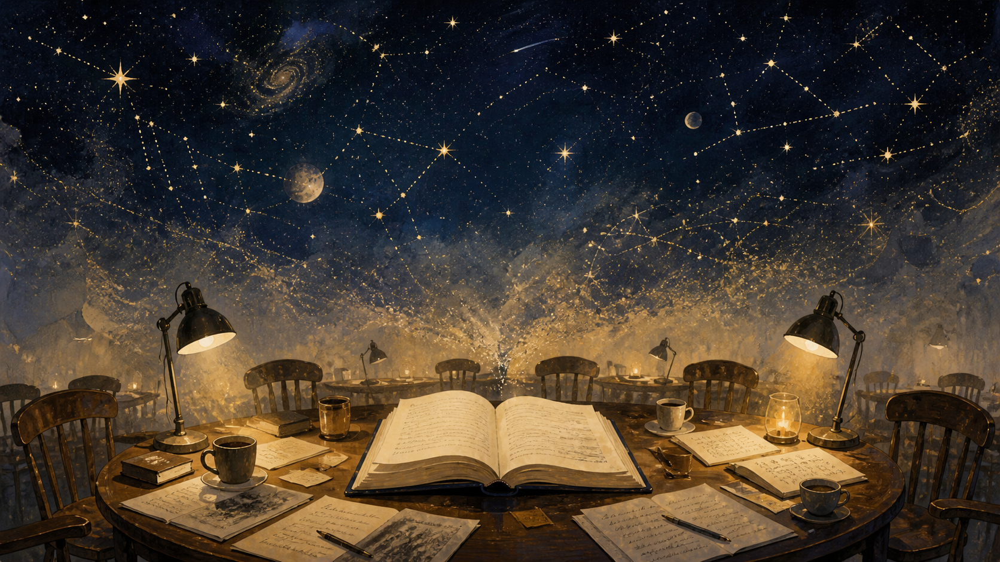
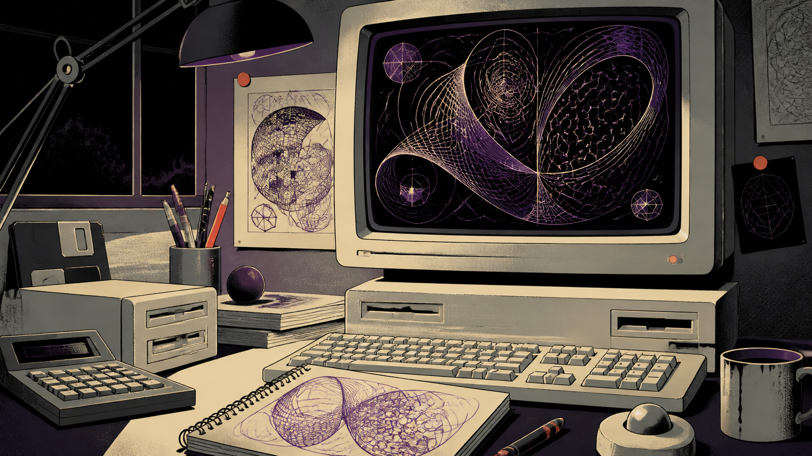
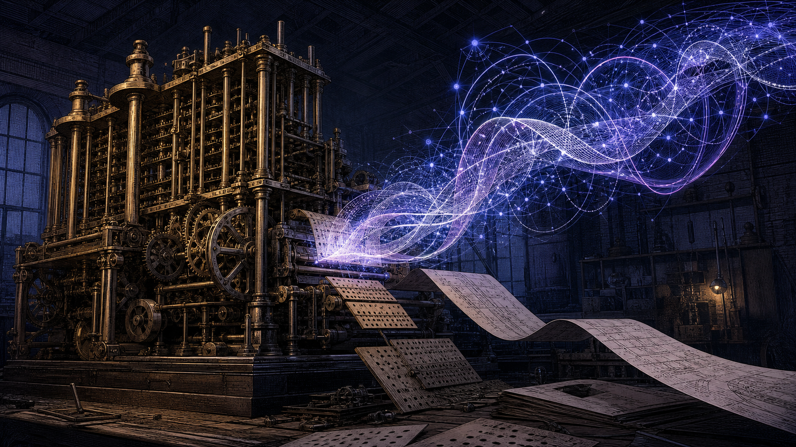
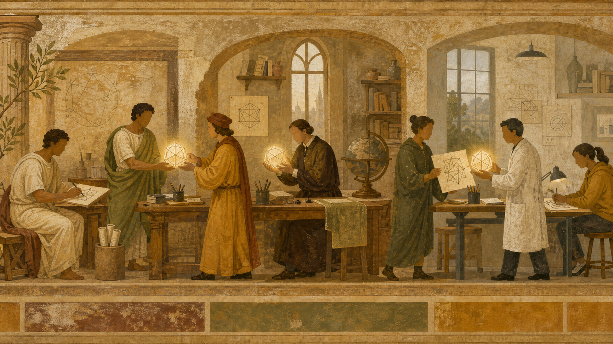
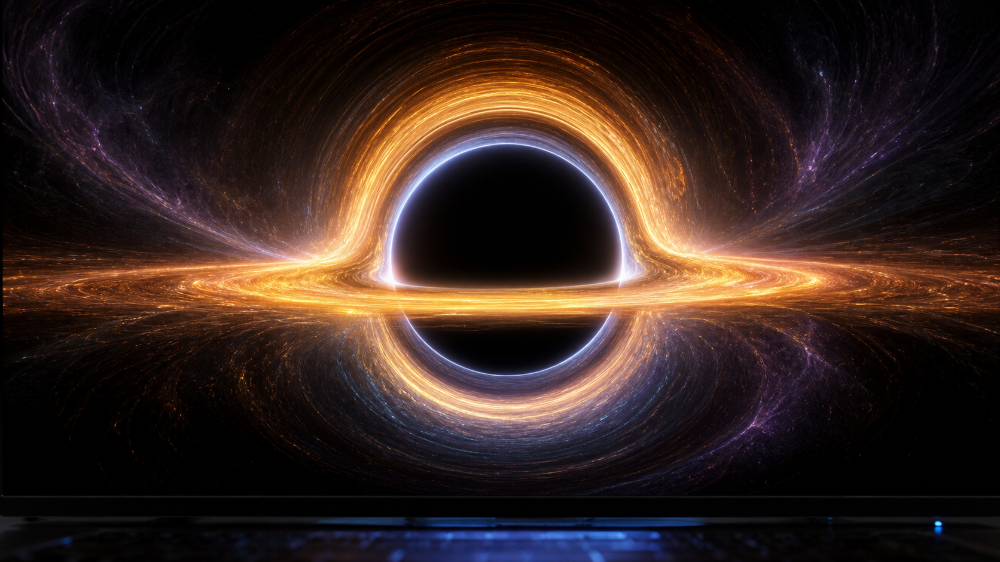
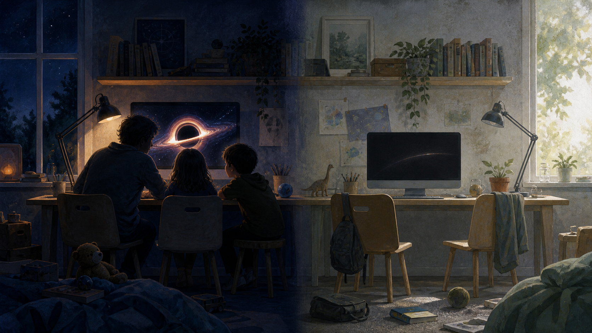

# 序

在看完《结构》那本书之后，我今天又看完了《科技群星闪耀时》——斯蒂芬·沃尔弗拉姆（Stephen Wolfram）写的那本。

其实人家英文书名叫《Idea Makers》，副标题是《Personal Perspectives on the Lives and Ideas of Some Notable People》，直译过来大概就是"有创意的制造者们"。这本书的大部分内容，其实是沃尔弗拉姆这十多年来写的一些杂文的合集，主要是关于他与那些大师、科学家们的交往经历、回忆录，以及他个人的评价。

不过不知道为什么，中文译本非要翻译成《科技群星闪耀时》。如果没有茨威格写的那本《人类群星闪耀时》，大抵我不会对这本书抱有这么大的期待。毕竟，这本书是以个人回忆录、主观视角和评价为主的，而《人类群星闪耀时》却是一部严肃的历史传记文集。

<!-- more -->

# 只是因为有趣——《科技群星闪耀时》

作为复杂性科学的大师之一，沃尔弗拉姆确实是一位可圈可点的人物。毕竟，他在这本传记随笔集里写的十五个人中，大概有十三个人，我是曾经了解过他们的生平和故事的。他本身也是这个领域一位非常出色的科学家，二十岁就在加州理工拿到了博士学位，和费曼算是亦师亦友的一段忘年交。

而且这份名单里有相当一部分人，是他真的打过交道的。比如乔布斯，两个人交往很多年，不是那种隔着传记材料的评价；比如曼德博（Benoit Mandelbrot），那基本上是我们这一行的祖师爷了，分形这一块是他开出来的，也正是这些机缘，把沃尔弗拉姆从粒子物理一路引到了复杂系统上去。

## 一次纯粹出于审美的选择

无独有偶，我在念研究生做密码学工作的时候，没有用 C，也没有用 C++，而是直接用的 .NET Framework。关于一些数值计算和相关的模拟，我用的是 Mathematica。

在当时主流都是 C 语言加 MATLAB 的年代，我不知道为什么选来选去，竟然就选了 C# 加 Mathematica 这么一个组合。一方面，是因为我没有用过这些数学软件，MATLAB 的学习成本对我来说觉得有点高，所以选择了一个交互性比较好、界面看起来比较好看的 Mathematica。这纯粹是一种从颜值和审美上做出的选择。

有意思的是，书里提到，Mathematica 这个名字正是乔布斯建议的——沃尔弗拉姆当时列了一堆候选，乔布斯让他别绕弯子，就用这个大词。这么说来，我当年那次"因为好看所以选它"的决定，从名字这一层开始，就已经是被别人的审美判断安排好了的。

但事实上，我认为我选对了。因为此后的十几年，我一直都在用 Mathematica，不断地做一些关于混沌、分形和相关的计算模拟。而它的这种高强度的交互性、与数学的贴近性，以及它背后那个把细胞自动机真正做成一门学问的人——Mathematica 的创始人，也就是沃尔弗拉姆本人（他的名字中文译法一直不太统一，我习惯叫他沃尔弗拉姆）——其实也能看出来，他希望在数学、计算数学以及数学推导的自动优化上，做出自己的一些工作。

这有可能是他受了前人的启发，也可能是他的兴趣。我想，应该更多的是兴趣吧。

## 前人早就已经想过了

我下这个断言，是因为我看了这本书里关于巴贝奇（Charles Babbage）和爱达（Ada Lovelace）的篇章。

我知道巴贝奇当时在做差分机和分析机（Analytical Engine）的工作。以前计算机被称为 "Computing Machinery"，所以美国计算机学会至今仍叫做 ACM（Association for Computing Machinery）。这些其实都源自于十八、十九世纪的那批数学家和物理学家，他们希望让机器帮人计算，这是第一步（也就是差分机所做的工作）；第二步则是实现通用计算和推理。其实大家一直都在沿着这个方向努力，哪怕是现在的大模型，也是在完成这种更普适的计算和更普适的推理。

而爱达，她是诗人拜伦（Byron）的女儿。我以前从来不知道拜伦的女儿有如此高的造诣。她在那些注记里构想了通用计算机以及程序编写的思想与精髓，虽然当时都只是以文字形式记录下来的。直到后来的图灵，以及再后来的冯·诺伊曼发明了现代计算机，他们以前想象的东西才一步步变成现实。

真的是过了一百多年再回看，才发现前人不断做过类似的工作。正如我昨天在《结构》里看到的一个感叹：我们证明了一大堆关于单翼飞机机翼的受力点在四分之一弦长处，而自然界中羽毛的羽轴也恰好落在整个羽毛的四分之一处。难道这是巧合吗？这不是巧合。

只不过有很多事情，放在当时不一定被人关注。只有当我们往回看，通过整理和了解这些曾经的贵族、思想家的心路历程，才发现原来有那么多事情，前人早就已经想过、思考过了。

## 同一条岔路，我们已经走到第三遍

差分机和分析机的分别，说白了就是专用和通用的分别：一台只会算差分表，一台什么都想算。这条岔路后来又原封不动地重演了一遍，只不过换了个物理形态。

包括当时我们要做模拟电路、做半导体，做二极管、三极管和放大器，后来才发展到了集成电路。到了集成电路阶段，又面临一个选择：我们是用专用的集成电路，还是通用的集成电路？这演变成了到底是做 DSP（专用的数据处理器），还是做通用的 CPU。

这个故事当年在"仙童八叛徒"的故事里就能很好地看出来：从仙童出走的那批人创办的英特尔，选择了 x86，选择了做 CPU；而另外一些公司则把重心放到了别处——比如 TI（德州仪器）后来在 DSP 上做出了一整条产品线，摩托罗拉在 68000 这一路上和 x86 缠斗多年，而日本企业则把精力更多放在了存储而不是 CPU 上。

而到了今天，这条岔路又拐出了新的一段。AI 和 Agent 进来之后，CPU 已经不完全是那个"负责算"的角色了：真正的浮点算力交给了 GPU，CPU 更多地转去做协同——分配算力、调度任务、准备数据，以及承担机密计算这一类安全上的活儿。英伟达 2026 年发布的 Vera Rubin 就已经是这个样子：那颗 Vera CPU 不再是一颗通用的 ARM 核心，而是专门为了配合 GPU 而定制的，官方给它的定位就是处理 AI 负载里的数据预处理和协调工作；整个平台是六颗芯片放在一起协同设计出来的，机密计算和可靠性模块被直接做进了架构里面。

所以从最早那种只会做一件事的机器，到通用的计算，再到今天把推理、智能体和计算捏成一团的这种"更有智能的计算"，计算机的架构和计算设备其实一直在往前挪。专用和通用也不再是二选一的问题了——一个机架里既有负责调度的通用核心，也有负责堆算力的专用单元，它们从一开始就是被当成一个整体来设计的。

一百多年过去，问题的形状还是那个形状，只是每一轮给出的答案都比上一轮更复杂一点。其实，技术和故事一直在不断发生变化，但对于这些科技巨匠、技术巨匠、数学家和物理学家们来说，他们思考的东西一直都不曾变过。他们的思考和工作，正在一点一滴地推动着这个世界的发展。

## 纯粹的人

正如书里有一处写到他和所罗门·格洛姆（Solomon Golomb，他的朋友们都叫他 Sol）的友谊时，他就写到，格洛姆写了很多论文，他喜欢解谜，喜欢研究有趣的故事从而去发表论文。他并不是为了评职称，或者为了获得学术上的教职工作，而是因为他觉得有趣，想深入研究，研究完了想跟别人分享。

这一群人，无论是莱布尼茨、牛顿，还是后来的冯·诺伊曼、香农、图灵，亦或是格洛姆、曼德博、明斯基这一大批人，他们的研究都是极其纯粹的。这种纯粹在于，他们并不是为了教职，也不是为了那些虚头巴脑的考核而去做一些不得不做的研究，而是因为兴趣所致。他们做出了一些工作，然后跟同行去分享。

这就是科学之所以能从柏拉图一直传播到现在两千多年，并成为现代科学一个很重要支脉的原因，它就这样一点一点地传递了下来。

这才是我想象中大学应该有的样子。但我发现这些人至今为止、到现代为止，其实都还存在着。只不过他们不一定在我们的周围，我们并没有这么好的运气能和他们去做朋友。

## 在灵魂深处做一些对话

但是有一点激励着我：找到自己的兴趣点，不断地去跟这些大师在灵魂深处做一些对话。

我永远都达不到大师的那个高度，但我能从大师的想法和理论中，获得对自己某些猜想、某些看法的肯定或帮助，亦或者是纠错。我觉得这对我来说是很珍贵的。

包括 Mathematica，我到现在也会时不时地去使用，它依然是我去做关于我自己的复杂科学（包括混沌学）工作的一个基础。

前一段时间，我借助 AI 和开源的力量，把《星际穿越》里的那个大黑洞通过网页的形式做出来了。其实这些东西一般人看起来可能没什么，我却在屏幕前坐着激动了很久。

那个黑洞叫做 Gargantua（卡冈图雅）。想想当年这可是能让一位后来的诺贝尔物理学奖得主专门写论文的题材，而现在我们用 AI 就能把它漂亮地复刻出来。

那个关于光逃逸的视界，那个光子的流动，真的让我非常激动。

所以，其实数学这门学科远远不是我们小学、初中、大学书本上的那一点点东西。它还有更为广泛的分支，包括分形、混沌，以及拓扑学、密码学等诸多领域。

这每一个分支，只要有兴趣、愿意去做，其实我们多少都是能做一些东西出来的。

博士、硕士只是一种学术训练。有了这种学术训练，可能会让我们在接触新的领域、做一件新的事情、做一些新的探索时，有更好的章法，能更好地领略科学的方法、科学的精神和科学的步骤。但是，当我们知道了这些，自己默默地跟着走、跟着看、跟着学，这也并不是不可能的事情。

## 异类的困惑

不过，像我很难找到这种大师一样，这种人或许在我们当下的这个时代，或者我们的周边，就是一种异类。我本身也是这个异类之一。

我从小相信宏大的叙事，希望做一名天文学家或者科学家。哪怕在考大学没有办法去读天文、只能转读计算机的时候，我对自己说，这叫做"胸怀理想，面对现实"。但似乎在科研、学习、写代码、做论文的时候，我都有一种兴奋和一往无前的状态。

不过，我不知道如何将这种状态和情绪很好地传授给我的孩子。

其实那个黑洞做出来的时候，孩子也被吸引住了，趴在屏幕前跟我一起激动，问这问那。震撼归震撼，激动归激动，第二天他们该干嘛干嘛，没有人回来问我那圈光是怎么弯过去的。他们对宏大的叙事不是不感冒，是感冒完了就过去了，并没有变成那种想自己动手去弄明白的东西。

这样的话，其实我很着急，但又很无奈，只能选择一种更应试、更世俗的角度去对娃进行一种引导。从某种程度来说，这确实是蛮困惑的。

有时候我也想，会不会当年在我身上，这件事也是这么发生的，只不过某一次的"过去了"，碰巧没有过去。

# 结语

回过头看开篇那个小失落，其实不怪作者，是中文书名把它最好的地方给盖住了——它写的不是群星，是熟人。这里头没有仰望，只有平视。

这些人做事的动机也并不玄妙：觉得有趣，就去弄明白了。
