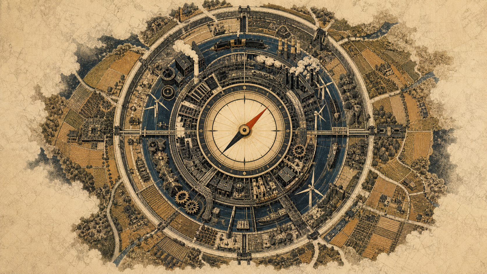
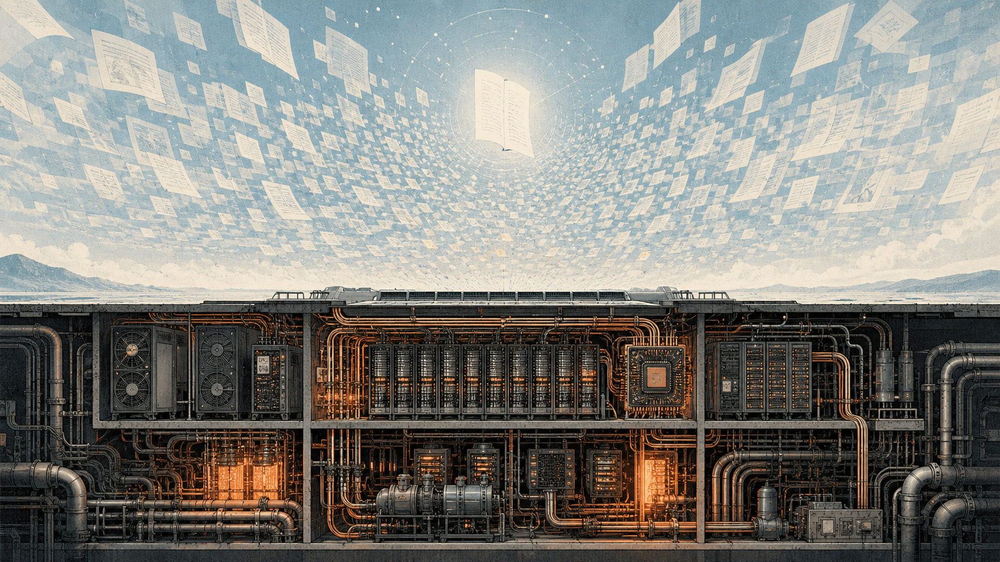
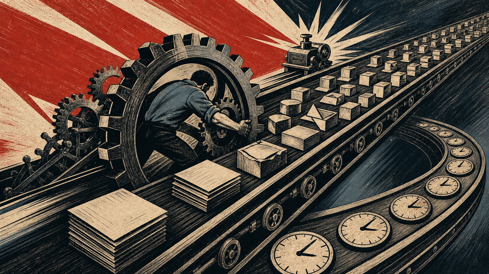
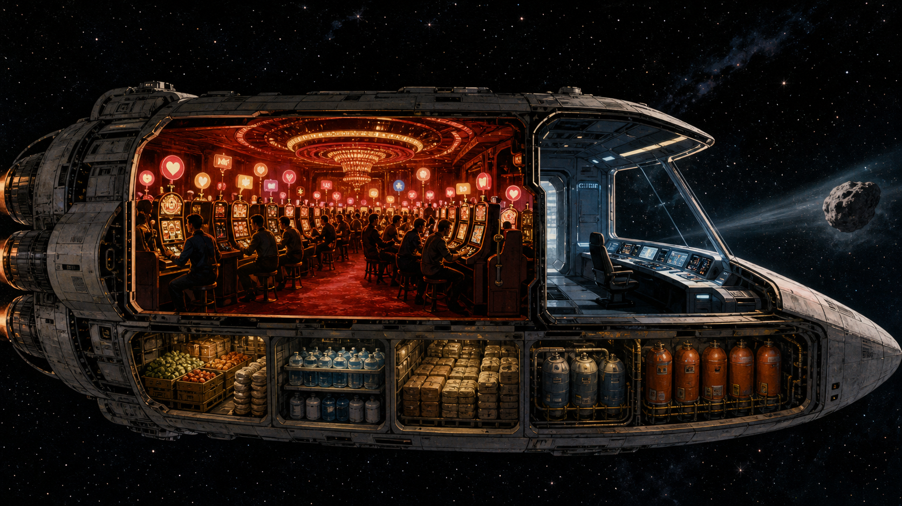
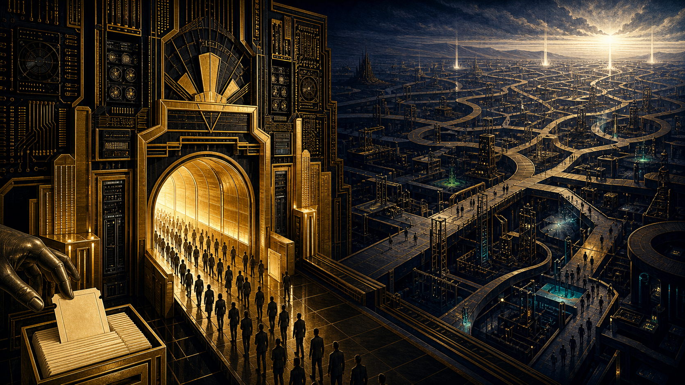
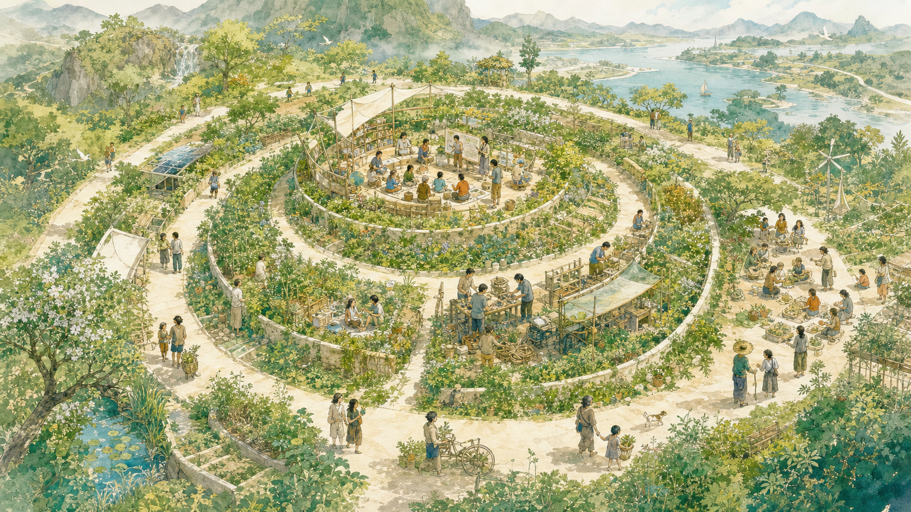

# 序

昨天晚上兴致忽然起来，把《资本之后的世界》（The World After Capital）一口气看完了。毕竟这本书谈的数字技术、人工智能和计算基础设施，都与我的专业工作有些关系，读起来难免比平常多几分代入感。

<!-- more -->

作者阿尔伯特·温格出生于德国，在哈佛学过经济学和计算机科学，后来在 MIT 取得信息技术博士学位。他创办过早期互联网公司，后来又成为风险投资人，长期站在资本流向新技术的第一线。这种经历，影响了他理解未来的方式。

整本书不算厚，讨论的主题却很大。温格想讨论的不是下一个热门产品，而是工业时代是否正在结束，以及资本之后究竟什么才是最稀缺的资源。他给出的答案是：**注意力**。

# 飞船并不缺燃料——《资本之后的世界》

作者有一些重要观点和预判，我还是蛮认同的：资本没有消失，但已经不再是数字时代唯一的瓶颈；数字产品和科学发现的价值，越来越难由价格、利润和估值准确衡量；当物质与信息逐渐丰裕以后，最稀缺的东西变成了人可以自主支配的注意力。后面的人工智能、AlphaFold、工作循环和全民基本收入，都是这几条判断的不同侧面。

## 三次跃迁：从土地、资本到注意力

农业提高了食物供给能力，人类开始从游动采集走向定居，土地也成为新的稀缺资源。在温格的框架里，第一次革命后最主要的制度是封建制度：掌握土地，也就掌握了粮食、人口、税收和军队。这套围绕土地、人口和征服建立的权力逻辑，后来又扩展到帝国与近代帝国主义。

第二次跃迁由科学革命、启蒙运动和工业化共同推动。机械、矿产、铁路和电力进入生产以后，决定生产规模的关键资源从土地转向了资本。这里的资本不只是账面上的货币，也包括厂房、机器、铁路和能源设施等物质生产资料。

工业时代最主要的两种制度——资本主义和社会主义——都是围绕资本展开的。两者虽然对立，争论的却是同一组问题：资本由谁拥有，怎样投入生产，收益又应该怎样分配。

第三次跃迁，则是从工业时代走向知识时代，稀缺资源也可能从资本转向注意力。作者的核心逻辑是，每一次文明跃迁，都是旧的稀缺资源被技术逐步克服，人类又被推向一种新的稀缺。他认为，人类积累的物质与知识资本，在技术上已经足以满足全球人口的食物、能源、饮水、住房和基本医疗需求。因此，资本不再是唯一的瓶颈，人能否自主支配**注意力**，开始变成更关键的问题。

## 复制免费，运行并不免费

温格认为，数字技术有两个与工业机器明显不同的性质：计算的普适性，以及复制的零边际成本。

所谓普适性，不是计算机能够解决世上的一切问题，而是同一套通用计算设备，可以通过不同软件处理医学、物理、交通和机器视觉等不同问题。

所谓零边际成本，则主要针对数字信息的复制。一份软件、一个模型权重文件或者一篇文章，多复制一份的成本几乎可以忽略。但**复制免费，不等于创造第一份和运行它也免费**。芯片、基础模型、编译器和操作系统，仍然需要数学、物理、计算机科学和长期工程经验的投入。数字产业没有消除知识劳动，反而让高度专业的知识和创造能力更加重要。

模型训练完成后，推理仍然需要芯片、内存、存储、电力和散热。顶级开源模型可以放出权重，并不意味着每个人手边的机器都能顺畅运行。算力集群能以较高速度运行大模型，高内存的 Mac Studio 也可以让量化模型走进普通人的桌面，但“能够加载”和“能够以可用速度工作”仍然是两回事。

不得不说，基础设施极其关键。知识可以免费复制，承载知识的物理世界却不会凭空消失。

## 价格衡量不了的价值

零边际成本带来的另一个变化，是资本以及围绕资本建立起来的度量体系，开始无法准确评价数字时代的产品和价值。工业时代的东西大多是稀缺的，一台机器、一间厂房或一段铁路，可以通过投入、产出、价格和利润来衡量。但数字产品一旦被创造出来，就可以被无数人同时使用，它的使用价值可以不断增长，价格却可能越来越低，甚至变成免费。

维基百科、开源软件和公开的模型权重都是这样。它们当然也需要资金、基础设施和大量人的劳动，却不必以直接收入和利润为前提。这些产品可以被广泛复制、使用和继续改进，为社会创造巨大价值，传统的收入、公司估值和 GDP 却未必能把这些价值记录下来。反过来，一个擅长吸引注意力并卖出广告的平台，可以拥有很高的收入和估值，却不等于它创造了同等程度的社会价值。

这恰恰是数字时代的优势：知识和数字产品不再必须依靠稀缺、排他和反复交易才能扩散，一次创造就可以被整个社会继续使用和改进。但这也意味着，如果我们仍然只用价格、利润和估值来判断什么值得做，就会错过数字时代最重要的价值。

在数字时代，资本仍然重要，只是它可能已经不再是唯一的瓶颈。

## 工作循环没有把时间还给人

温格的核心判断是：人类已经积累了足够庞大的知识与物质资本，原则上有能力满足所有人的食物、饮水、住房和基本医疗需求。问题不再只是“能不能生产出来”，而是怎样分配，以及人类把有限的注意力投向哪里。

工业时代围绕一套稳定的循环运转：人出卖劳动时间，换取工资，再用工资消费商品；消费又支撑企业继续投资、生产和雇佣。我们习惯把它叫作工作，温格则把它称为“工作循环”（Job Loop）。

AI 正在改变这套循环。所谓“提质增效”，工作中已经看得很具体：原来一天剪辑一个视频，收入是 1000 元；有了脚本和程序辅助，一天也许可以剪辑十个，但一天的收入仍然是 1000 元。原来三五天才能完成的代码或文案，如今可能在一两天里交付。

这当然是生产力的提高。但省下来的时间去了哪里？一天做出十倍的东西，劳动者的收入未必增加十倍；原来三天的任务一天完成，第二天也不会自动变成假期，而是继续安排新的任务。**人工智能节省了时间，旧的工作制度却没有把时间还给人。**

这也让我想到马克思关于“异化劳动”的讨论。他所批评的不只是工资高低，而是劳动者同自己的劳动发生了异化：劳动产品作为一种异己的力量同他相对立，劳动过程也不再是自主的生命活动，而成为受他人支配的谋生手段。

用今天的话来说，人也会被当成可以计算、替换和不断提高产出的生产要素。如果 AI 节省下来的时间只是被换成更多任务，那么使用的虽然是数字时代的技术，延续的仍然是工业时代的工作循环。

过去的产业革命会带来技术性失业。新的机器和生产方式提高了效率，采用落后技术的企业倒闭或退出，原来的劳动者被释放出来，再进入生产率更高的产业。这个过程当然会造成失业、痛苦和长时间的调整，但传统经济学背后的逻辑比较清楚：落后生产力被淘汰，劳动力再被更高的生产力吸收。

这次产业革命却不只是把人从一个低生产率岗位挪到另一个高生产率岗位。AI 不只淘汰某一个行业的落后工具，而是同时进入许多行业，改变人理解问题和使用计算机的方式。懂 AI 和不懂 AI 的人，生产率的差距可能迅速拉开。因此，我们无法只把人换到另一个岗位，就认为转型已经完成。

许多人过去几十年积累的技能和判断方式，都可能被重新定价，这才是实际中最困难的地方。

## 飞船上的赌场

前面的问题，是价格无法记录数字产品创造的全部价值；这里的问题更进一步：有些事情从一开始就没有价格。

温格对注意力有一个很直接的定义：**注意力等于时间加上意图**。只知道一个人在某件事上花了多少时间还不够，还要看他的意识究竟指向哪里。两个人同样陪家人两个小时，一个人始终在交谈，另一个人一直盯着手机，投入的时间相同，注意力却完全不同。

把温格在书中写到的几个例子放在一起，可以组成一个更容易理解的飞船隐喻。人类社会就像一艘正在太空中高速航行的飞船：船上的食物、水、燃料和自动化系统，代表人类已经积累的物质资本和生产能力；驾驶舱里的人则必须观测前方，决定整艘飞船的方向。这里最有限的，是船员愿意把多少时间和心力放在航向上。

现在，飞船前方有可能会出现陨石，必须有人观测、计算并及时转向。可是，避开一颗尚未撞来的陨石，既不能立即带来收入，也很难形成稳定的市场价格。价格机制擅长把人的时间引向能够交易和变现的事情，却不会自动把足够的注意力留在驾驶舱里。

偏偏船上还开着一座赌场，它就代表今天那些争夺注意力的数字平台。赌场有非常清楚的盈利方式：它利用随机奖励、即时反馈和多巴胺相关的奖赏机制，把船员从驾驶舱吸引到赌桌前。每一次下拉刷新、点赞和点开下一条内容，都像再拉一次老虎机的手柄。赌场再把船员的目光卖给广告商，就把注意力变成了可以定价的生意。

于是，飞船上出现了一个很荒谬的局面：最重要的事是避开陨石，却没有价格；赌场不能决定飞船的方向，却能够把人的注意力换成收入。

寻找人生的意义、陪伴家人、研究基础科学、应对气候危机和防范下一次大流行病，都像驾驶舱里的工作：价值很大，却很难由市场准确标价。

它说明的问题很直接：飞船并不缺燃料，缺的是留在驾驶舱里、抬头看路的人。

## 无法提前标价的科学：从 AlphaGo 到 AlphaFold

DeepMind 的故事很适合放在这里。它早期让 AI 直接观察 Atari 游戏画面的像素，再通过算法、控制和深度强化学习不断进步。这在当时首先是一个科学问题，而且很难赚钱。他们后来需要依靠谷歌的资本和算力继续研究，也说明即使研究目标不由价格机制决定，研究过程仍然离不开资本。

后来 AlphaGo 在 2016 年以 4:1 战胜李世石，让全世界第一次直观感受到这种方法的力量。再往后，AlphaFold2 在 2020 年把蛋白质结构预测推进到突破性的精度。2024 年，德米斯·哈萨比斯与约翰·江珀因此共同分享了诺贝尔化学奖，也让谷歌看到了这类科学研究能够产生的巨大社会价值。

这条路从游戏走向围棋，再走向蛋白质，前后不到十年。AlphaFold 没有脱离资本，但它的科学价值也不是资本能够提前准确标价的。若只按短期收入分配注意力，让 AI 打电子游戏和下围棋都很像昂贵的玩具，很难获得传统投资人的认同，更不用说投入多年研究蛋白质结构。等到 AlphaGo 战胜李世石，AlphaFold 又改变了蛋白质结构预测，旧的评价体系才开始重新认识这些研究的价值。

在我读到的传记材料中，哈萨比斯明确谈到，后续围绕通用 AI（Gemini）展开的庞大研发和管理工作消耗了他过多精力，留给科学探索的时间反而少了。2026 年 8 月，这个矛盾又有了一个很具体的结果：他交出 Google DeepMind 的日常运营职责，转任 Google DeepMind 主席和 Alphabet 首席科学家，Google DeepMind 的日常领导工作则交给 Koray Kavukcuoglu。

哈萨比斯在公开信中说，他需要为自己留出时间和空间，去思考 AGI 的更大图景，同时也会在 Isomorphic Labs 投入更多精力。这与他在传记中谈到的困扰是相互呼应的。它说明的是，科学研究、通用 AI 和市场竞争，确实在争夺同一批人的时间。资本、算力和人才都不缺时，一个人仍然只有一天二十四小时。

## 少数人的突破，巨大的产业

Transformer 走向大语言模型的过程，则是另一个类似的例子。2017 年，谷歌的八位研究者发表《Attention Is All You Need》，正式提出 Transformer 架构。2018 年，OpenAI 第一篇生成式预训练论文只有四位作者，Ilya Sutskever 是其中之一；到了 2020 年，GPT-3 论文的作者增加到三十一位。此后的规模化训练、指令微调与人类反馈等工作，最终让 ChatGPT 在 2022 年走向公众。

Ilya Sutskever 的重要贡献，不是重新发明了 Transformer，而是看到了这套架构继续扩展的潜力和价值，并参与推动它变成可以大规模训练的语言模型，事实上他成功了。从 2020 年 GPT-3 论文发表，到 2022 年 ChatGPT 开放给公众，只用了两年多。一个人数不多的基础研究团体，从有一点进展到推动一个巨大产业形成，并且获得了巨额的市场回报，不过几年时间。这是数字时代很新的产业特征，也完全出乎传统投资人的计划和旧的评价体系。

这里恰好存在一个同名但层次不同的呼应。《Attention Is All You Need》中的 Attention，是模型在大量信息中计算哪些内容彼此相关，以及应该给予多大权重；温格所说的注意力，则是人在有限时间里决定把意图投向哪里。两者不是同一个概念，但都指向数字时代的一个基本变化：**数字信息已经不再稀缺，怎样从大量信息中作出选择，反而变得越来越重要**。Transformer 解决的是机器怎样分配计算中的注意力，《资本之后的世界》追问的则是人类应该怎样分配自己的注意力。

直到现在，仍然有不少计算机从业者认为大语言模型只是概率统计上的雕虫小技。但它已经能够直接参与工作，并开始改变软件、内容生产和产业的组织方式。技术发展得太快，很多人还没有充分理解它。这也是为什么我认为，我们正处在第三次产业革命之中。

从顶尖大模型企业公开露面的核心研究者、工程师和创业者来看，不论中国还是美国，都有很多年轻面孔。这一次并不是一群资历最深、头发花白的行业老人，在所有问题都想清楚以后，再按计划推动产业落地。相反，一批年轻研究者和工程师在职业生涯初期就直接进入了基础模型的训练和优化。他们没有等模型先解决幻觉、成本和可靠性问题，而是在模型还不成熟时，就把它当成一个可以继续改进的工程对象。

## 资本是门票，不是结果

反过来看，一些大厂并不缺技术、算力和资深研究人员，却很难同样迅速地推出有竞争力的产品。原因并不是高年资的人天然不懂 AI，而是大公司越成功，既有产品、收入、品牌和责任就越多。对大厂来说，一次错误可能损害原有业务；对新公司和年轻团队来说，它更容易被当成下一次迭代的起点。

Meta 现在遇到的困境，就很能说明这个问题。Llama 4 的市场反应没有达到预期以后，Meta 重组 AI 团队，投入巨额资金并以高薪挖来研究人员，人员流动却没有停止；图灵奖获得者、前首席 AI 科学家杨立昆也已经离开 Meta 创业。这不能简单解释为 Meta 不愿意投钱，恰恰相反，它说明的是：花钱买到一批明星人才，并不等于立即得到一个能够有效协作的团队，更不等于买到一款领先的模型。

这里的差别，不是年龄本身，而是积累经验的起点不同。许多经验丰富的人首先看到模型的错误，年轻开发者却已经在实际工作中思考，怎样把这个并不完美的东西用起来。当前者还在等待确定性时，后者已经在一次次试验中积累了新的经验。

至少在这一轮竞争里，结果已经很清楚：那些更早进入模型训练和实际应用的年轻团队，暂时走在了前面。传统的评价方式和投资理论，很难完整解释这些新事物。

今天研究大模型的企业和学者很多，投入的资金与算力也极其庞大，但无论闭源还是开源，能够长期停留在第一梯队的始终只有少数几家。训练一个前沿模型需要巨额资本和少数顶尖研究人员，模型一旦领先，又可以通过 API、软件和开源权重迅速覆盖大量用户。使用习惯、开发工具和数据反馈继续向领先者集中，赢者占据大部分市场的现象，在数字时代反而变得更明显。

通过调整统计口径、突出局部跑分来证明自己能力很强，在这个时代并不总是管用。大家会直接把模型下载下来，用自己熟悉的场景和工作评估它的能力。“跑分”带来的荣耀很容易消失，只有能干活的模型才会被开发者留下；其余的可能只会变成下一个“PPT 项目”，继续吸引相信旧评价体系的投资人。

资本可以买到芯片、算力和研究时间，买到短期的收益，却难以买来情怀和洞见，所以无法保证技术路线、组织方式和产品判断一定正确。它仍然是前沿竞争的必要条件，却已经不能按照投入比例换回技术突破和市场成功。

**资本可以买到门票，但买不到结果。**

## 从工作循环到知识循环

温格把自动化生产和数字分发不断降低商品、服务与知识成本的趋势，称为“技术性通缩”。传统通缩往往来自需求萎缩，技术性通缩则来自生产和分配效率的提高。如果教育和医疗因为技术而变得更便宜，名义 GDP 未必上升，人的生活却可能变好。这又一次说明，资本的度量体系无法记录数字时代的全部收益。

温格给出的制度方案，是全民基本收入。在美国的设想中，他提出每月向十八岁以上的人支付 1000 美元，十二岁以上的未成年人 400 美元，更小的孩子 200 美元。这个数字不是为了让人过上富裕生活，而是保证基本生存，使人不必被迫把全部时间卖进工作循环。

这很符合我们对乌托邦和共产主义的描述。至少我认为，人类现在还没有达到这个状态。温格是一名投资人，已经拥有比较充分的经济自由，因此他会愿意为这样一个小理想国去思考和推动一些事情。

他相信，当基本需求不再时时威胁一个人，人就能把注意力投入学习、创造与分享，进入所谓的“知识循环”（Knowledge Loop）。我们不必为了找工作才学习，也可以因为好奇而学习；不必所有事情都先回答“怎么变现”，也可以先问“它有没有意义”。

不过，最近的几个开源项目，很容易让人联想到这个观点。OpenClaw 最初只是彼得·斯坦伯格的一个周末项目，后来迅速发展成受到广泛关注的开源个人 AI 助手；DHH 主导的 Omarchy，则把 Arch Linux 和一系列桌面组件迅速整合成一套完整的使用体验。更早的 Ubuntu 也得益于马克·沙特尔沃思的长期投入，虽然这些产品最终的发展离不开团队和开源社区。

这些项目的发起者已经不需要为基本生活发愁，因此可以把精力投入一件短期未必挣钱、自己却想做的事情。大公司也花巨资做过不少 Unix 或 Linux 产品，却未必能产生同样的影响。投入了钱，并不等于一定能把东西做好。产品做得好不好，使用者其实会有相对一致的判断。反而是这些拥有经济自由的人，可以按照自己的认识，把已经存在的好东西迅速组合起来，从概念推进到可以使用的产品。

这些例子至少说明，在数字时代，依靠个人创造力迅速完成一件事情正在一次次发生，也从一个侧面印证了作者的观点。经济自由可以释放个人的时间和创造力。

## 人文主义：注意力应该投向哪里

因此，温格最后呼唤的是人文主义的回归。他所说的人文主义，不是空泛地赞美人，而是把人的能动性与责任放在中心，相信批判性探究能够帮助我们比较思想、纠正错误并创造新的知识。

这也意味着，我们需要摆脱只按职业回报衡量知识的功利主义观念，学会为了知识本身而学习。全民基本收入可以在一定程度上缓解这种担忧：即使让好奇心决定学习方向，人也不至于无法糊口。

那么，这样的社会还会有足够的工程师和科学家吗？温格认为，不但不会更少，反而可能比现在更多。因为很多孩子原本就有强烈的好奇心，是不断的强迫学习和功利评价慢慢消耗了这种好奇心。当一个人可以根据兴趣学习，再把学习到的东西用于创造和分享，知识循环才有可能运转起来。

# 结语

我并不认为资本已经不重要了。算力要钱，芯片要钱，住房、医疗与能源都要钱。对于许多仍在为基本生活奔波的人来说，说“资本已经不稀缺”，甚至显得过于轻松。

但我认为温格最重要的观点，并不是“资本消失了”，而是**资本已经不足以解释我们面对的全部问题**。问题不只在于资本还能不能继续创造财富，也在于价格、利润和估值已经无法告诉我们，哪些事情值得交出有限的注意力。我们有能力制造更多东西，却未必想清楚为什么还要制造；AI 替我们节省了时间，这些时间却可能立即被更多工作和更多信息填满；我们拥有几乎无限的数字副本，却仍然只有一天二十四小时。

所以资本之后的世界，未必真是一个乌托邦。它也可能是一艘物资充足、技术先进，却没有人抬头看路的飞船。

我们需要争取的，不只是免于工作的自由，还包括自主支配注意力的自由。只有把更多注意力放在家人、知识、创造以及那些暂时无法标价的事情上，我们才有可能从工业时代走向作者所说的知识时代。

Transformer 让机器能够在大量信息中计算哪些内容彼此相关、应该分配多大权重，但人类应该把自己的注意力投向哪里，仍然不能交给模型、资本或价格替我们决定。

而这一步，技术不会替我们完成。
