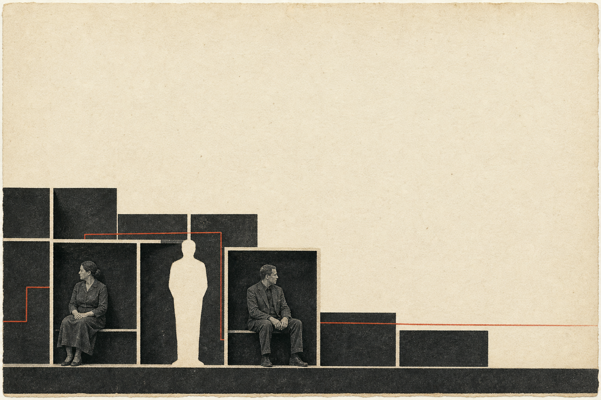
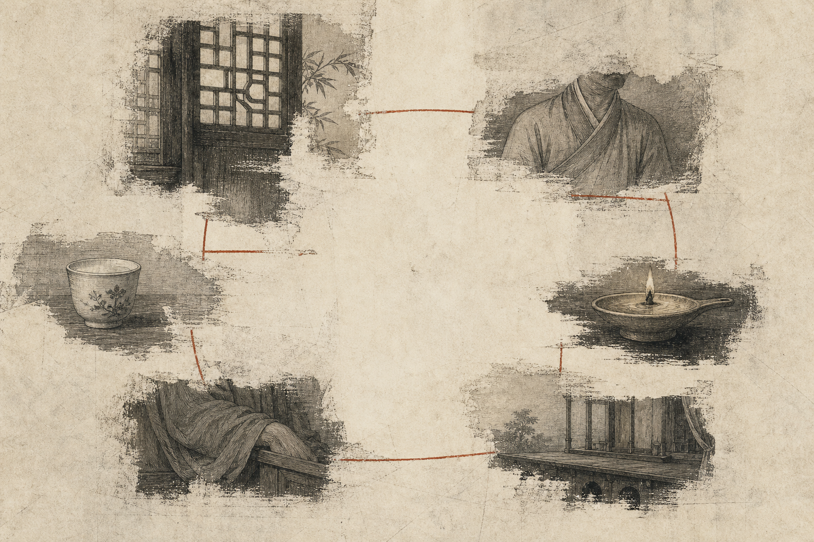
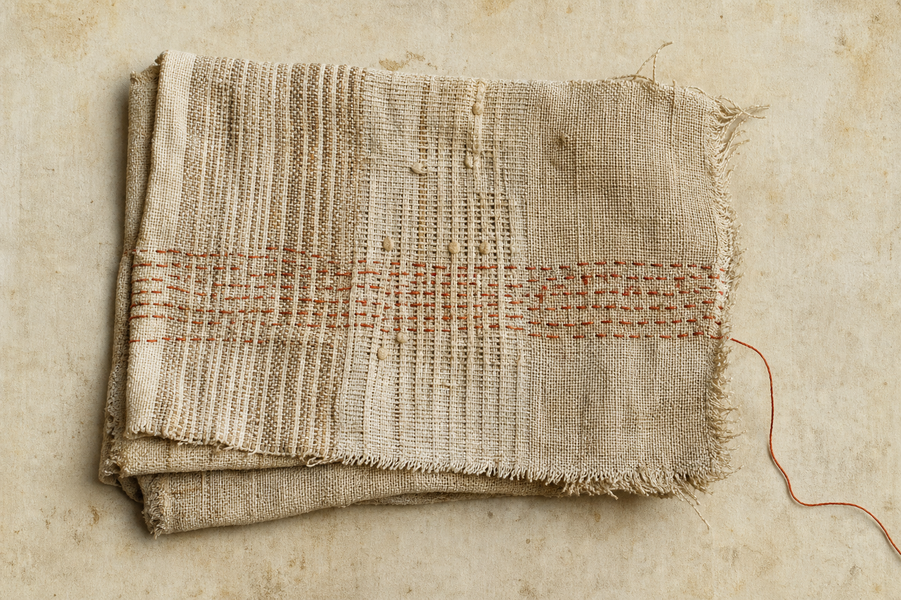
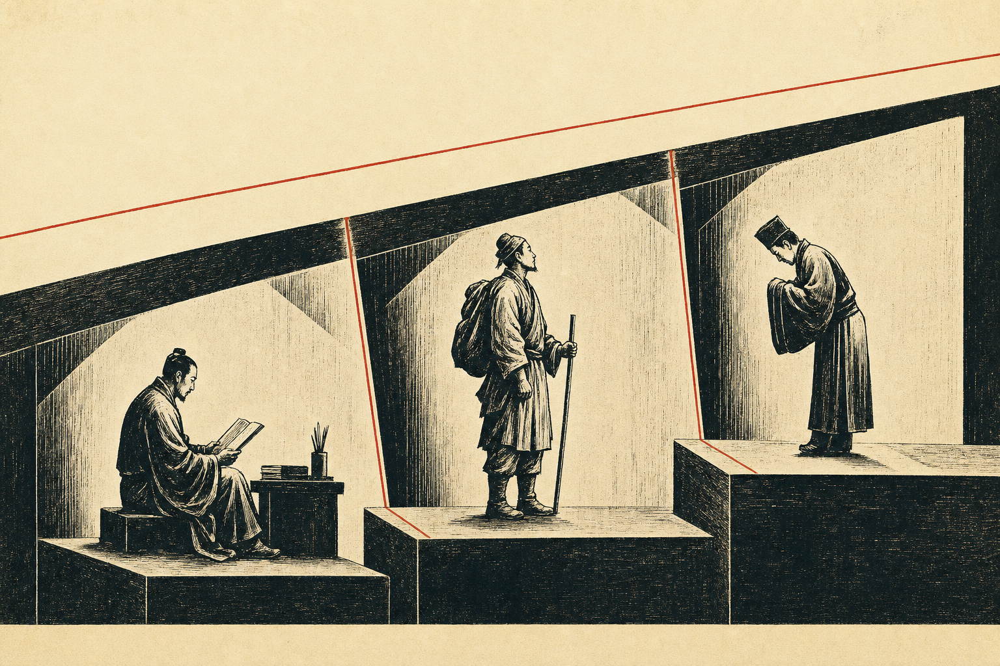
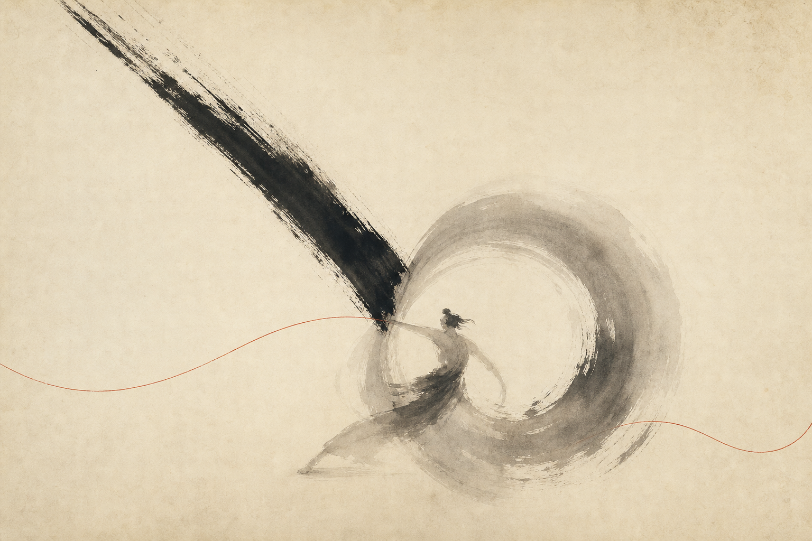
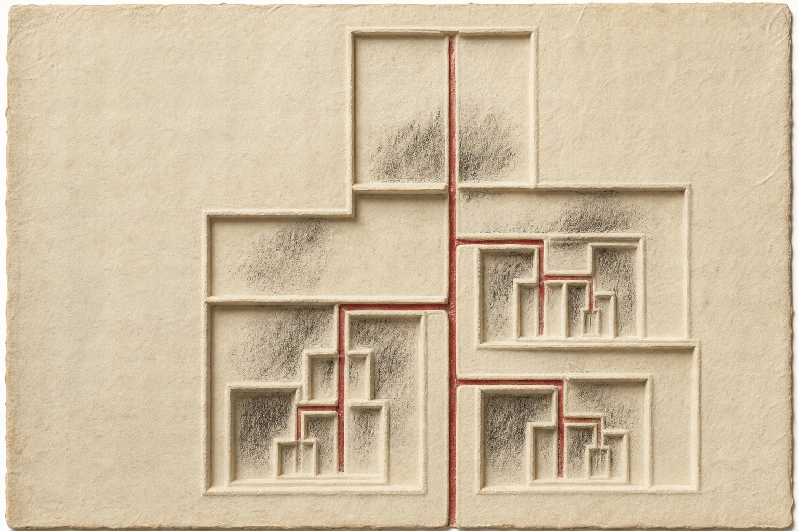
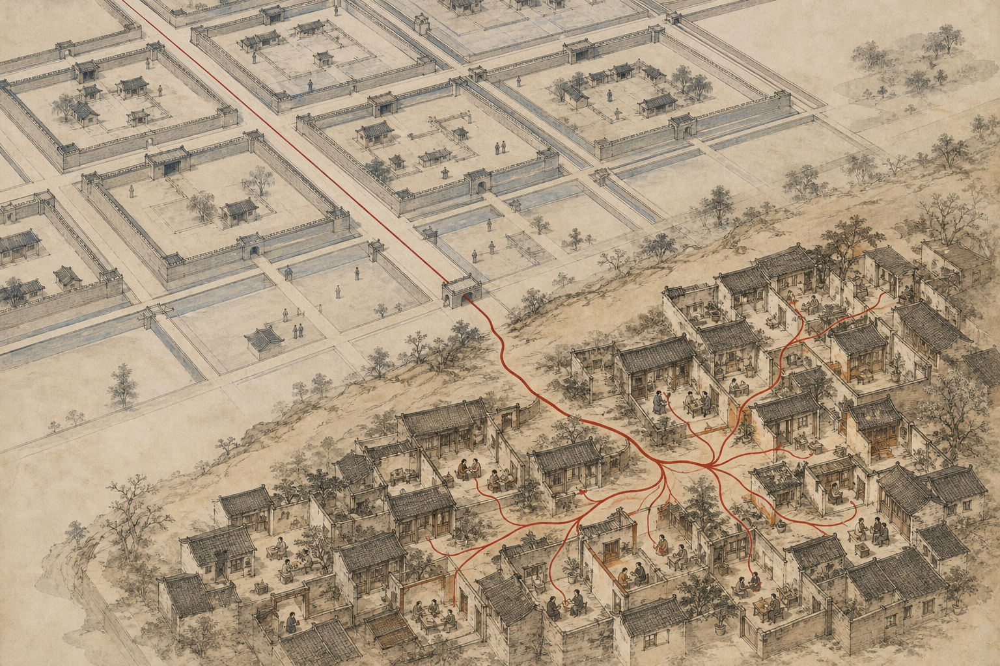
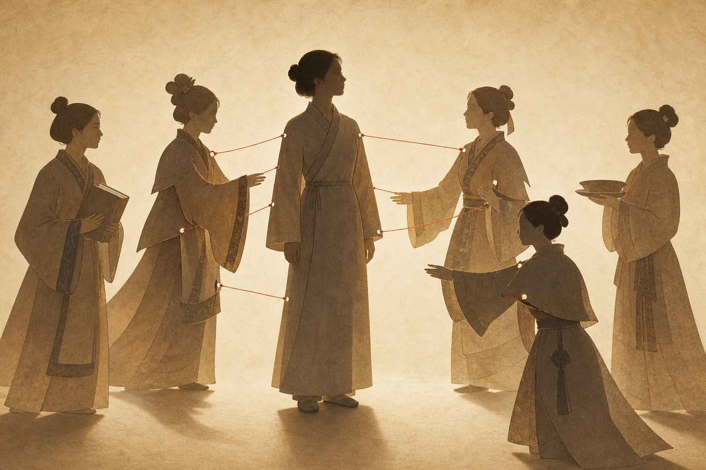
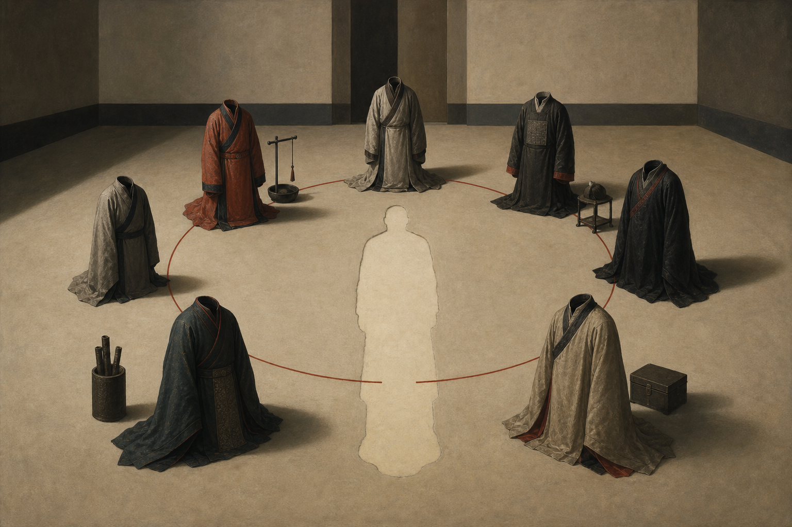
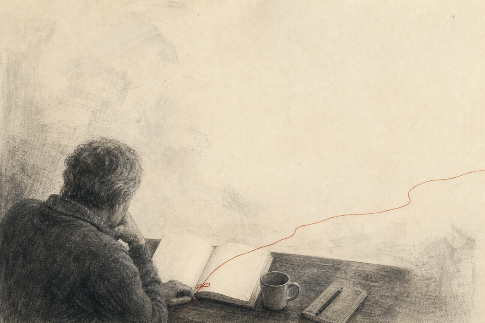

# 序

这是易中天“品读中国”系列四本书中的第三本。前两本《品人录》和《读城记》，我已经先后读完；到了这一本，画风突然变了。光看《中国的男人和女人》这个题目，就知道它要谈的不再只是历史人物和城市性格，而是男人、女人、家庭、婚姻，以及中国人在漫长的传统中怎样安排彼此的位置。

书的后记写于 1997 年，我手里这个上海文艺出版社的版本则是 1999 年初版。也就是说，它在我上高中以前就已经写成了。那时的易中天还没有因为《百家讲坛》而家喻户晓；我后来在电视上认识的那个能把严肃问题讲得生动有趣的易中天，原来早已站在这本书里了。

虽然我不知道学界怎样评价易中天，毕竟行内与行外看一个人的标准并不一样，但我依然很愿意读他的书。男女、婚姻、妻妾、家庭，原本都是再俗不过的话题，经他讲起来，却立刻风雅了不少。更难得的是，他在后记里列出了大量参考书目，也坦言许多问题未能深入展开，因为这本书首先是写给普通读者的。

把复杂的学问讲给普通人听，并不是一件容易的事，也因此格外难得。

<!-- more -->

# “山河·故人”——《中国的男人和女人》

一开始，我以为这本书只是谈中国传统里的男人和女人。读下去才发现，男女不过是入口，后面真正想说的，是家庭、宗法、礼制、国家，以及一个人在层层关系中怎样得到自己的位置。

这也是全书最让我有感触的地方：我们今天看古典小说时感到的那些别扭，未必是书没有讲明白，而是作者与当时读者共享的那套常识，到了我们这里已经断掉了。没有那套常识，人物为什么这样说话、为什么一定要守住某个名分、为什么明明痛苦却不能离开，我们自然很难看懂。

这篇笔记虽然从男人写起，最后真正记住的却不是某一种男人或女人，而是他们怎样一起被安放进名分里。

## 为什么古典小说总让人觉得别扭

书里引用了许多四大名著的情节和人物关系。那些片段我以前也看过，可当时常常只是觉得奇怪：《红楼梦》里的人为什么活得那么拧巴？《水浒传》里的男人为什么只谈义气，几乎不谈爱情？许多人物的选择，用今天的眼光看甚至有点不可理喻。

《红楼梦》写成于清代，《三国演义》《水浒传》《西游记》的主要成书过程则都在明代。作者写给当时的人看，男女、家庭、妻妾、主仆以及宗族之间的关系，本就是生活里的常识，不需要再从头解释。真要讲得太透，反而像是在把人人都知道的事情重复一遍。

可几百年过去，社会结构和生活经验都变了，有些词虽然还在，背后的意思已经不同。我们接收到的往往只是支离破碎的信息：这里知道一点礼教，那里听说一点宗法；知道“老爷”“太太”“公子”“小姐”，却不清楚这些称呼为什么不只是称呼，而是一整套权利与义务。

或许这些知识并没有真的消失，只是从我自己的经历来看，在从小到大的成长过程中几乎接触不到。随着真正熟悉那套生活方式的老一辈人逐渐离去，剩下的东西到了我这里便显得零零散散。书里后来谈到“风俗”与伦常，我才意识到，为什么叫风俗，什么是“风”，又怎样成为“俗”，原本也都有具体的场景和来路。

我们去西湖能看到苏小小墓，读陈寅恪先生晚年的《柳如是别传》，又会在《琵琶行》里遇到那位年长色衰、漂泊江湖的琵琶女。她们的时代、身份和处境并不完全相同，却都活在今天已经远去的制度与风俗里。如果只用一句“那是古代的事情”把她们打发掉，似乎什么都解释了，其实什么也没有解释。

过去我把这种背景笼统地叫作“封建社会”，好像四个字就足以包办两千年的历史。读完这本书，我才觉得，仅有这四个字远远不够。真正需要理解的，是帝制时代长期存在的宗法观念、礼制秩序、家族结构与文化心理，它们怎样互相支撑，又怎样落到一个普通人的婚姻、身份和日常生活里。

这些东西早已进入我们所谓的“文化基因”，沉淀成语言、习惯和下意识。经过两千多年的浸润，儒释道早已不只是经书里的思想，而是内化进了中国人的日常：谈秩序、责任和分寸时，常能看到儒家的礼；说因果、轮回与放下时，背后有佛教留下的语言；讲自然、顺势和看开一点，又常常带着道家的影子。不同传统早已彼此交融，很难把今天的每一个词硬归到某一家，但它们确实共同塑造了我们理解世界的方式。

许多时候，我们已经在使用它们，却并不知道来处。它们融进生活以后，变得如此寻常，以至于我们常常意识不到它们的存在。

这当然不只是中国如此。欧洲长期受到希腊罗马传统与基督教文明的影响，古代波斯与后来的伊斯兰文明，也在西亚不同地区一层层留下自己的痕迹。各地历史并不相同，更不能说今天那些国家的认同和世界观都“大差不差”；但若完全脱离这些文化背景，我们同样很难理解那里的人为什么会这样思考、这样生活。

人当然不只是文化的产物，但也没有人能够完全脱离文化而生活。理解一种文化，不是为了赞同它的一切，而是为了知道其中的人为什么会那样生活。离开具体的历史背景，仅凭今天的词义去判断过去，难免会处处碰壁。

## 书里的男人，为什么“不像男人”

书一开篇，易中天先把传统戏曲和小说里的男人归成了三类。这当然是他为了展开论述所作的概括，却很有辨识度：

- 第一类是白面书生。他们往往胆小怕事、少有见识、软弱无力，甚至不敢负责任。
- 第二类是江湖好汉。他们有英雄气，却没有儿女情；讲爱情的专讲爱情，讲英雄的专讲英雄。因此《红楼梦》里处处是情，《水浒传》里遍地是英雄，两边却很少相见。
- 第三类是忠臣孝子。他们会哭，也善跪；一到君父面前，便把自己的刚强收了起来。至于国难当头，戏台和小说反倒常让穆桂英一类的女性人物挺身而出。

于是易中天问：明明很男人的男人，为什么一到书本和舞台上，反倒“不像男人”了？

他的解释很有锋芒。他认为，传统政治秩序只允许皇帝一人独占“阳刚”，其余臣民在权力面前都必须顺从、低头，甚至被“臣妾化”。到了家庭内部，这套关系又缩小为丈夫与妻子、父亲与子女之间的秩序。所谓男人的“无性化”与“女性化”，在他看来，并不只是性格问题，而是权力结构留下的文化心理。

这当然是一种带着易中天式夸张和反讽的文化解释，但他把男人的气质与权力结构联系起来，依然让我觉得很有道理。

他的追问依然有效：一种文化怎样规定男人应该成为什么样的人？一个人在皇帝、父亲、丈夫这些权力角色面前，又被允许保留多少自己的性情？

文化也会形成自己的心理定势和偏见。北方人的大方，在南方人眼里或许叫粗放；南方人的精细，在北方人看来没准就是小气。很难说清谁是谁非，却能看见一个人怎样被自己的生活环境慢慢塑造。

易中天认为，新派武侠小说之所以成功，或许正因为它重新拼合了过去彼此分开的东西：大侠不但有英雄气，也可以侠骨柔肠；故事里既有江湖，也有爱情，既有美女，也有英雄。仔细想想，确实挺有道理。

## 从“祖”到“宗”，家与国为什么相像

如果说“君为臣纲，父为子纲，夫为妻纲”代表了传统伦理的一种秩序，那么男尊女卑的家庭，确实很像帝制国家的缩小版：君臣、父子、夫妻，看似是三种关系，背后却都在强调尊卑、上下和服从。

易中天从“祖”字讲起。“祖”的左边是示字旁，与祭祀有关；他又把右边的“且”解释为早期生殖崇拜的遗存，由此把“祖”与父系氏族联系起来。不过，“且”的早期字形究竟表示什么，学术上并无定论；我更愿意把它看成书中解释父系祖先崇拜的一条思路，而不是唯一答案。

真正让我一目了然的，是他对宗法的梳理。

西周贵族宗法以父系血缘和嫡长继承为核心，首先要解决的是“正统”由谁接下去。血统一脉相承，像一根接力棒一棒一棒传下去，不能大家哄抢，必须确定一个被承认的接棒人。爵位、宗主身份以及主持主要祖先祭祀的资格，也随这一脉传递。嫡长一系为大宗，旁支另立以后又成为相对于自身后代的大宗；所以大宗、小宗并不是两个永远固定的家族，而是一层套一层、彼此相对的关系。

在同姓分封的宗法模型中，周天子居于大宗位置，受封诸侯相对为小宗；诸侯在自己的封国内，又成为本支的大宗，卿大夫、士也依次如此。西周还有异姓诸侯，他们主要通过婚姻、盟誓和政治关系被纳入统治秩序，不能全部塞进同一棵宗族谱系。不过，血缘上的亲疏、政治上的等级和财产爵位的继承，确实因此被紧密地连在了一起。

这里也不能理解得太机械。不过，宗法所确立的亲疏、等级与名分，后来确实成为儒家礼制的重要内容。小宗并非完全不能祭祖，只是不能取代大宗主持共同始祖和主干一系的祭祀；庶人也不是没有家庭和祖先，只是不在同一套贵族爵位与分封体系里。

到了秦统一六国，这套以宗法和分封组织国家的方式发生了根本变化。郡县制与官僚制逐渐取代世卿世禄，地方官员不再依靠血缘世袭，而由中央任命。国家当然仍会借用君臣如父子一类的家庭伦理，但真正治理这样一个大一统帝国，已经不能只靠宗族里的长幼尊卑，而要依靠郡县、官吏与统一的法令。从这个意义上说，西周式的“家国同构”确实弱化了：国家不再是一层层放大的宗族，而成为由中央权力直接控制的帝国。

但“家天下”并没有就此消失，更准确地说，它只是换了一种形态。皇位仍由一家一姓世袭，宗法不再像西周那样直接构成分封政治的骨架，却仍然参与皇位继承和国家礼制，同时更深地沉入宗族、家庭和普通人的生活。祖先崇拜、嫡庶之分、婚姻秩序、孝道与名分，仍然一代代延续。国家的组织方式变了，这套文化心理却顽强地留了下来，继续影响着此后两千多年的中华文明。

看明白这一点之后，再看电视剧里的宗主、族长、嫡庶之争，许多原本模糊的地方突然就能对上了。在我看来，这就像把皇宫里的那套等级缩小以后，搬进了一个家族。我以前对这些概念只是模模糊糊地有一点感觉，易中天却把它们写得清清楚楚、一目了然。

这样再去看“修身、齐家、治国、平天下”，很多事情便清楚了。这句话出自《大学》，不是孔子亲口留下的一句格言，却准确表达了传统政治伦理中由个人到家庭、再到国家与天下的连续想象。秦以后，国家在制度上已经不能再主要依靠宗法分封来治理，但在伦理想象中，家与国之间的桥并没有断：两者仍然共享着一套关于秩序、名分与服从的语言。

## 名分的诱惑，也就是名分的陷阱

在易中天的概括中，父系社会建立以后，女人被当作食品、财富和权力一样的东西加以分配，分配的依据是“名”，规则则是“礼”。这当然不是说每个历史时期、每个家庭都完全一样，而是说在那套制度里，女人首先被看成某个人的妻、妾、女儿或婢女，然后才可能被看成她自己。妻、妾、婢、妓之间的等级，也由礼法、财产和父权关系反复固定下来。

书里谈“名分”时，用了一个很重的词：**用心险恶的设计**。

易中天认为，传统伦常表面上维护男女有别、上下有等、尊卑有序，骨子里却是在取消每个人的独立人格和自由意志，使一个人不再作为“人”存在，而只作为君、臣、父、子、夫、妻、主、仆中的一个位置存在。

任何名分都不能孤立存在。它必须依附于一个团体和一段关系：国家里的君臣，家族里的宗主与族人，家庭里的父子夫妻。一旦团体瓦解，名分也会跟着消失。《红楼梦》里的贾府一旦树倒猢狲散，老爷、太太、公子、小姐的身份便迅速失去效力，原来被等级压住的人也不再照旧守规矩。

更值得琢磨的是，一个人在团体中的名分越高，对团体的依赖可能反而越大。最怕国破的是国君，最怕家亡的是家长。因为一旦国破家亡，他们失去的不只是财产和权力，还有那个证明“我是谁”的位置。一个人越想保住自己的名分，就越需要与团体认同；团体意识越强，属于个人的东西往往也就越少。

名分因此既是诱惑，也是威胁。身处尊贵的位置，可以被尊重、被敬畏，也可以对别人发号施令；身处卑贱的位置，则可能被轻视、被侮辱，甚至被任意践踏。为了争取或保住一个好名分，人便会主动克制自己，把个人的欲望、性情和判断交出去。

易中天把这笔交易说得很直白：

> 请交出你的心灵自由来。

这句话确实很狠，却把事情说透了。青史留名的忠臣、孝子、烈女、贤妻，大多是不断克制自己的人；戏台上的坏人往往比好人好看，也正因为好人必须守规矩，坏人却可以任性。一个人越符合名分，就越可能被赞美；可那个脱离名分以后仍然独立存在的人，反而越来越难被看见。

书中写的表面是男人和女人，背后问的却是：当所有人都被安排进一个位置以后，人去了哪里？可今天不少影视作品只顾还原服饰、称谓和礼仪，却很少继续追问：这些形式背后，究竟怎样安放一个具体的人。

## 给孩子一把钥匙，也给自己留一个问题

现在低年级的孩子也在不断接触《西游记》、四大名著和《红楼梦》的片段。可当他们对传统社会的结构几乎没有概念时，那些疑问该怎么解决？看不懂的时候，又怎么会有兴趣继续往下看？

名著自带光环，我们很容易先告诉孩子：这是经典，它一定有道理。但这个“道理”究竟是在弘扬一种秩序，还是在批判、揭露它；是在真心认同，还是作者不得不借着旧规则说话，不能只靠“经典”两个字来回答。

给孩子一本名著，也要给他们一把进入那个时代的钥匙。否则，孩子记住了人物和情节，却不知道人物为什么痛苦；背下了名句，却分不清作品是在赞美、叹息，还是反讽。所谓背景知识，不是为了替古人开脱，而是为了让我们有能力真正评价他们。

这又回到夫子的老话：

> 学而不思则罔，思而不学则殆。

看了很多书却不思考，到头来仍会迷茫；整天想得很多，却不肯学习、不去实践，也会困在自己的判断里，到最后甚至会发现自己什么也干不了。正如我最近出去走了一趟丝绸之路，又接连看了一些书，才突然发现，有些东西自己曾经错误地坚持了很久。现在回头看，确实有点可笑。

人一旦对某件事信以为真，就会不断寻找材料强化它，最后把它塞进自己更大的三观体系里。越是如此，越容易“以其昏昏，使人昭昭”。真正困难的不是获得一个观点，而是承认那个曾经确信无疑的自己，也可能错了。

回到这本书本身，它写于近三十年前，其中一些概括带着那个时代的语言和局限，有些解释也需要重新核对。但它替我补上了一块很重要的背景：古典作品里的男女、婚姻和家庭，从来不是孤立的私人生活，它们背后站着宗法、礼制、财产、权力和名分。

只有看清它怎样运转，我们才知道那些看似天经地义的规矩，究竟保护了谁，又牺牲了谁。也只有走到这一步，我们才可能把一个具体的人，从层层名分中重新辨认出来。

# 结语

或许这就是一个中年人的感悟吧。活了四十年，中间有过起伏，有过希望和失望，也有过迷惑和自以为是的顿悟，到了这个年纪再回头看，才有机会把原来认知里的裂缝一条条找出来，重新拼接，重新补足。

过去以为读书是把未知变成已知，读得越多，答案应该越多；现在却发现，读得越多，不懂的东西也越多。

